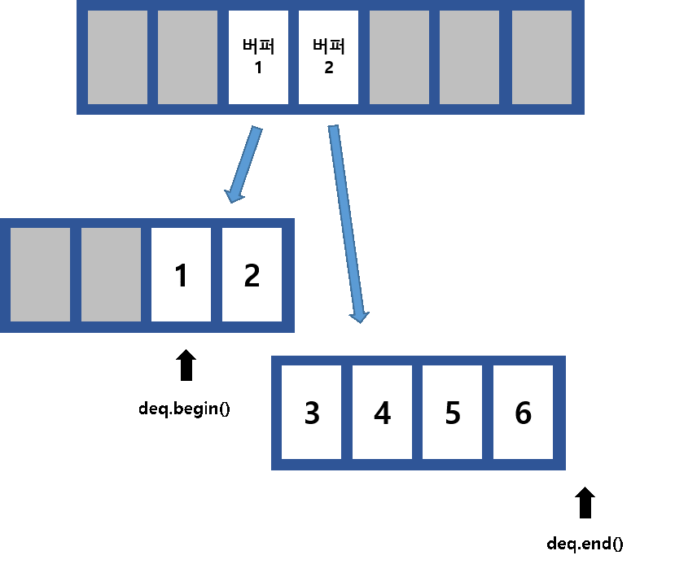

# vector

메모리상에서 데이터가 연속적으로 위치하는 배열입니다.

std::vector의 경우 배열의 크기를 런타임에서 조절할 수 있지만 

std::array의 크기는 컴파일 타임에 결정되어야 하고 런타임에서 바꿀 수 없습니다. 

## 자료형 선택 기준

std::array : **사용할 배열의 크기를 미리 알 수 있고 크기가 변하지 않는다면** 

std::vector : 그렇지 않을 경우

## vector 구성

1. 할당된 배열의 **시작 주소를 가리키는 포인터**
2. **다음에 데이터가 삽입될 위치**를 가리키는 포인터
3. 할당된 배열의 **끝 주소를 가리키는 포인터**

## vector 데이터 삽입 시 주의사항
일반적으로 데이터를 뒤에 삽입하는 push_back연산은 상수 시간복잡도를 가지지만. 할당된 공간이 전부 차면 배열을 통째로 복사해 새로운 vector에 할당하는 **reallocation**이 발생해 시간이 많이 소요됩니다.

따라서, 알고리즘 문제 풀이 시에는 가급적 vector의 size를 충분히 확보한 상태로 사용하는 것이 좋습니다. 해당 내용은 아래 예시 코드를 통해 직접 확인해 볼 수 있습니다.

 

# deque

여러 개의 버퍼에 데이터를 나눠서 저장합니다.

 

## Vector vs Deque 추가적인 차이점
해당 내용만 보면 deque가 vector보다 대부분의 상황에서 유리해 보일 수 있습니다. 하지만 vector에는 deque에는 없는 또다른 차별점이 있습니다. 

*Vector의 요소들은 메모리상에 연속적으로 존재하는 것이 보장*되지만, 
*deque는 메모리에서 요소들이 연속적이지 않습니다.* 

따라서 **C배열의 라이브러리와 상호작용해야 하는 상황이거나, 공간지역성을 고려해야하는 상황에서는 deque가 불리**

# list (std::forward_list)
linked list입니다. 

Container의 어느 위치든 O(1)에 데이터를 삽입하거나 삭제할 수 있지

random access(Container의 i번째 데이터에 O(1)에 접근)는 불가능합니다.

std::list는 doubly-linked list이고, std::forward_list는 singly-linked list입니다. 

singly-linked list 단점

- Container 맨 앞에 데이터를 삽입하는 건 빠르지만 맨 뒤에 삽입하는 건 느립니다.
- 어떤 iterator의 다음 iterator는 삭제할 수 있지만 그 iterator 자신은 삭제하지 못합니다. 

singly-linked list 장점

- doubly-linked list에 비해 포인터를 하나 덜 가지므로 기본적인 연산이 빠르고 메모리를 적게 사용합니다. 
만약 doubly-linked list의 기능까지 필요하지 않다면 더 가볍고 빠른 std::forward_list가 좋은 선택일 것입니다.

# Associative Containers
데이터를 정렬된 상태로 유지하는 자료구조입니다. 

Red-Black Tree를 기반으로 하고 데이터의 추가/삭제/접근의 시간복잡도가 O(logn)입니다. 

데이터를 정렬된 상태로 유지하는 것은 매우 강력한 기능이고 

O(logn)은 적은 시간복잡도지만 연산에 붙는 상수가 크고 사용하는 메모리가 많으므로 주의가 필요합니다

## Red-Black Tree:

- 자가 균형 이진 탐색 트리(self-balancing binary search tree) 
- 대표적으로는 연관 배열 등을 구현하는 데 쓰이는 자료구조
 트리에 n개의 원소가 있을 때 O(log n)의 시간복잡도로 삽입, 삭제, 검색을 할 수 있으며 최악의 경우에도 우수한 실행 시간을 가집니다.
 
## set (std::map)
Red-Black Tree는 Binary Search Tree이므로 어떤 key를 기준으로 데이터를 저장합니다. std::set은 데이터를 자체를 key로 사용하고, std::map은 (key, value) 쌍을 받아서 사용합니다.  

단순히 **데이터를 정렬 상태로 유지하고 싶다면 std::set**을, **(key, value) 데이터 쌍을 key를 기준으로 정렬하고 싶다면 std::map**을 사용하면 됩니다.

## std::multiset (std::multimap)

원소의 중복을 허용합니다. 

같은 key를 여러 개 저장하고 싶을 때 사용합니다. 

단, 시간복잡도 주의가 필요합니다. 

std::set에서 key의 개수를 세거나, key를 지우는 함수는 모두 O(logn)이지만,

std::multiset에서는 같은 key를 모두 세고, 모두 지우므로 O(logn + (같은 key를 가지는 데이터의 개수)) 만큼의 시간이 듭니다.

## Unordered Associative Containers

해시값을 사용해 데이터를 저장하는 자료구조입니다.

대부분의 경우에서 데이터의 추가/삭제/접근이 O(1)이므로 Associated Container보다 효율적입니다.

하지만 데이터를 정렬된 상태로 유지해야 하거나 (무수히 많은 key 값들로 인해) 해시 충돌이 걱정되는 상황이라면 Associated Container를 사용하는 게 좋습니다.
 

std::unordered_set (std::unordered_map)
Data를 중복 없이 저장하고 싶고, Data의 순서가 상관없을 때 Associateve Container 대신 사용할 수 있습니다.
std::unordered_map의 데이터 저장 방식은 아래와 같습니다.
 

 
- 데이터를 여러 개의 버킷에 나눠서 저장합니다. 
- 주어진 key의 해시값을 계산하고 이를 버킷 개수로 나눈 나머지를 구해서 어떤 버킷에 들어갈지 계산합니다. 
- 중요한 점은 다른 key여도 같은 버킷에 들어갈 수 있다는 것입니다. 이를 해시 충돌이라 하며, 해시 충돌에 대응하기 위해 std::unordered_map은 각 버킷마다 linked list로 (key, value) 쌍을 저장합니다. 
- 만약 해시값이 고르지 않게 분포하면 하나의 버킷에 모든 데이터가 삽입될 수 있고, 데이터를 추가/삭제/접근하기 위해 linked list를 순회해야 하므로 최악의 경우 시간복잡도가 O(n)이 됩니다.
- 기본으로 사용하는 hash function은 std::hash이고,
-  std::hash에서 기본으로 지원되는 타입은 int, double 등의 primitive type과 std::string 등이 있습니다.
 
