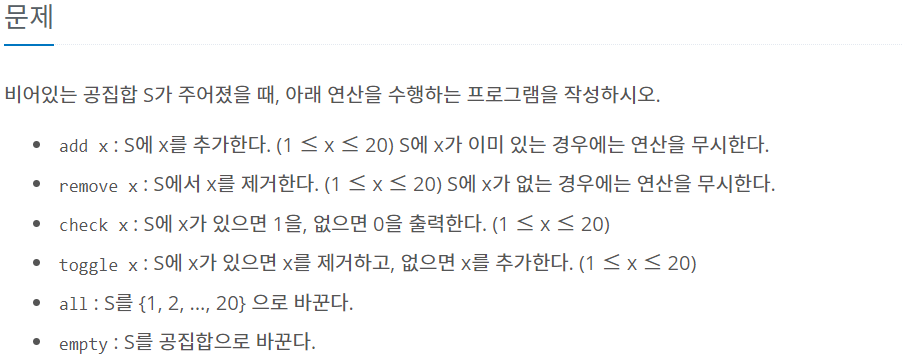

# 비트 마스크
- 컴퓨터 내부적으로 데이터를 이진수로 표현하는 특성을 이용해 정수의 이진수 표현을 자료구조로 쓰는 기법

## 1. 비트 연산자
- AND, OR, XOR
  - AND 연산 (&): 대응하는 두 비트가 모두 1일 때, 1 반환
  - OR 연산 (|): 대응하는 두 비트가 하나라도 1일 때, 1 반환
  - XOR 연산 (^): 대응하는 두 비트가 서로 다르면, 1 반환
    ```python
    1010 & 1111 = 1010
    1010 | 1111 = 1111
    1010 ^ 1111 = 0101

    ```

- NOT
  - NOT 연산 (~): 비트의 값을 반전하여 반환
    ```python
    ~1010 = 0101


    ```

- 왼쪽, 오른족 shift
  - 왼쪽 Shift (<<): 왼쪽으로 비트를 옮긴다. (A * 2^B) 의미
  - 오른쪽 Shift (>>): 오른쪽으로 비트를 옮긴다. (A / 2^B) 의미
  
    ```python
    00001010 << 2 = 101000
    00001010 >> 2 = 000010

    ```

## 2. 비트마스크 개념

- 10개의 방문 체크
    ```python

    check = [False] * 10
    check = 0b0000000000
    ```

## 3. 비트마스크와 집합

- 백준 11723 집합 문제

```python
# 원소 추가
S |= (1<<num)   # num번째 위치를 1로 세팅

# 원소 삭제
S &= ~(1<<num) # num번째 위치 0으로 세팅

# 원소 토클
S ^= (1<<num) # 없다면 추가, 있다면 삭제

# 원소 체크
print(1 if S & (1<<num) != 0 else 0)

# 원소 비우기 및 채우기
S = 0
S = 1<<21 - 1 # 20 칸의 비트가 1로 채워진 상태

# 집합끼리 연산
A | B   # 합집합
A & B   # 교집합
A & ~B  # 차집합 (A - B)
A ^ B   # A와 B 중 하나에만 포함된 원소들의 집합

# 집합의 크기
## 비트에서 1인 비트 수 세기
def bitCnt(x):
    if x ==0: return 0
    return x%2 + bitCnt(x//2) # 마지막 비트값, 마지막 비트 떼내기

```
## 4. 문제 활용
### 4.1 부분 수열(Subequence)
- 원 수열의 일부 항을 따서 새로 만든 수열

```python
def subsequence(arr):
    n = len(arr) # 원소의 개수
    result_list = [] # 생성된 부분 수열 저장
    for i in range(1 << n): # 부분 수열 개수
        subset = [] # 부분수열 담기 위함
        for j in range(n): # 원소의 수만큼 비트를 비교함
            if i & (1 << j):
                subset.append(arr[j]) # 부분 수열 만들기
        result_list.append(subset)
    return result_list

sample_list = [1, 2, 3]

subsequence_list = subsequence(sample_list)
print(subsequence_list) 
# [[], [1], [2], [1, 2], [3], [1, 3], [2, 3], [1, 2, 3]]
```

### 4.2 특정 합을 만족하는 부분집합
- boj 1182
  - 합이 s가 되는 부분집합 수
```python
n, s = map(int, input().split())
arr = list(map(int, input().split()))

cnt = 0
for i in range(1, 1 << n):
  subset = []
  for j in range(n):
    if i & (1<<j):
      subset.append(j)
    
  if sum(subset) == s:
    cnt += 1

print(cnt)
```


---


<h6>reference : https://velog.io/@1998yuki0331/Python-%EB%B9%84%ED%8A%B8-%EB%A7%88%EC%8A%A4%ED%82%B9-%EC%A0%95%EB%A6%AC<h6>