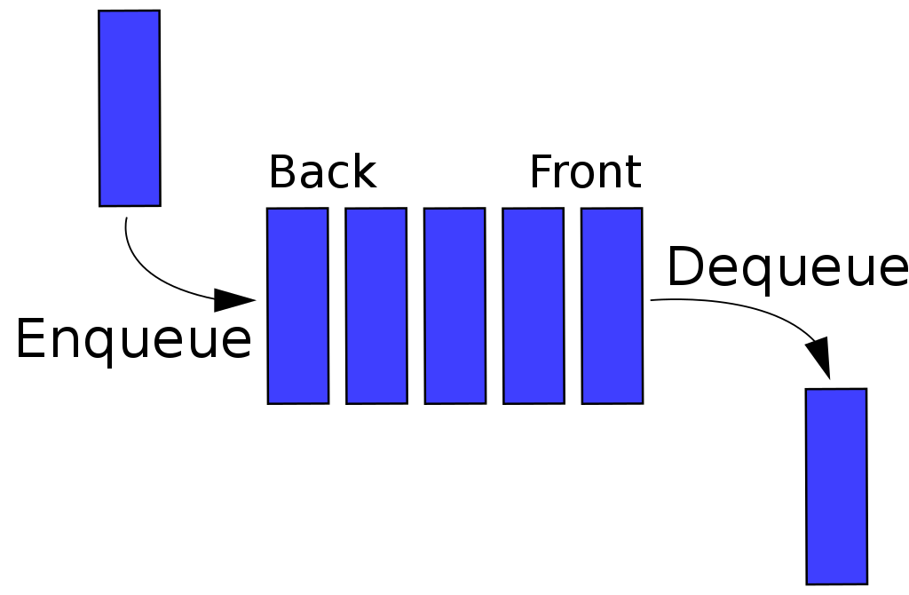

# Queue

## "큐"란?

- FIFO(First In, First Out) : 선입선출, `먼저 입력된 데이터가 먼저 반환`되도록 설계한 메모리 구조
- 삽입과 삭제의 위치가 제한적인 자료구조
  - 큐의 뒤에서는 삽입만 하고 큐의 앞에서는 삭제만 이루어지는 구조
- 웹에서 순서대로 처리되어야 하는 작업에 적용되는 자료구조
- BFS, 너비우선탐색에 사용되는 자료구조


  <h6>출처 : https://ko.wikipedia.org/wiki/큐 </h6>

## 큐의 구조 및 기본 연산
### 1. 큐의 선입선출 구조
- 머리(front) : 저장된 원소 중 첫번째 원소
- 꼬리(rear) : 저장된 원소의 마지막 원소

### 2. 큐의 기본연산
- 삽입 : enQueue
- 삭제 : deQueue

### 3. 큐의 주요 연산
- enqueue : 큐의 뒤쪽에 원소를 삽입하는 연산
- dequeue : 큐의 앞쪽에서 원소를 삭제하고 반환하는 연산
- createQueue : 공백 상태의 큐를 생성하는 연산
- isEmpty() : 큐가 공백상태인지를 확인하는 연산
- isFull() : 큐가 포화상태인지 확인하는 연산
- Qpeek() : 큐의 앞쪽에서 원소를 삭제 없이 반환하는 연산

## 큐의 활용
### 1. 버퍼(buffer)
- 데이터를 한 곳에서 다른 곳으로 전송하는 동안 일시적으로 그 데이터를 보관하는 메모리 영역
- 버퍼링 : 버퍼를 활용한 방식, 또는 버퍼를 채우는 동작을 의미

##  파이썬에서 큐 구현

### 2.1 선형 큐
<details>
<summary>선형 큐</summary>
<div markdown = "1">
- **1차원 배열을 이용한 큐**
    - 큐의 크기 = 배열의 크기
    - front : 저장된 첫번째 원소의 인덱스
    - rear : 저장된 마지막 원소의 인덱스
- **상태표현**
    - 초기 상태 : front = rear = -1
    - 공백 상태 : front = rear
    - 포화 상태 : rear = n -1
    
- **초기 공백 큐 생성**
    - 크기 n인 1차원 배열 생성
    - front와 rear를 -1로 초기화
- **삽입 : enQueue(item)**
    - 마지막 원소 뒤에 새로운 원소를 삽입
    1. rear값을 하나 증가시켜 새로운 원소를 삽입할 자리를 마련
    2. 그 인덱스에 해당하는 배열원소 Q[rear]에 item을 저장
    
    ```python
    def enQ(item):
        global rear
        if rear == n-1:
            print('q is full')
        else:
            rear = rear += 1
            Q[rear] = item
    ```
    
- 삭제 : dequeue()
    - 가장 앞에 있는 원소를 삭제
    1. front 값을 하나 증가시켜 큐에 남아있게 될 첫번째 원소 이동
    2. 새로운 첫번째 원소를 리턴함으써 삭제와 동일한 기능함
    
    ```python
    def deQ():
        if front == rear:
            print('Q is empty')
        else:
            front = front += 1
            return Q[front]
    ```
    

- **공백 상태 및 포화 상태 검사 : isEmpty(), isFull()**
    - 공백상태 : front = rear
    - 포화 상태 : rear = n-1
    
    ```python
    def isEmpty():
        return front == rear
    
    def Full():
        return rear == len(Q) - 1
    ```
    
- 검색 : Qpeek()
    - 가장 앞에 있는 원소를 검색하여 반환
    - 현재 front의 한자리 뒤(front + 1)에 있는 원소, 즉 큐의 첫번째에 있는 원소를 반환
    
    ```python
    def Qpeek()
        if isEmpty():
            print('Q is empty')
        else:
            return Q[front + 1]
    ```
    

### 연습문제

```python
q = [0] * 3
rear = front = -1

for i in range(1, 4):
    rear += 1
    q[rear] = i

for i in range(1, 4):
    front += 1
    print(q[front])
```

### 선형 큐 문제점

1. 잘못된 포화상태 인식

  - 배열의 앞부분에 활용할 수 있는 공간이 있음에도 포화상태로 인식하여 삽입 수행하지 않음

### 해결방법

1. 매 연산이 이뤄질 때마다 배열을 앞으로 모두 이동시킴>> 비효율적
2. 1차원 배열을 사용하되, 논리적으로는 배열의 처음과 끝이 연결되어 원형 형태의 큐를 이룬다고 가정

</div>
</details>
---

### 2.2 원형 큐
<details>
<summary>원형 큐</summary>
<div markdown = "1">
## 구조

### 1. 초기 공백 상태

- front = rear = 0

### 2. index의 순환

- front와 rear의 위치가 배열의 마지막 인덱스인 n-1를 가르킨 후, 그 다음에는 논리적 순화를 이루어 배열의 처음 인덱스인 0으로 이동해야 함
- 이를 위해 나머지 연산자 mod 사용

### 3. front 변수

- 공백 상태와 포화 상태 구분을 쉽게 하기 위해 front가 있는 자리는 사용하지 않고 항상 빈자리로 둠

### 4. 삽입 위치 및 삭제 위치

- 삽입 : rear = (rear + 1) mod n
- 삭제 : front = (front + 1) mod n

## 연산과정

1. create Queue
2. enQueue(A)

### 초기 공백 큐 생성

- 크기 n인 1차원 배열 생성
- front와 rear를 0으로 초기화

### 공백상태 및 포화상태 검사

```python
def isEmpty():
    return front == rear

def isFull():
    return (rear + 1) % len(cQ) == front
```

### 삽입 enQueue(item)

- 마지막 원소 뒤에 새로운 원소를 삽입하기 위해
    1. rear 값을 조정하여 새로운 원소를 삽입할 자리를 마련
    2. 그 인덱스에 해당하는 배열 cQ[rear]에 item을 저장
    
    ```python
    def enQueue(item):
        global rear
        
        if isFull():
            print('queue is full')
        else:
            rear = (rear + 1) % len(cQ)
            cQ[rear] =item
    ```
    

### 삭제 deQueue(item)

- 가장 앞에 있는 원소를 삭제하기 위해
    1. front값을 조정하여 삭제할 자리를 준비함
    2. 새로운 front원소를 리턴함으로써 삭제와 동일한 기능
    
    ```python
    def deQueue():
        global front
        
        if isEmpty():
            print('queue is Empty')
        else:
            front = (front + 1) % len(cQ)
            return cQ[front]
    ```

</div>
</details>
---


### 2.3 리스트 이용

- 제거 작업의 시간복잡도가 O(n)이기 때문에 비효율적
```python
  queue = []

queue.append('1st floor')
queue.append('2nd floor')
queue.append('3rd floor')
print(queue) 

# ['1st floor', '2nd floor', '3rd floor']

queue.pop(0) # 1rd floor
queue.pop(0) # 2nd floor
queue.pop(0) # 3st floor

```
### 2.2 deque 클래스 활용
```python
from collections import deque
queue = deque()

queue.append('1st floor')
queue.append('2nd floor')
queue.append('3rd floor')
print(queue) 
# ['1st floor', '2nd floor', '3rd floor']

queue.popleft() # 1rd floor
queue.popleft() # 2nd floor
queue.popleft() # 3st floor
```

## 2.3 queue.Queue() 클래스 사용

```python
from queue import Queue

queue = Queue()
queue.put('1st floor')
queue.put('2nd floor')
queue.put('3rd floor')
print(queue) 
# ['1st floor', '2nd floor', '3rd floor']

queue.get() # 1rd floor
queue.get() # 2nd floor
queue.get() # 3st floor
```

---

# collections의 deque

## deque란

- Double-ended-queue : 배열의 양 끝에 요소를 추가/삭제를 지원한다.
- 리스트 클래스의 pop()메서드와 달리, 양방향에서 시간복잡도가 O(1)인 메서드를 지원한다.
- 데이터 접근은 O(n)의 시간복잡도

## deque method

- 모두 시간복잡도가 O(1)이다.
- append() : add a element into a right side of deque
- appendleft() : add a element into a left side of deque
- pop() : remove a element from a right end of deque
- popleft() : add a element from a left end of deque

---

# queue.Queue() 클래스

## Queue() 클래스란?

- 주로 멀티 스레딩 환경에서 사용되며, 내부적으로 locking을 지원하여 여러 개의 쓰레드가 동시에 데이터를 추가하거나 삭제할 수 있음
- `deque`와 달리 방향성이 없기 때문엘 데이터 추가와 삭제가 하나의 메서드로 처리됨
- 시간복잡도가 O(1)인 메서드를 지원, 데이터 접근은 O(n)의 시간복잡도

## Queue 클래스의 메서드

- `put()` : 데이터를 추가
- `get()` : 배열의 왼쪽의 데이터를 삭제