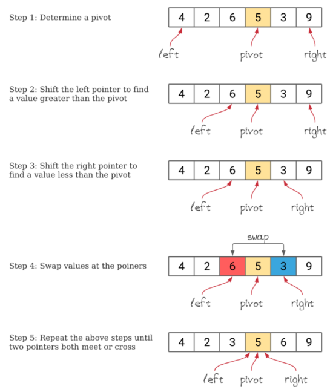

# 퀵정렬
<h6>참조 : https://www.daleseo.com/sort-quick/</h6>
<h2>개념</h2>

- 분할 정복(divide and conquer) 알고리즘 중 하나
- 재귀함수 이용
- 피봇(pivot)이라는 임의의 기준값을 설정(보통 중앙값으로 함. 가장 빠름)
- 피본을 기준으로 큰 값(오른쪽) 작은 값(왼쪽)으로 나눔(정렬)
    - 정렬 후 오른쪽과 왼쪽은 비교할 필요가 없음

<h2>특징</h2>

- 파이썬이나 자바에서 제공되는 built-in 메서드 sort()는 퀵정렬 기본
- 분할 시점부터 비교연산이 일어나기 때문에 그 이후 병합에 들어가는 비용이 매우 적거나 구현 방법에 따라서 아예 병합을 하지 않을 수 있습니다.
- 구현 방법에 따라 공간복잡도가 달라질 수 있음
- 입력 배열이 차지하는 메모리만을 사용하는 in-place sorting 방식을 구현할 경우, O(1)의 공간복잡도를 가진 코드의 구현이 가능하다.

  
  
  <h6>출처 : https://www.baeldung.com/cs/quicksort-vs-heapsort  </h6>
---
<h2>알고리즘</h2>
오름차순
1. 피봇 설정
2. 피봇보다 크면 오른쪽 작으면 왼쪽 리스트에 저장
3. 피봇은 mid리스트에 저s장
4. 각 리스트로 퀵 함수 재호출함과 동시에 합치기

---

<h2>예시 코드</h2> 
<details>
<summary> </summary>
<div markdown="1">

```python
def quick_sort(arr):
  if len(arr) <2:
    return arr

  fvt_idx = len(arr)//2
  leftlist, midlist, rightlist = [], [arr[fvt_idx]], []

  for el in arr:
    if arr[fvt_idx] > el:
      leftlist.append(el)
    elif arr[fvt_idx] < el:
      rightlist.append(el)

  return quick_sort(leftlist) + quick_sort(midlist) + quick_sort(rightlist)

```

</div>
</details>

---

<h2>장단점</h2>

- 장점
  - 기본적인 정렬의 상용코드가 퀵정렬방식을 채택

- 단점
  - 공간복잡도가 크다.(상용화되는 코드에서 메모리 사용 과다는 심각한 문제)
  - fivot 선택 방식에 따라 성능 차이가 크다.
---

<h2>퀵 정렬 개선 </h2>

<h2>예시 코드</h2> 
<details>
<summary> </summary>
<div markdown="1">

알고리즘
- 리스트의 정 가운데 있는 값을 피봇 설정
- 분할하는 함수와 구간마다 끝 구간을 줄여가며 피봇과 비교후 swap하는 함수 작성
- 전체 구간에서 피봇 설정
- 피봇기준으로 끝 인덱스에서 증가시키고 줄여나가면서 비교
- 왼쪽에서 피봇보다 큰값과 오른쪽에서 피봇보다 작은 값을 찾았다면 교환
- 끝 인덱스 두 개가 교차했을 때 break - 큰 인덱스 반환
- 반환된 인덱스 기준으로 위 아래 배열 다시 함수 호출
```python
def quick_sort(arr):

  # 배열을 나눠서 분할 정복하도록 하는 함수
  def partition(lft_idx, rgt_idx):
    if lft_idx >= rgt_idx:ㄴ
      return
    
    # 배열에서 입력된 인덱스를 기준으로 양 옆에서 인덱스를 증가시키고 줄여가며 피봇을 기준으로 교환 
    mid = sort(lft_idx, rgt_idx)
    #왼쪽 오른쪽 배열에 대해서 입력된 인덱스가 같거나 교차되었을 때까지 분할해서 sort 실행
    partition(lft_idx, mid - 1)
    partition(mid, rgt_idx)

    return arr

  # 입력된 인덱스들 구간에서 피봇을 정하고 비교 교환해나가며 끝난 후 새로운 mid_idx 반환
  def sort(lft_idx, rgt_idx):

    fivot = arr[(lft_idx + rgt_idx)//2]

    # 왼쪽 인덱스와 오른쪽 인덱스가 교차하기 전까지
    # 왼쪽에서 피봇보다 값이 큰 인덱스 찾고 오른쪽에서 피봇보다 값이 작은 인덱스 찾기
    while lft_idx <= rgt_idx:
      while arr[lft_idx] < fivot:
        lft_idx += 1
      while arr[rgt_idx] > fivot:
        rgt_idx -= 1
    
    # 인덱스들이 교차되지 않았을 때 교환 진행 및 인덱스 증감
      if lft_idx <= rgt_idx:
        arr[lft_idx], arr[rgt_idx] = arr[rgt_idx], arr[lft_idx]
        lft_idx, rgt_idx = lft_idx + 1, rgt_idx - 1
    # 다음에 순환할 배열의 구간을 결정할 mid_idx 반환
    return lft_idx

  return partition(0, len(arr) - 1)

```


<h2> 복잡도 </h2>
- 이상적인 경우 O(nlogn)
- 최악의 경우 O(n**2)
<details>
<summary> </summary>
<div markdown="1">


</div>
</details>


---