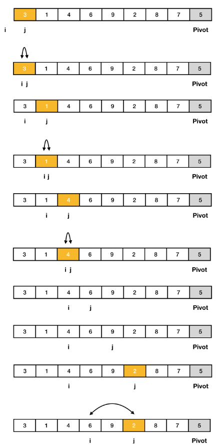

# 퀵정렬
<h6>참조 : https://www.daleseo.com/sort-quick/</h6>
<h2>개념</h2>
- 분할 정복(divide and conquer) 알고리즘 중 하나
- 재귀함수 이용

<h2>종류</h2>
1. Hoare(호어)
2. Lomuto(로무토)
3. pythonic
- 때에 따라 효율적인 방식이 다름
<details>
<summary> </summary>
<div markdown="1">

### 피봇값 최적 선택
- 맨 왼쪽, 중간, 맨 오른쪽 3개의 값중 중간값을 피봇으로 선택하여 swap
  - 호어 : 피봇을 맨 왼쪽에 위치시킴
  - 로무토 : 피봇을 맨 오른쪽에 위치시킴

### 비교
1. hoare
  - 평균적으로 swap을 3배 이상 덜 발생시킴
  - 배열의 인자가 모두 같은 수일 경우
    - i와 j인덱스가 교차되는 순간 Swap을 멈춤(O(nlogn) 유지)
  - 배열이 정렬된 상태라면 한번도 Swap을 발생시키지 않음
  
2. Lamuto
   - 상대적으로 구현이 쉬움
   - 모든 인자가 같은 수이거나 이미 정렬된 배열에 대해 swap을 끝까지 계속 발생시키기 때문에 시간복잡도 O(n^2)

### 최악의 시간복잡도가 되는 경우
1. hoare
   - 맨 왼쪽의 값으로 채택한 피봇값이 최소값인 경우
   - 맨 오른쪽의 값으로 채택한 피봇값이 최대값인 경우
     - 분할이 일어나지 않음(O(n^2))
  
2. Lamuto
   - 모든 인자가 같은 수이거나 이미 정렬된 배열일지라도 swap을 끝까지 계속 발생시키기 때문에 시간복잡도 O(n^2)
   - 피봇을 잘못 선택할 경우 분할되지않아 효율 저하

<h2> hoare partition을 사용한 퀵 정렬</h2>
- 오름차순
- 초기상태
  - pivot : 레코드의 맨 왼쪽 값
  - i : 배열의 pivot 위치 바로 다음 index
  - j : 배열의 마지막 index
- 동작
  - i와 j가 교차할 때까지 반복
  - i는 피봇보다 큰 값, j는 피봇보다 작은 값을 찾음
  - 둘 다 찾으면 swap
  - i만 찾으면 j -= 1
  - j만 찾으면 i += 1
  - i와 j가 교차하면 j와 pivot swap
    - 위 과정을 거친 피봇은 다음 정렬에서 제외(자기 위치에 위치한 상태)

    
  

<h3> hoare partition quick sort implement <h3>

```python
  def HoarePartition(arr, l, r):
      p = arr[l]
      i, j = l, r

      while i <= j:
          while i <= j and arr[i] <= p:
              i += 1
          while i <= j and arr[j] >= p:
              j -= 1
          if i < j: arr[i], arr[j] = arr[j], arr[i]
      arr[l], arr[j] = arr[j], arr[l]
      return j

  def qsort(arr, l, r):
      if l < r:
          s = HoarePartition(arr, l, r)
          qsort(arr, l, s - 1)
          qsort(arr, s + 1, r)

  n = 1000000
  arr = list(map(int, input().split()))
  qsort(arr, 0, n - 1)
  print(arr[500000])
```

<h2> Lomuto partition방법을 사용한 퀵 정렬</h2>
- 오름차순
- 피봇값보다 큰 값을 오른쪽에 작은 값을 왼쪽에 위치시킴
- 초기상태
  - pivot : 레코드의 맨 오른쪽 값
  - i : 맨 왼쪽 원소의 index의 - 1
  - j : 배열의 index로 레코드의 맨 왼쪽
- 동작
  - j가 초기값부터 피봇 값 바로 전 index까지 반복
    - j가 가르키는 값이 피봇값보다 작거나 같다면 
      - i += 1
      - i 값과 j 값 swap
    - j += 1
  - 반복이 끝나면 i + 1위치와 피봇 swap

    
  
  
  

<h3> Lomuto partition quick sort implementation <h3>

```python
  def LomutoPartition(arr, l, r):
      p = arr[r]

      i = l - 1

      for j in range(l, r):
        if arr[j] < p:
          i += 1
          arr[i], arr[j] = arr[j], arr[i]

      arr[i + 1], arr[r] = arr[r], arr[i + 1]
      return i + 1

  def qsort(arr, l, r):
      if l < r:
          s = LomutoPartition(arr, l, r)
          qsort(arr, l, s - 1)
          qsort(arr, s + 1, r)

  n = 1000000
  arr = list(map(int, input().split()))
  qsort(arr, 0, n - 1)
  print(arr[500000])
```
</div>
</details>

<h2>pythonic quick sort</h2>
- 파이썬이나 자바에서 제공되는 built-in 메서드 sort()는 퀵정렬 기본
- 분할 시점부터 비교연산이 일어나기 때문에 그 이후 병합에 들어가는 비용이 매우 적거나 구현 방법에 따라서 아예 병합을 하지 않을 수 있습니다.
- 구현 방법에 따라 공간복잡도가 달라질 수 있음
- 입력 배열이 차지하는 메모리만을 사용하는 in-place sorting 방식을 구현할 경우, O(1)의 공간복잡도를 가진 코드의 구현이 가능하다.

  
  
  <h6>출처 : https://www.baeldung.com/cs/quicksort-vs-heapsort  </h6>
---
<h2>알고리즘</h2>
오름차순
1. 피봇 설정
2. 피봇보다 크면 오른쪽 작으면 왼쪽 리스트에 저장
3. 피봇은 mid리스트에 저s장
4. 각 리스트로 퀵 함수 재호출함과 동시에 합치기

---

<h3>예시 코드1</h3> 
<details>
<summary> </summary>
<div markdown="1">

```python
def quick_sort(arr):
  if len(arr) <2:
    return arr

  fvt_idx = len(arr)//2
  leftlist, midlist, rightlist = [], [arr[fvt_idx]], []

  for el in arr:
    if arr[fvt_idx] > el:
      leftlist.append(el)
    elif arr[fvt_idx] < el:
      rightlist.append(el)

  return quick_sort(leftlist) + quick_sort(midlist) + quick_sort(rightlist)

  numbers = [3, 2, 4, 6, 9, 1, 6, 7, 5]
  print(f'정렬 전 :', numbers)
  print('------' * 10)
  numbers = quick_sort(numbers)
  print(f'정렬 후 :', numbers)

```
</div>
</details>

---

<h2>장단점</h2>

- 장점
  - 기본적인 정렬의 상용코드가 퀵정렬방식을 채택

- 단점
  - 공간복잡도가 크다.(상용화되는 코드에서 메모리 사용 과다는 심각한 문제)
  - fivot 선택 방식에 따라 성능 차이가 크다.
---

<h2>퀵 정렬 개선 </h2>

<h3>예시 코드</h3> 
<details>
<summary> </summary>
<div markdown="1">

<h3>알고리즘</h3>
- 리스트의 정 가운데 있는 값을 피봇 설정
- 분할하는 함수와 구간마다 끝 구간을 줄여가며 피봇과 비교후 swap하는 함수 작성
- 전체 구간에서 피봇 설정
- 피봇기준으로 끝 인덱스에서 증가시키고 줄여나가면서 비교
- 왼쪽에서 피봇보다 큰값과 오른쪽에서 피봇보다 작은 값을 찾았다면 교환
- 끝 인덱스 두 개가 교차했을 때 break - 큰 인덱스 반환
- 반환된 인덱스 기준으로 위 아래 배열 다시 함수 호출
  
```python
def quick_sort(arr):

  # 배열을 나눠서 분할 정복하도록 하는 함수
  def partition(lft_idx, rgt_idx):
    if lft_idx >= rgt_idx:ㄴ
      return
    
    # 배열에서 입력된 인덱스를 기준으로 양 옆에서 인덱스를 증가시키고 줄여가며 피봇을 기준으로 교환 
    mid = sort(lft_idx, rgt_idx)
    #왼쪽 오른쪽 배열에 대해서 입력된 인덱스가 같거나 교차되었을 때까지 분할해서 sort 실행
    partition(lft_idx, mid - 1)
    partition(mid, rgt_idx)

    return arr

  # 입력된 인덱스들 구간에서 피봇을 정하고 비교 교환해나가며 끝난 후 새로운 mid_idx 반환
  def sort(lft_idx, rgt_idx):

    fivot = arr[(lft_idx + rgt_idx)//2]

    # 왼쪽 인덱스와 오른쪽 인덱스가 교차하기 전까지
    # 왼쪽에서 피봇보다 값이 큰 인덱스 찾고 오른쪽에서 피봇보다 값이 작은 인덱스 찾기
    while lft_idx <= rgt_idx:
      while arr[lft_idx] < fivot:
        lft_idx += 1
      while arr[rgt_idx] > fivot:
        rgt_idx -= 1
    
    # 인덱스들이 교차되지 않았을 때 교환 진행 및 인덱스 증감
      if lft_idx <= rgt_idx:
        arr[lft_idx], arr[rgt_idx] = arr[rgt_idx], arr[lft_idx]
        lft_idx, rgt_idx = lft_idx + 1, rgt_idx - 1
    # 다음에 순환할 배열의 구간을 결정할 mid_idx 반환
    return lft_idx

  return partition(0, len(arr) - 1)

```

<h2> 복잡도 </h2>
- 이상적인 경우 O(nlogn)
- 최악의 경우 O(n**2)
</details>

</div>