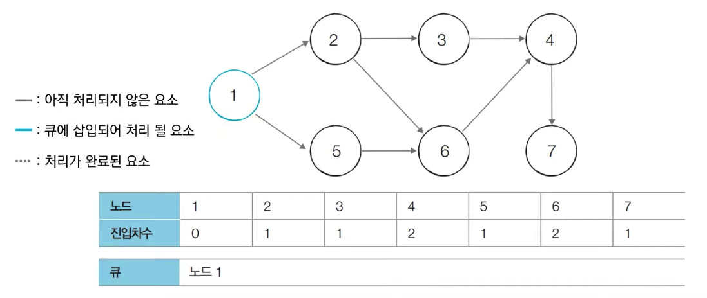

# 위상정렬, topology sort
- 방향 그래프의 모든 노드를 방향성에 거스르지 않도록 순서대로 나열하는 것
- ex> 선수과목을 고려한 학습순서 설정
- 그래프는 사이클이 없는 방향 그래프(DAG)여야 함
- 답이 여러가지가 될 수 있음

## 1. 관련 용어
### 진입차수(indegree)
- 특정 노드에 들어오는 간선의 개수

### DAG
- 사이클이 없는 방향 그래프

## 2. 동작과정
1. 진입차수가 0인 노드를 큐에 넣는다
2. 큐가 빌 때까지 반복
   1. 큐에서 원소를 꺼내 해당 노드에서 출발하는 간선을 그래프에서 제거
   2. 새롭게 진입차수가 0이 된  노드를 큐에 넣는다.



- 초기 단계
  - 진입차수가 0인 노드를 큐에 넣음
  - 현재 노드1의 진입차수만 0이기 때문에 큐에 노드 1만 삽입

- 반복
  - 큐에 들어 있는 노드1을 꺼낸다.
  - 노드1과 연결된 간선 제거
  - 연결되어 있던 노드 2와 노드5 진입차수 -1
  - 진입차수가 0인 노드를 큐에 삽입
  


### 주의 
- 모든 원소를 모두 방문하기 전에(큐에서 원소가 v번 추출되기 전) 큐가 빈다면 **사이클이 존재한다는 의미**
  - 사이클이 존재하는 경우 어떠한 원소도 큐에 들어가지 못하기 때문
  
```python
'''
7 8
1 2
1 5
2 3
2 6
3 4
4 7
5 6
6 4
'''

from collections import deque

# 노드의 개수와 간선의 개수 받기
v, e = map(int, input().split())
# 모든 노드에 대한 진입차수는 0으로 초기화
indegree = [0 for i in range(v + 1)]
# 모든 노드에 연결된 간선 정보를 담기 위한 연결리스트(그래프) 초기화
graph = [[] for _ in range(v + 1)]

# 방향 그래프의 모든 간선 정보 입력받기
for _ in range(e):
    a, b = map(int, input().split())
    graph[a].append(b)
    indegree[b] += 1                    # 연결된 간선에 따라 진입차수 계산

# 위상 정렬 함수
def topology_sort():
    res = []                            # 수행 결과 저장 리스트
    q = deque()

    for i in range(1, v + 1):
        if indegree[i] == 0:
            q.append(i)

    while q:
        # 큐에서 원소 꺼내기
        node = q.popleft()
        res.append(node)

        for c in graph[node]:
           indegree[c] -= 1             # 해당원소와 연결된 노드들의 진입차수에서 1 빼기

           if indegree[c] == 0:
               q.append(c)              # 진입차수가 0이 되는 노드를 큐에 삽입
    return res

res = topology_sort()

print(res)
# [1, 2, 5, 3, 6, 4, 7]
```

## 시간복잡도
- O(v + e)
  - 차례대로 모든 노드를 확인하며 각 노드에서 나가는 간선을 차례대로 제거해야 한다.