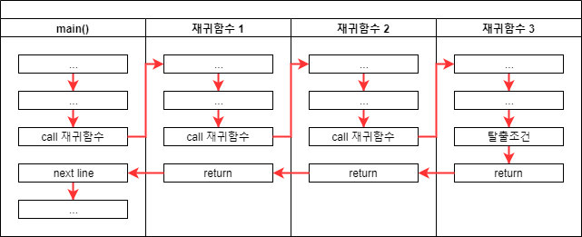

# 재귀함수 recursive functions

<h2>개념</h2>

- 함수 안에서 함수 자기 자신을 호출하는 방식
- 재귀함수에서 호출되는 각각의 함수는 새로운 공간을 확보해서 매번 전혀 다른 공간에서 작업합니다.
- 무한적으로 불러내지 않도록 **탈출조건**을 설정해야 합니다.
- 수학적 귀납법과 점화식을 생각하면 편합니다.
    - 초기값이 주어지고,  f(n)이 옳다고 가정할 때, f(n+1)이 옳으면, 모든 정수 n에 대해 옳다.
    - f(n) = ..의 식을 코드로 표현하고, 초기값을 탈출 조건으로 설정하면 됩니다.




<h6>출처 :http://10bun.tv/beginner/episode-4/#%E1%84%8C%E1%85%A2%E1%84%80%E1%85%B1%E1%84%92%E1%85%A1%E1%86%B7%E1%84%89%E1%85%AE%E1%84%8B%E1%85%B4-%E1%84%92%E1%85%A9%E1%84%8E%E1%85%AE%E1%86%AF-%E1%84%86%E1%85%B5%E1%86%BE-%E1%84%85%E1%85%B5%E1%84%90%E1%85%A5%E1%86%AB-%E1%84%80%E1%85%AA%E1%84%8C%E1%85%A5%E1%86%BC</h6>

<h2>시간복잡도</h2>

1. 최선의 경우
   - 비교횟수 : n-1번 O(n)
2. 최악의 경우(입력 자료가 역순일 경우)
   - 비교횟수 : (n-1)*(n-2)/2 >> O(n**2)
   - 교환횟수 : (n-1)*(n-2)/2 + 2(n-1) >> O(n**2)

<h2>알고리즘</h2>

- 배열의 두 번째 요소부터 앞쪽(왼쪽)의 자료와 비교-교환한다.
- 다음 반복에서 세 번째 요소부터 왼쪽의 요소들과 비교-교환한다.
   ...

---

<h2>예시코드 1_factorial </h2> 
<details>
<summary> </summary>
<div markdown="1">

```python
def factorial(n):
    if n < 2:
        return n
    
    return n * factorial(n-1)
```
</div>
</details>
---
<h2>예시코드 2_fibonacci</h2> 
<details>
<summary> </summary>
<div markdown="1">

```python
def fibonacci(n):
    if n < 2:
        return n
    
    return fibonacci(n-1) + fibonacci(n-2)
```
</div>
</details>
---
---
<h2>예시코드 3_회문 판별하기</h2> 
<details>
<summary> </summary>
<div markdown="1">

```python
def ispalindrome(word):
    if len(word) < 2:
        return True
    if word[-1] != word[1]:
        return False
    
    return ispalindrome(word[1:])
```
</div>
</details>
---

<h2>예시코드 4_순차탐색</h2> 
<details>
<summary> </summary>
<div markdown="1">

```python
def search(li, target, srt = 0):

    if srt > len(li)-1:
        return -1
    if li[srt] == target:
        return srt
    
    return search(li,target, srt = srt +1)

a = [1, 2, 3, 4, 5 ,6]
print(search(a, 5))
```
</div>
</details>
---

<h2>예시코드 5_2진수 변환</h2> 
<details>
<summary> </summary>
<div markdown="1">

```python
def dec_to_bin(n):

    if n < 2:
        return str(n)
    
    return dec_to_bin(n // 2) + dec_to_bin(n % 2)


print(dec_to_bin(10))
```
</div>
</details>

<h2>예시코드 6_배열의 합</h2> 
<details>
<summary> </summary>
<div markdown="1">

```python
def my_sum(li):


    if len(li) == 1:
        return li[0]
    
    return li[0] + my_sum(li[1:])

a = [1]

print(my_sum(a))

```
</div>
</details>

---
</div>
</details>

<h2>예시코드 7_</h2> 
<details>
<summary> </summary>
<div markdown="1">

```python


```
</div>
</details>
---
<h2>장단점</h2>

- 장점
1. 간결하고 직관적인 코드를 제공
- 단점
1. 메모리 및 프로세스 측면에서 일반적인 소스코드와 비교했을 때 비효율적

---
> TIP
>
    함수의 실행코드는 메모리에 한 번만 저장되어 같은 공간인 것이 맞습니다.
    다만, 로컬 변수 및 파라메터 등은 전혀 다른 공간에서 새로 생성되어 이전 함수 호출과 전혀 연관없는 진행이이루어집니다.
    따라서 호출할 때마다 새로운 객체가 생성된다고 생각하시면 됩니다.
