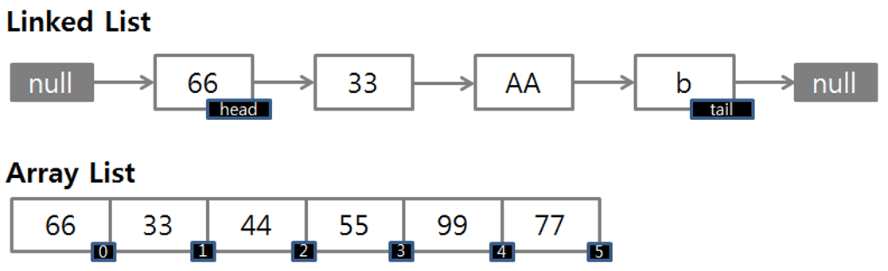
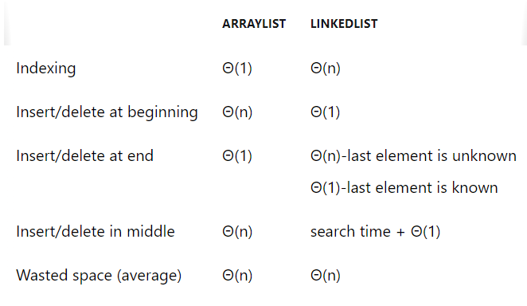

# LinkedList
- 배열에 값을 추가/삭제가 유용하도록 하는 자료 구조
- (파이썬에서는 리스트가 모든 기능을 지원하긴 함. 이어붙이기, 중간삽입, 삭제)
 

## 용어
- node : 데이터와 다음 데이터를 가르키는 주소(pointer)로 이루어져 있음
- pointer : 각 노드에서 다음 데이터를 가르키는 주소값을 가짐
- head : 링키드리스트에서 시작점인 데이터를 의미
- tail : 링키드리스트에서 가장 마지막 데이터 의미
- next=None : 다음 데이터가 없는 경우, 포인터의 주소값은 None

## 장점
- 자료의 삽입과 삭제가 용이하다.
- 리스트 내에서 자료의 이동이 필요하지 않다.
- 사용 후 기억 장소의 재사용이 가능하다
- 연속적인 기억 장소의 할당이 필요 없다
- 수정 시 시간복잡도 : O(1)
  
## 단점
- 포인터 사용으로 인해 저장 공간의 낭비가 있다.
- 알고리즘이 복잡하다
- 특정 자료의 탐색 시간이 많이 소요
  

## 배열 리스트와 차이점
- linkedlist : 일정한 자료형의 변수들을 연결하여 사용
 

## 구현
### 1. deque
```python
from collections import deque

linked_list = deque()
linked_list.append("first")
linked_list.append("second")
linked_list.append("third")
print(linked_list)
# deque(['first', 'second', 'third'])

linked_list.insert(1, 'fourth')
print(linked_list)
# deque(['first', 'fourth', 'second', 'third'])
linked_list.pop()
linked_list.remove('fourth')
```
###  deque로 linkedlist를 구현해야 할 때
- 앞과 뒤에서 요소를 삭제 및 삽입만이 필요할 때(중간 위치에서 하면 시간복잡도 커짐)
- 제자리 내부반전
- 성능보다 스토리지가 우선일 때, 요소 모두가 자체로 개별 요소로서 받는 것이 아닐 때


### 2. llist package사용
- `pip install llist`
  
```python
import llist
from llist import sllist, sllistnode

# a singly linked list
lst = sllist(['first','second','third'])
print(lst)
# sllist(['first','second','third'])
print(lst.first)
# sllistnode(first)
print(lst.last)
# sllistnode(third)
print(lst.size)
# 3

# 값 추가
lst.append('fourth')
node = lst.nodeat(2)
lst.insertafter('fifth', node)

# popping
lst.pop()

# removing
node = lst.nodeat(1)
lst.remove(node)

```

### 3. strucklinks
- `pip install strucklinks`
- 다양한 자료구조를 시각화하고 쉽게 접근하도록 할 때 사용
```python
import structlinks
from structlinks import LinkedList

lst = LinkedList()

lst = LinkedList(1, 10.0, 'string')
# [1 -> 10.0 -> sting]
el = lst[0] # 1

lst[0] = 10
# [10 -> 10.0 -> sting]

lst.append('another string')
lst.insert(1, 0.0)
# [10 -> 0.0 -> 10.0 -> sting -> another string]
```

### 4. 직접 구현
```python
class Node:

    # 노드 생성
    def __init__(self, data, next=None):
        self.data = data
        self.next = next # 다음 데이터 주소

    @staticmethod
    def add(data):
        node = head

        while node.next:
            node = node.next
        node.next = data

node1 = Node(1)
head = node1
node2 = Node(3)
# 노드 연결하기
node1.next = node2

print(node1.next.data) # 3
print(node2.data) # 3

node2.add(Node(5))
print(node2.next.data) # 5

node = head
while node.next:
    print(node.data, end = " ")
    node = node.next
    if not node.next:
        print(node.data)
# 1 3 5
```
<h6>참조 : https://ybworld.tistory.com/85</h6>