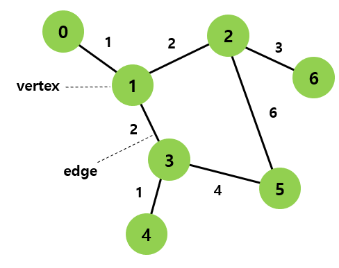

# graph
- 단순히 노드와 그 노드를 연결하는 간선을 하나로 모아 놓은 자료 구조
- 연결되어 있는 객체 간의 관계를 표현하는 비선형 자료구조
- 가장 일반적인 자료 구조

## 그래프의 정의
- 그래프 G : (V, E)로 표시 
- V : 정점(vertex)의 집합
- E : 간선(edge)의 집합
- 정점(vertex) : 여러 가지 특성을 가질 수 있는 객체. 노드라고도 함
- 간선(edge) : 정점 간의 관계를 의미. link라고도 함

  
## 그래프의 종류
1. 무방향 그래프(Undirected graph)
   - 무향 엣지 : 양방향을 의미
2. 방향 그래프(directed graph)
   - 엣지를 통해 한 방향으로만 갈 수 있음
   - **차수**
    1. 진입 차수 : 외부에서 오는 엣지의 수
    2. 진출 차수 : 외부로 향하는 엣지의 수
    - 진출 차수의 합 = 진출 차수의 합 = 그래프 내에 엣지 수
3. 가중치 그래프
   - 간선에 값이 걸려 있는 그래프
4. 루트 없는 트리(unrooted Tree)
5. 이분 그래프(bipartite graph)
6. 사이클없는 방향 그래프(directed acycleic graph)

## 경로의 길이
- 경로를 구성하는 **엣지의 수**

## 그래프의 연결성
### 연결 그래프(connected graph)
- 무향 그래프G에 있는 모든 정점 쌍에 대하여 경로가 존재할 경우
- 모든 정점이 다른 정점에 갈 수 있는지가 중요
- 그래프가 네트워크를 의미할 때, 그래프의 연결성 = 네트워크의 reliability

### 트리(tree)
- 무순환 연결 그래프(connected acyclic graph)
- 시작 정점에서 다시 시작 정점으로 돌아올 떄 이미 방문한 엣지를 무조건 다시 방문하지 않고서 불가능한 구조
- 연결성 입장에서 최소한의 연결로 구성됨

### 완전 그래프(complete graph)
- 모든 정점이 서로 연결되어 있는 그래프
- n개의 정점을 가지는 완전 그래프의 엣지 개수
    - 무향 : n(n-1)/2
    - 유향 : n(n-1)
    
## 그래프 구현
### 1. 인접행렬
- 그래프의 연결관계를 **이차원 배열**로 나타내는 방식 
- 정점의 개수 : K 일 때
- K * K matrix
- row : 해당 정점의 연결 상태(공간 복잡도 : O(n**2). 희소그래프일 경우 비효율적)
    - 자가 루프가 없는 단순 그래프의 경우 인접행렬의 대각선 성분은 0
    - 무향그래프 인접행렬은 대칭행렬
```python


for i in range(1, K):
    for j in range(1, K):
        

```

### 2. 인접리스트
- 각 정점에 인접한 정점들을 연결리스트로 표현
- 정점이 n개인 그래프라면 n개의 연결리스트 구성
- 각 연결리스트 요소마다 포인터 변수가 리스트의 **처음 노드(0)를 가르킴**
- 연결 리스트가 없는 경우, 즉 차수가 없는 경우 포인터 변수값은 null
- **공간복잡도** : O(n + m) ( n : 정점의 개수, m : 엣지 개수)
    1. 무향그래프 : n + 2m (양방향이기 때문)
    2. 방향그래프 : n + m (단방향이라 중복 표기가 없음)

    
<h6><참조> : https://daebaq27.tistory.com/25 </h6>