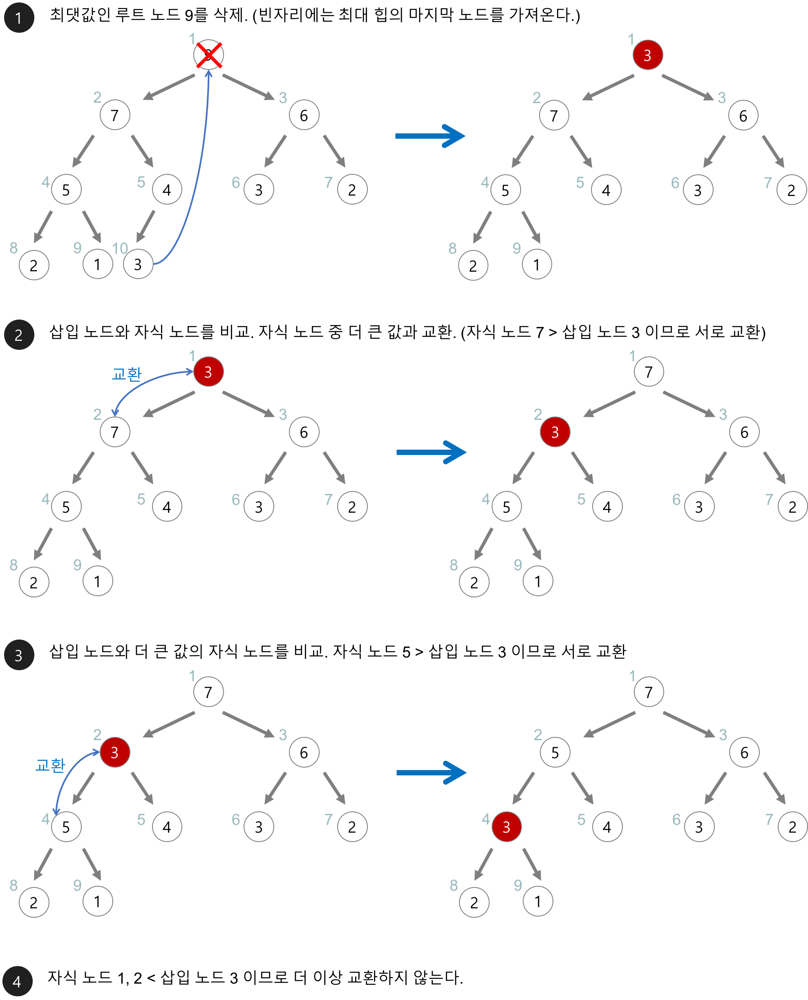

# 힙(heap)
<h6> 출처 : https://gmlwjd9405.github.io/2018/05/10/data-structure-heap.html</h6>
<h6> 출처 : https://ojt90902.tistory.com/572</h6>
<h6> 출처 : https://m.blog.naver.com/PostView.naver?isHttpsRedirect=true&blogId=leeinje66&logNo=221622360256</h6>

## 사전 지식
- 우선순위 큐 : 우선순위 개념을 큐에 도입한 자료구조
  - 데이터들이 우선순위를 가지고 있고 우선순위가 높은 데이터가 먼저 나감
  
    |자료구조|삭제되는 요소|
    |:------:|:---:|
    |스택(stack)|가장 최근에 들어온 데이터|
    |큐(queue)|가장 먼저 들어온 데이터|
    |우선순위 큐(priority queue)|가장 우선순위가 높은 데이터|
- 이용사례
  1. 시뮬레이션 시스템
  2. 네트워크 트래픽 제어
  3. 운영체제에서의 작업 스케쥴링
  4. 수치 해석적인 계산
- 구현
  - 배열, 연결리스트, <mark>**힙**</mark>
  - 힙이 가장 효율적

|구현방법|삽입|삭제|
|:---:|:---:|:---:|
|순서없는 배열|O(1)|O(n)|
|순서없는 연결리스트|O(1)|O(n)|
|정렬된 배열|O(n)|O(1)|
|정렬된 연결리스트|O(n)|O(1)|
|힙(heap)|O(logn)|O(logn)|

## 힙이란?
- 우선순위 큐(priority queue)를 위해 만들어진 자료구조
- 완전 이진 트리의 일종
- 여러 개의 값들 중 최댓값이나 최솟값을 빠르게 찾아내도록 만들어진 자료구조
- 힙은 일종의 반정렬 상태를 유지
  - 부모노드의 키 값이 자식 노드의 키 값보다 항상 큰(작은) 이진트리
- 힙트리는 중복된 값 허용(이진 탐색 트리는 중복값 허용 안함)

## 종류
- 최대 힙(max heap)
  -  부모 key >=  자식 key
- 최소 힙(min heap)
  - 부모 key <=  자식 key


## 구현
### 힙의 세가지 규칙(max heap기준)
1. 루트 노드가 항상 최댓값을 가진다.
2. 반드시 완전 이진 트리이어야 한다.
3. 최대 힙 내에 임의의 노드를 루트로 하는 서브트리 또한 최대 힙이다.

### 구현 1. 배열
- 첫번째 인덱스(i = 0)는 사용하지 않음
- 특정 위치의 노드 번호는 새로운 노드가 추가되어도 변하지 않음
  - 예 : 루트 노드의 오른쪽 노드의 인덱스는 항상 3
- **힙에서 부모노드와 자식노드의 관계**
  - `왼쪽 자식의 인덱스 = 부모의 인덱스 * 2`
  - `오른쪽 자식의 인덱스 = 부모 인덱스 * 2 + 1`
  - 부모의 인덱스 = 자식 인덱스 //2
  
  

### 1.1 삽입 연산
1. 힙의 끝에 요소 삽입
2. 부모노드와 비교를 통해 제자리로 이동

  

 
### 1.2 삭제 연산
1. root와 힙 가장 끝 값과 교환
2. `data.pop()`을 통해 최대값 제거 및 반환
3. maxheapify()로 현재 루트를 제자리로 위치시키기(다시 보기)
   
  

```python
class MaxHeap:
    def __init__(self):
        self.data = [None]

    def insert(self, item):
        self.data.append(item)

        i = len(self.data) - 1 # 끝 부분 인덱스
        while i > 1: # 부모노드가 나보다 작을 때까지 재정렬
            if self.data[i] > self.data[(i//2)]:
                self.data[i], self.data[(i//2)] = self.data[(i//2)], self.data[i]
                i = i//2
            else:
                break
    
    def remove(self):
        if len(self.data) > 1: # 힙에 자료가 두개 이상일 때만
            self.data[1], self.data[-1] = self.data[-1], self.data[1]
            data = self.data.pop() # 루트와 마지막 노드 교환 후 루트 제거
            self.maxheapify(1) # 루트에 있는 마지막 노드를 제 위치로 정렬
        else: # 힙에 자료가 하나일 때
            data = None 
        return data

    # 삭제 과정에서 자식 노드 우선순위 결정(max heap 기준)
    def get_priority(self, i):
        if len(self.data) -1 >= i * 2 + 1:
            if data[i*2] < data[i * 2 + 1]:
                return 2 * i + 1
            else:
                return 2 * i
        elif len(self.data) -1 == i * 2:
            return i * 2
        else:
            return -1

    # 삭제과정에서 부모노드가 제자리로 찾아갈 수 있도록 재귀적 교환
    def maxheapify(self, i):
        # 자식노드 중 큰 값을 대상으로
        child = get_priority(i)
        smallest = i

        if child == -1:
            return
        else: # 자식 노드가 있고 자식 노드 중 높은 우선순위의 노드
            if self.data[i] < self.data[child]:
                self.data[i], self.data[child] = self.data[child], self.data[i]
                self.maxHeapify(child)
            else: # 우선순위가 낮은 자식노드도 비교해보기
                if child % 2:
                    child -= 1
                else:
                    child += 1
                    
                if self.data[i] < self.data[child]:
                    self.data[i], self.data[child] = self.data[child], self.data[i]
                    self.maxHeapify(child)
```

### 2. heapq 모듈
### 2.1 **최소 힙** 생성 및 원소 추가
```python
import heapq

heap = []
heapq.heappush(heap, 50)
heapq.heappush(heap, 10)
heapq.heappush(heap, 20)

print(heap) # [10, 50, 20]

# 생성된 배열을 바로 힙으로 바꾸기
heap2 = [50 ,10, 20]
heapq.heapify(heap2)

print(heap2)

```

### 2.2 원소 삭제
- 가장 작은 값을 힙에서 제거함과 동시에 그 결과 값으로 리턴
  
```python
result  = heapq.heappop(heap)
print(result) # 10
print(heap) # [20, 50]
```

### 2.3 **최대 힙** 생성 및 원소 추가
```python
heap_item = [1,3,5,7,9]

max_heap = []

for item in heap_item:
    heapq.heappush(max_heap, (-item, item))
print(max_heap) # [(-9, 9), (-7, 7), (-3, 3), (-1, 1), (-5, 5)]
```
<h6> 출처 : https://m.blog.naver.com/PostView.naver?isHttpsRedirect=true&blogId=leeinje66&logNo=221622360256</h6>

### 꽌심 3
### - 3.1 삽입연산

1. 삽입할 자리 확장
2. 확장한 자리에 삽입할 원소 저장
3. 삽입 노드 23 > 부모 노드 19 : 자리 바꾸기
4. 삽입 노드 23 > 부모노드 20 : 자리 바꾸기
5. 비교할 부모 노드가 없으므로 자리 확정

### -3.2 삭제 연산(최대 힙)

- 힙에서는 루트 노드의 원소만을 삭제할 수있다.
- 루트 노드의 원소를 삭제하여 반환
- 힙의 종류에 따라 최대값 또는 최소 값 구할 수 있음
1. 루트 원소 삭제
2. 마지막 노드를 삭제 및 루트에 저장
3. 삽입 노드 10 < 자식 노드 19 : 자리 바꾸기
    1. 자식노드가 2개라면, 둘 중 큰 값과 비교
4. 비교할 자식 노드 없으므로 자리 확정

```python
#  최대 힙

# 삽입 연산
def enq(n):
    global last
    last += 1           # 마지막 정점 추가
    heap[last] = n      # 마지막 정점에 KEY 추가
    
    c = last
    p = c // 2  # 완전이진트리에서 부모 정점 번호
    while p and heap[p] < heap[c]:  # 부모가 있고, 부모 < 자식인 경우 자리 교환
        heap[p], heap[c] = heap[c], heap[p]
        c = p
        p = c// 2

# 삭제 연산
def deq():
    global last
    
    tmp = heap[1]           # 루트 백업
    heap[1] = heap[last]    # 삭제할 노드의 키를 루트에 복사
    last -= 1               # 마지막 노드 삭제
    p = 1                   # 루트에 옯긴 값을 자식과 비교
    c = p * 2               # 왼쪽 자식
    while c <= last:        # 자식이 하나라도 있으면
        if c+1 <= last and heap[c+1]> heap[c]:     # 오른쪽 자식이 있꼬 오른쪽 자식이 더 크면
            c += 1          # 비교 대상을 오른쪽 자식으로 정함

        if heap[p] < heap[c]:   # 자식이 더 크면 최대 힙 규칙에 어긋나므로
            heap[p], heap[c] = heap[c], heap[p]
            p = c               # 자식을 새로운 부모로
            c = p*2             # 왼쪽 자식 번호를 계산
        else:                   # 부모가 더 크면 중단
            break
    return tmp
            
heap = [0] * 100
last = 0

enq(2)
enq(5)
enq(7)
enq(3)
enq(4)
enq(6)
print(heap)
while last:
    print(deq(), end=' ')
```