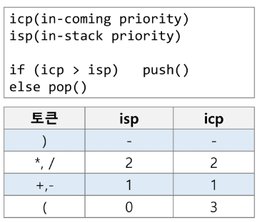

# 스택을 이용한 문자열 계산식 계산

- step1 : 중위 표기법의 수식을 후위 표기법으로 표현(스택 이용)
- step2 : 후위 표기법의 수식을 스택을 이용하여 계산한다.

## **중위 표기법(infix notation)**
- 연산자를 피연산자의 가운데 표기하는 방법
- 예> A+B
## **후위 표기법(postfix notation)**
- 연산자를 피연산자 뒤에 표기하는 방법
- 예 > AB+

## step1. 중위표기식의 후위 표기식 변환 방법1
- 수식의 각 연산자에 대해 우선순위에 따라 괄호를 사용하여 다시 표현
- 각 연산자를 그에 대응하는 오른쪽 괄호의 뒤로 이동시킨다.

### 예
- A*B-C/D
  - 1단계 : ((A*B) - (C/D))
  - 2단계 : ((AB)* - (CD))
  - 3단계 : AB*CD/-

### 알고리즘(stack 이용)
1. 입력 받은 중위 표기식에서 토큰을 읽는다.
2. 토큰이 피연산자일 때, 새 배열에 저장
3. 토큰이 연산자(괄호 포함)일 때, 
   1. 이 토큰이 스택의 top에 저장되어 있는 연산자보다 우선순위가 높으면 스택에 push
   2. 그렇지 않다면(우선순위가 낮다면) 스택 top의 연산자의 우선순위가 토큰의 우선순위보다 작을 때까지 스택에서 pop한 후 토큰의 연산자를 push.
   3. 만약 top에 연산자가 없으면 push
4. 토큰이 오른쪽 괄호 ’)’일 때,
   1. 스택 top에 왼쪽 괄호 ‘(’가 올 때까지 스택에 pop연산을 수행
   2. pop한 연산자를 새 배열에 저장
   3. 왼쪽괄호를 만나면 pop
5. 중위 표현식에 더 읽을 것이 없다면 중지, 더 읽을 것이 있다면 1부터 다시 반복
6. 스택에 남아있는 연산자를 모두 pop - 새배열에 저장
    - 스택 밖의 왼쪽 괄호는 우선 순위가 가장 높으며, 스택안의 왼쪽 괄호는 우선 순위가 가장 낮다.

  
 
## step2. 후위 표기법의 수식을 스택을 이용하여 계산

1. 피연산자를 만나면 스택에 push한다.
2. 연산자를 만나면 필요한 만큼의 피연산자를 스택에서 pop하여 연산하고, 연산 결과를 다시 스택에 push한다.
3. 수식이 끝나면 마지막으로 스택을 pop하여 출력한다.

## 구현
```python

# 1. 후위 표기법 만들기
state = '(6+5*(2-8)/2)'

# 1. 후위 표기법 만들기

# 토큰:[isp, icp]
priority = {'+':[1, 1], '-':[1, 1], '/':[2, 2], '*':[2, 2], '(':[0, 3]} 
operators = ['+', '-', '/', '*', '(']
stack = []
postfix_arr = []

for x in state:
    
    if x ==  ')':
        while len(stack) > 0 and stack[-1] != '(':
            postfix_arr.append(stack.pop())
                
    elif x in operators:
        
        while len(stack) > 0 and priority[stack[-1]][0] >= priority[x][1]:
            top = stack.pop()
            if top != '(':
                postfix_arr.append(top)

        stack.append(x)# 우선순위에 따라 stack에 pop 시킨 후 stack에 연산자 넣기
            
    else: # 숫사일 때 바로 배열에 저장
        postfix_arr.append(x) 
        

while stack: # 스택에 남아있는 연산자 ( 빼고 배열에 저장
    top = stack.pop()
    if x != '(':
        postfix_arr.append(top)

print(postfix_arr)

# 6528-*2/+

# 2. 후위 표기법의 수식을 스택을 이용하여 계산하기
temp = []
i = 0
while i < len(postfix_arr):
    x = postfix_arr[i]
    if x not in operators:
        temp.append(x)
        i += 1
    else:
        B = int(temp.pop())
        A = int(temp.pop())
        
        if x == '-':
            temp.append(A-B)
        elif x == '+':
            temp.append(A+B)
        elif x == '/':
            temp.append(A/B)
        elif x == '*':
            temp.append(A*B)
        i += 1
        
result = temp.pop()
print(result)


```

