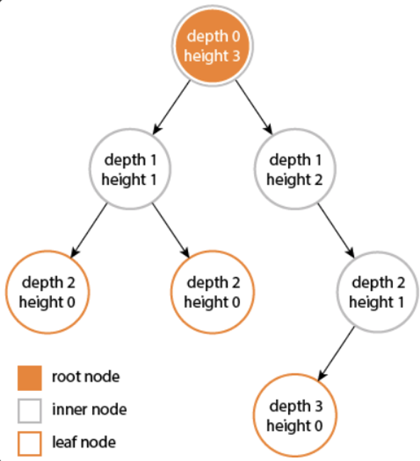

# 트리
- 노드들이 나무가지처럼 련결된 비선형 계층적 자료구조
- 트리 내에 트리가 있는 재귀적 자료 구조
- 예
  - 파일 및 폴더

## 구성
- 루트 : 차상위 노드
- 부모 노드
- 자식 노드
- 형제 노드

## 용어
- 노드 : 트리를 구성하는 기본 요소
- 간선(edge) : 노드와 노드간 연결선
- 루트 :트리 구조에서 부모가 없는 최상위 노드
- 깊이 : 루트에서 어떤 노드까지의 간선 수
- Level : 루트에서 어떤 노드ㅡ까지의 간선 수
- degree : 노드의 자식 수
- path : 한 노드에서 다른 한 노드에서 이르는 길 사이에 놓여 있는 노드들의 순서
- distance :두 노드 사이의 최단 경로에 있는 간선 수

