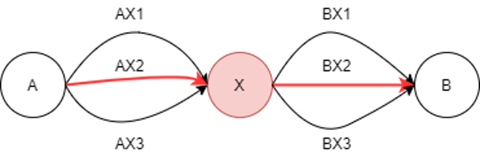

# DP(Dynamic Programming) 동적계획법
좀 더 조사-공부하기
- 최적화 문제를 해결하는 패러다임
- 같은 인풋에 대한 반복되는 호출을 하는 솔루션을 만났을 때, 즉 중복 컴퓨팅을 개선하는 방법론
- 입력 크기가 작은 부분들을 모두 해결한 후에 그 해들을 이용하여 보다 큰 크기의 문제 해결하는 순

## DP 적용되기 위한 조건 2가지
1. 겹치는 부분 문제(overlapping subproblems)
   - 문제를 나누고 그 문제의 결과 값을 재활용해서 전체 답을 구함.
   - 동일한 작은 문제들이 반복하여 나타나는 경우에 사용 가능
   
2. 최적 부분 구조(optimal substructure)
   - 부분 문제의 최적 결과 값을 사용해 전체 문제의 최적 결과를 낼수 있는 경우를 의미
   - 만약 A-B까지 가장 짧은 경로를 찾고자하는 경우에 예시로 할 때, 많은 경로 중 A-AX2/BX2-B가 가장 짧은 경로라면 전체 최적 경로 

  

## 순서
1. DP로 풀 수 있는 문제인지 확인 >> 조건 충족 확인하는지 체크
2. 문제의 변수 파악(state) >> 문제 내 변수의 개수를 파악
3. 변수 간 관계식 만들기(점화식)
4. memo하기(memoization)
5. 기저 상태 파악 >> 가장 작은 문제의 상태 파악 ex> f(0) = 0, f(1) = 1
6. 구현

## 종류

1. memoization
   - 재귀 사용.
   - 위에서 부터 호출을 시작하여 dp[0]까지 내려간 다음, 결과값을 재귀를 통해 전의시켜 재활용하는 방식
   - 함수의 중복호출을 방지하고자 결과를 저장하는 것
   - top down
2. tabulation
   - 반복문 사용
   - 아래에서부터 계산을 수행하고 누적시켜서 큰 문제 해결
   - 도표를 작성이라는 뜻
   - 입력 크기가 작은 부분부터 해결하면서 그 해들을 이용하여 보다 큰 크기의 문제 해결
   - bottom up
    
## memoization
- 컴퓨터 프로그램을 실행할 때 **이전에 계산한 값을 메모리에 저장**하여 매번 다시 계산하지 않도록 전체적인 실행 속도를 빠르게 하는 기술
- 동적 계획법의 핵심이 되는 기술
- 메모리에 넣기라는 의미
- ~~memorization 아님 주의~~
- fibo(n)을 계산하자마자 저장하면(memoize) 실행 시간을 O(n)으로 줄일 수 있다.

### 구현1
```python
def fibo1(n):
    if n >= 2 and len(memo) <= n:
        memo.append(fibo1[n-1] + fibo1[n-2])
    
    return memo[n]

memo = [0, 1]
print(fibo1(10)) # 55
```
### 구현2
```python
def fibo2(n):
    if memo[n]==-1:
        memo[n] = fibo2(n-1) + fibo2(n-2)
    return memo[n]

memo = [-1] * 101
memo[0] = 0
memo[1] = 1

for i in range(101):
    print(i, fibo2(i))

```

## tabulation
1. 문제를 부분 문제로 분할
2. 부분 문제로 나누는 일을 끝냈으면 가장 작은 부분 문제부터 해를 구한다.
3. 그 결과는 테이블에 저장하고, 테이블에 저장된 부분 문제의 해를 이용하여 상위 문제의 해를 구한다.

```python
def fibo3(n): # iterative 방식 : fib2()
    f = [0, 1]

    for i in range(2, n + 1):
        f.append(f[n-1] + f[n-2])

    return f[n]
```

- 정리하자면, DP는 재귀함수를 interative 방식으로 수행해서 부분 문제를 저장하고 각 문제를 해결해서 종합하는 방식
- 반복적 구조로 DP를 구현하는것이 효율적
