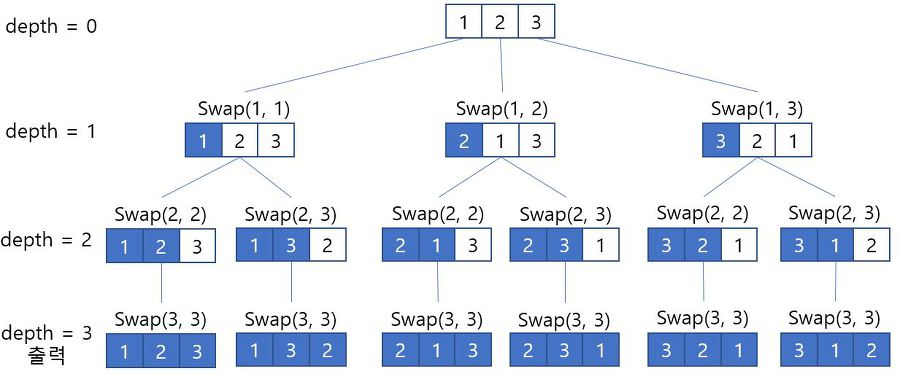
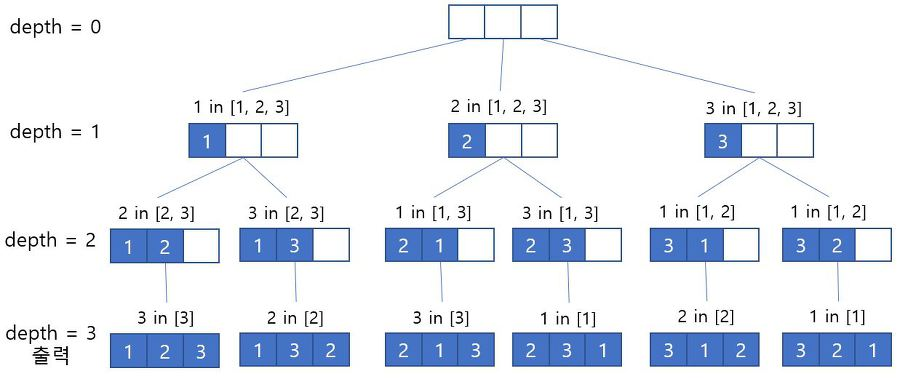

# 순열(pernutation)
<h6>참조 : https://m.blog.naver.com/PostView.nhn?isHttpsRedirect=true&blogId=ssang8417&logNo=222147007019</h6>
<h6>참조 : https://bcp0109.tistory.com/14</h6>
## 1. 순열이란?
- 서로 다른 n개 중 r개를 골라 순서를 고려하여 나열한 경우의 수
- 순서가 부여된 임의의 집합을 다른 순서로 뒤섞는 연산
- nPr : n!/(n-r)!


## 2. 순열 구하는 방법
### 2.1 재귀함수와 swap함수를 이용해 배열 값을 직접 변경하여 순열을 구하는 방법
1. swap함수 만들어서 배열들을 직접 바꾸기
2. 배열의 첫 값부터 순서대로 하나씩 바꾸며 모든 값을 한번씩 swap
3. depth 기준 인덱스로 depth보다 인덱스가 작은 값들은 그대로 고정하고 depth보다 큰 값들만 가지고 다시 swap
- 간단하고 코드도 깔끔하게 나오지만 순열의 순서가 보장되지 않음

```python
def permutation(arr, depth, n, r):
    if depth == r:
        print(arr[:r])
        return

    for i in range(depth, n):
        swap(arr, depth, i)
        permutation(arr, depth + 1, n, r)
        swap(arr, depth, i)

def swap(arr, depth, i):
    arr[i], arr[depth] = arr[depth], arr[i]


arr = [1, 2, 3]
permutation(arr, 0, 3, 2)
```

### 2.2 재귀함수와 visited 배열을 이용하여 처리한 위치에 대해 참으로 설정하여 순열을 구하는 방법(DFS-backtracking)


1. depth마다 뽑힐 수 있는 가지 수 저장 
2. promising 조건
   1. 해당 요소가 뽑힌 적이 없어야 함
   2. 뽑힌 기록을 저장
3. 뽑고 싶은 수만큼 재귀

```python

def dfs(arr, r, depth, visited, result):
    if depth == r:
        print(result)
        return
    
    for i in range(len(arr)):
        if not visited[i]: # 백트래킹 조건
            result[depth] = arr[i] # 해당 깊이에서 가능한 케이스를 저장
            visited[i] = True
            dfs(arr, r, depth + 1, visited, result) # 방문하지 않은 곳을 찾았다면 그곳을 기준으로 한단계 더 깊이 들어간다.
            visited[i] = False # 다른 케이스에서 visited[i]는 방문하지 않은 상태이다.

arr = [1,2,3]
r = 3
visited = [False for _ in range(r)]
result = [0 for _ in range(r)]
dfs(arr, r, 0, visited, result)  
```