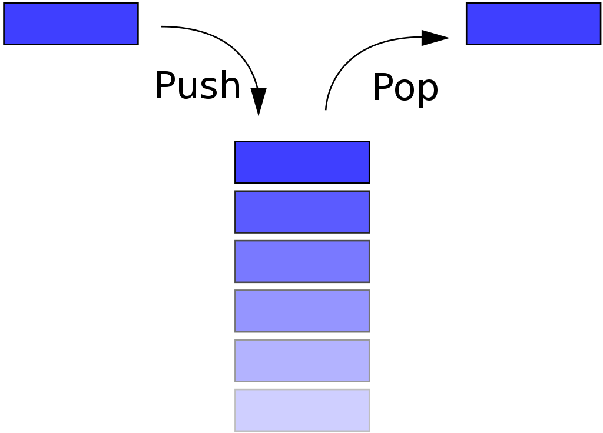
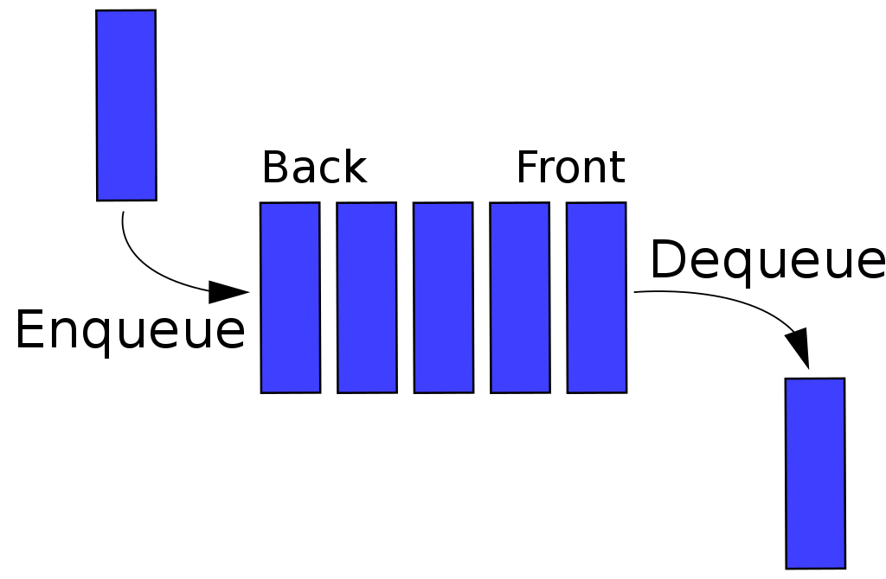

# stack
## 1. 스택이란
- LIFO(Last in, First out) : 후입선출, `나중에 입력된 데이터가 먼저 반환`되도록 설계한 메모리 구조
- 보통 웹의 undo 작업할 때 사용되는 자료구조
- DFS, 깊이우선탐색에 활용되는 자료구조
- 데이터 입력은 push라 하고 출력은 pop이라 한다.
- push는 append() 메서드를, pop은 pop() 메서드를 통해 작업한다.
- pop의 경우, 스택에 데이터가 비어있는지 여부부터 확인해야 함
    - `isEmpty()` : 스택이 비어있는지 여부 확인

  
  
  <h6>출처 : https://ko.wikipedia.org/wiki/스택 </h6>

## 2. 파이썬에서 스택 구현
### 2.1 리스트 이용
- 배열의 뒷 요소를 삭제할 때는 시간 복잡도가 deque와 차이 없음
```python 
stack = []

stack.append('1st floor')
stack.append('2nd floor')
stack.append('3rd floor')
print(stack) 
# ['1st floor', '2nd floor', '3rd floor']

stack.pop() # 3rd floor
stack.pop() # 2nd floor
stack.pop() # 1st floor
```

### 2.2 deque 클래스 활용
```python
from collection import deque
stack = deque()

stack.append('1st floor')
stack.append('2nd floor')
stack.append('3rd floor')
print(stack) 
# ['1st floor', '2nd floor', '3rd floor']

stack.pop() # 3rd floor
stack.pop() # 2nd floor
stack.pop() # 1st floor

```

# Queue
## "큐"란?
- FIFO(First In, First Out) : 선입선출, `먼저 입력된 데이터가 먼저 반환`되도록 설계한 메모리 구조
- 웾에서 순서대로 처리되어야 하는 작업에 적용되는 자료구조
- BFS, 너비우선탐색에 사용되는 자료구조
- 데이터 입력은 enqueue, 출력은 dequeue라고 한다.

  
  
  <h6>출처 : https://ko.wikipedia.org/wiki/큐 </h6>

## 2. 파이썬에서 큐 구현
### 2.1 리스트 이용
- 제거 작업의 시간복잡도가 O(n)이기 때문에 비효율적
```python 
queue = []

queue.append('1st floor')
queue.append('2nd floor')
queue.append('3rd floor')
print(queue) 
# ['1st floor', '2nd floor', '3rd floor']

queue.pop(0) # 1rd floor
queue.pop(0) # 2nd floor
queue.pop(0) # 3st floor
```

### 2.2 deque 클래스 활용
```python
from collection import deque
queue = deque()

queue.append('1st floor')
queue.append('2nd floor')
queue.append('3rd floor')
print(queue) 
# ['1st floor', '2nd floor', '3rd floor']

queue.popleft() # 1rd floor
queue.popleft() # 2nd floor
queue.popleft() # 3st floor
```

## 2.3 queue.Queue() 클래스 사용

```python
from queue import Queue

queue = Queue()
queue.put('1st floor')
queue.put('2nd floor')
queue.put('3rd floor')
print(queue) 
# ['1st floor', '2nd floor', '3rd floor']

queue.get() # 1rd floor
queue.get() # 2nd floor
queue.get() # 3st floor

```
---
# collections의 deque
## deque란
- Double-ended-queue : 배열의 양 끝에 요소를 추가/삭제를 지원한다.
- 리스트 클래스의 pop()메서드와 달리, 양방향에서 시간복잡도가 O(1)인 메서드를 지원한다.
- 데이터 접근은 O(n)의 시간복잡도

## deque method
- 모두 시간복잡도가 O(1)이다.
- append() : add a element into a right side of deque
- appendleft() : add a element into a left side of deque
- pop() : remove a element from a right end of deque
- popleft() : add a element from a left end of deque
---
# queue.Queue() 클래스
## Queue() 클래스란?
- 주로 멀티 스레딩 환경에서 사용되며, 내부적으로 locking을 지원하여 여러 개의 쓰레드가 동시에 데이터를 추가하거나 삭제할 수 있음
- `deque`와 달리 방향성이 없기 때문엘 데이터 추가와 삭제가 하나의 메서드로 처리됨
- 시간복잡도가 O(1)인 메서드를 지원, 데이터 접근은 O(n)의 시간복잡도

## Queue 클래스의 메서드
- `put()` : 데이터를 추가
- `get()` : 배열의 왼쪽의 데이터를 삭제