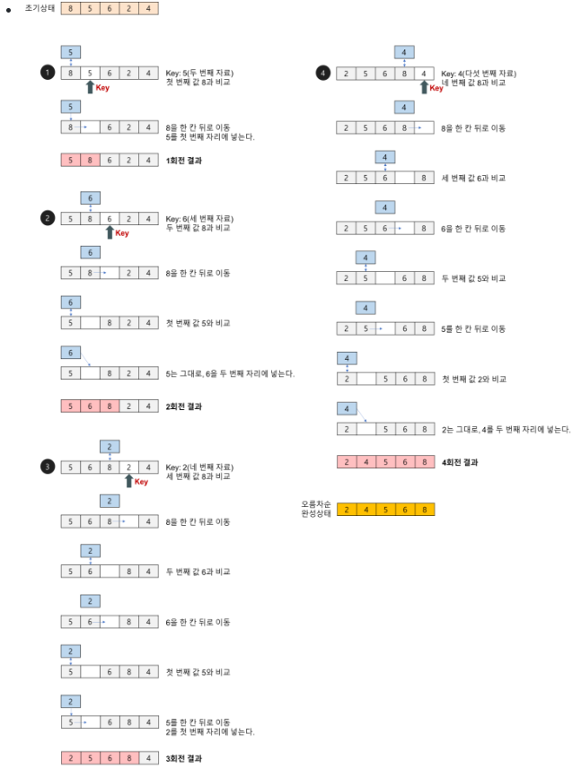

# 삽입정렬
<h2>개념</h2>
- 정렬범위를 1칸씩 확장해나가면서 새롭게 정렬 범위에 들어온 값을 기존의 값들과 비교하여 알맞은 자리에 삽입하는 알고리즘

  
  
  <h6>출처 :https://gmlwjd9405.github.io/2018/05/06/algorithm-insertion-sort.html</h6>

<h2>시간복잡도</h2>

1. 최선의 경우
    - 비교횟수 : n-1번  O(n)
2. 최악의 경우(입력 자료가 역순일 경우)
    - 비교횟수 : (n-1)*(n-2)/2 >> O(n**2)
    - 교환횟수 : (n-1)*(n-2)/2 + 2(n-1) >> O(n**2)
    
<h2>알고리즘</h2>

- 배열의 두 번째 요소부터 앞쪽(왼쪽)의 자료와 비교-교환한다.
- 다음 반복에서 세 번째 요소부터 왼쪽의 요소들과 비교-교환한다.
     ...

---

<h2>예시 코드</h2> 
<details>
<summary> </summary>
<div markdown="1">

```python
def insertion_sort(data, increasing = True):
    #오름차순
    if increasing == True:

        for i in range(1, len(data)):
        
            for j in range(i, 0, -1): 
                if data[j] < data[j-1]:
                    data[j], data[j-1] = data[j-1], data[j]
                else:
                    break


    # 내림차순
    else:

        for i in range(1, len(data)):
        
            for j in range(i, 0, -1): 
                if data[j] > data[j-1]:
                    data[j], data[j-1] = data[j-1], data[j]
                else:
                    break

    return data

if __name__ == '__main__':
    numbers = [7, 4, 11, 9, 2]

    print(insertion_sort(numbers))
    print(insertion_sort(numbers, increasing = False))
```

</div>
</details>

<h2>장단점</h2>

- 장점
  1. 안정적인 정렬 방법
  2. 레코드의 수가 적을 경우 알고리즘이 간단해서 다른 복잡한 정렬보다 유리할 수 있다.
- 단점
  1. 비교적 많은 레코드들의 이동을 포함한다.
  2. 레코드 수가 많고 레코드 크기가 클 경우에 적합하지 않다.

---
