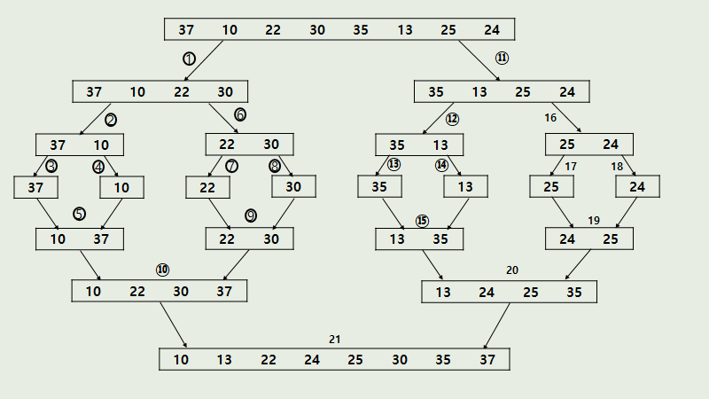

# 합병정렬

<h2>개념</h2>

- 분할 정복(divide and conquer) 알고리즘의 하나
- 문제를 작은 2개로 분리하고 각각을 해결한 다음, 결과를 모아서 원래의 문제를 해결하는 전략

- 한번 순환하고 나면 끝 값이 시퀀스의 max value가 위치한다.

- 그 다음 순환에서는 두 번째 max value가 n-1번째에 위치합니다.
  
  
  <h6>출처 : https://gmlwjd9405.github.io/2018/05/08/algorithm-merge-sort.html </h6>

- 알고리즘
1. 리스트의 길이가 0 or 1이면 이미 정렬된 것으로 본다.
2. 정렬되지 않은 리스트를 절반으로 잘라 비슷한 크기의 두 부분 리스트로 나눈다.
3. 각 부분 리스트를 재귀적으로 합병 정렬한다.
4. 두 부분 리스트를 다시 하나의 정렬된 리스트로 합병한다.

주의
- 추가적 리스트가 필요함
- 각 부분 배열을 정렬할 때도 합병 정렬을 재귀적으로 호출
- 정렬이 이루어지는 시점은 2개의 리스트를 합병하는 단계

---

<h2>예시 코드</h2> 
<details>
<summary> </summary>
<div markdown="1">

```python
def merge_sort(arr):

```

</div>
</details>

---

<h2>장단점</h2>

- 장점
  1. 안정적인 정렬방법
    - 데이터의 분포에 덜 영향을 받는다. 시간복잡도가  nlogn으로 동일
  2. 레코드을 연결리스트로 구성하면, 링크 인덱스만 변경됨으로 데이터의 이동은 무시할 수 있을 정도로 작아진다.
  3. 따라서 크기가 큰 레코드를 정렳할 경우, 연결리스트를 사용한다면, 타 정렬보다 가장 효율적

- 단점
  1. 임시 배열이 필요하고 공간복잡도가 크다.
    - 제자리 정렬이 아님

---

<h2> 시간 복잡도 </h2>
- O(nlogn)
<details>
<summary> </summary>
<div markdown="1">

각 합병 단계의 비교 연산
크기 1인 부분 배열 2개를 합병하는 데는 최대 2번의 비교 연산이 필요하고, 부분 배열의 쌍이 4개이므로 24=8번의 비교 연산이 필요하다. 다음 단계에서는 크기 2인 부분 배열 2개를 합병하는 데 최대 4번의 비교 연산이 필요하고, 부분 배열의 쌍이 2개이므로 42=8번의 비교 연산이 필요하다. 마지막 단계에서는 크기 4인 부분 배열 2개를 합병하는 데는 최대 8번의 비교 연산이 필요하고, 부분 배열의 쌍이 1개이므로 8*1=8번의 비교 연산이 필요하다. 이것을 일반화하면 하나의 합병 단계에서는 최대 n번의 비교 연산을 수행함을 알 수 있다.
최대 n번
순환 호출의 깊이 만큼의 합병 단계 * 각 합병 단계의 비교 연산 = nlog₂n

https://gmlwjd9405.github.io/2018/05/08/algorithm-merge-sort.html

각 합병 단계의 이동 연산
임시 배열에 복사했다가 다시 가져와야 되므로 이동 연산은 총 부분 배열에 들어 있는 요소의 개수가 n인 경우, 레코드의 이동이 2n번 발생한다.
순환 호출의 깊이 만큼의 합병 단계 * 각 합병 단계의 이동 연산 = 2nlog₂n
https://gmlwjd9405.github.io/2018/05/08/algorithm-merge-sort.html

</div>
</details>


---