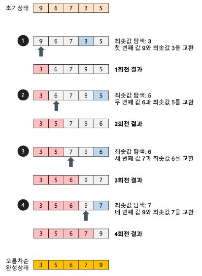

# 선택정렬 selection sort

<h2>개념</h2>

- 가장 작은 값을 찾아서 첫 번째 자리에 놓고 그 다음 작은 값을 2번째 자리에 놓으며 정렬
  
  
  <h6>출처 :https://gmlwjd9405.github.io/2018/05/06/algorithm-selection-sort.html</h6>

- 비교 교환 횟수 : (시퀀스 요소 개수-1)*(시퀀스 요소 개수 -2)/

1. **오름차순**
   
   - `교환 if a[n-1] > a[n]`
   - 다음 인덱스의 값이 현재보다 작다면 교환

2. **내림차순**
   
   - `교환 if a[n-1] < a[n]`
   - 다음 인덱스의 값이 현재보다 크다면 교환

---

<h2>예시 코드</h2> 
<details>
<summary> </summary>
<div markdown="1">

```python
def bubblesort(data, increasing = True):
    #오름차순
    if increasing == True:

        for i in range(len(data)-1,0, -1): # 순환마다 불필요한 비교를 방지하기 위한 for문
            for j in range(0, i): # 순환마다 비교횟수가 1씩 줄어든다.
                if data[j] > data[j+1]: # 교환이 발생하는 조건 : 뒤보다 클 때
                    data[j+1], data[j] = data[j], data[j+1]
    # 내림차순
    else:
        for i in range(len(data)-1,0, -1):
            for j in range(0, i):
                if data[j] < data[j+1]: # 교환이 발생하는 조건 : 뒤보다 작을 때
                    data[j+1], data[j] = data[j], data[j+1]

    return data

if __name__ == '__main__':
    numbers = [7, 4, 11, 9, 2]
    
    print(bubblesort(numbers))
    print(bubblesort(numbers, increasing = False))
```

</div>
</details>

---
<h2>장단점</h2>

- 장점
    1. 개념이 단순해서 프로그래밍하기 쉽습니다.
- 단점
    1. 비교작업이 너무 많아서 연산 시간이 오래 걸리는 편입니다.
    2. 대량의 데이터에 버블정렬을 적용하면 집에 못갑니다.
    3. 비교가 끝나기 전에 정렬이 완료되어도 비교연산을 끝까지 진행해야 합니다.

---
<h2>개선법</h2>

- flag를 활용한 중단
    - 교환이 한번도 실행되지 않았을 경우 중단시키는 코드를 추가한다.

---

<h2>개선안 예시 코드</h2> 
<details>
<summary> </summary>
<div markdown="1">

```python
def bubblesort(data, increasing = True):
    #오름차순
    if increasing == True:

        for i in range(len(data)-1,0, -1): # 순환마다 불필요한 비교를 방지하기 위한 for문
            flag = 0
            for j in range(0, i): # 순환마다 비교횟수가 1씩 줄어든다.
                if data[j] > data[j+1]: # 교환이 발생하는 조건 : 뒤보다 클 때
                    data[j+1], data[j] = data[j], data[j+1]
                    flag += 1

            if not flag: # 교환이 없었다면 순환을 멈춘다.
                break
            
    # 내림차순
    else:
        for i in range(len(data)-1,0, -1):
            
            flag = 0

            for j in range(0, i):
                if data[j] < data[j+1]: # 교환이 발생하는 조건 : 뒤보다 작을 때
                    data[j+1], data[j] = data[j], data[j+1]
                    flag += 1
            
            if not flag:
                break

    return data

if __name__ == '__main__':
    numbers = [7, 4, 11, 9, 2]
    
    print(bubblesort(numbers))
    print(bubblesort(numbers, increasing = False))
```

</div>
</details>
