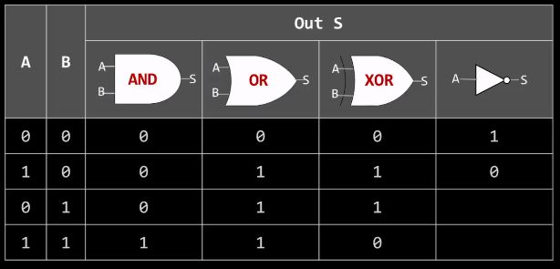
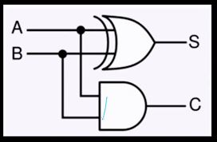
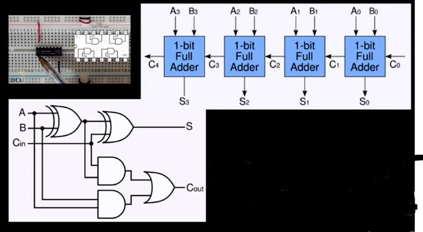

# 디지털 회로/ CPU 연산


## CPU 제작 방법



- CPU는 기본적으로 전자식 산수 계산기입니다.
    - +,-, *, /

## 컴퓨터가 덧셈하는 방법 # 1. 반가산기



- 2진수 1 + 1 = 2진수 10<sub>(2)
- A가 1, B가 1이면 XOR 연산 결과 S는 0이다
- 동시에 A가 1, B가 1이면 AND 연산 결과 C는 1이다.
    - 이 결과 1은 자리 올림(Carry)이다.

### 단점

- 해당 숫자 외에 자리올림 수까지 더해야 하는 비효율

## 컴퓨터가 덧셈하는 방법 # 2. 전가산기



- 반가산기를 늘려서 이어 전가산기를 만듦

## 컴퓨터가 뺄셈하는 방법 # 1. 10진수

- 6에 4를 더하면ㅁ 10이다. 즉, 4는 6에 대한 10의 보수이다.
- 13 - 6은 7이다.
- 13에 6에 대한 10의 보수 4를 더하고 10 자리에서 1을 빼도 역시 7이다.
- 쉽게 말해. 보수 덧셈이 뺄셈이다.

> 보수를 구한 다음 더하기.

## 컴퓨터가 뺄셈하는 방법 # 1. 2진수

- 2진수에선 0은 1로, 1은 0으로 뒤집으면 1의 보수가 된다.
- 1의 보수에 1을 더하면 2의 보수이다.
- 어떤 숫자에 2의 보수를 더하면 자동으로 2진수 뺄셈이 된다. 단, 자리올림은 버린다.

> 보수: 각 자리 숫자의 합이 자리올림이 되게 하는 최솟값

### 예시

```
a = 3
b = 2
a - b = 1

2의 보수
0 0 1 0(b)  ->   1 1 0 1 (~b)  ->   0 0 1 1  (a)
               + 0 0 0 1 (+1)     + 1 1 1 0  (b의 보수)
			  ----------           ---------
                 1 1 1 0            0 0 0 1  -> 결과 1
```

## 컴퓨터가 곱셈하는 방법 # shift to left

- 4비트로 5를 표현하면 0101이다.
- 4비트 0101을 왼쪽으로 한칸씩 밀면(shift) 1010이다.
- 맨 오른쪽에 0이 채워진다.(Padding)
- 4비트로 표현하는 2진수 1010는 10이다.
- 왼쪽으로 한 칸 밀면 곱하기 2. 두칸 밀면 곱하기 4가 된다.

## 컴퓨터가 나눗셈하는 방법 # 1. shift to right

- 4비트로 6을 표현하면 0110이다.
- 4비트 0110을 오른쪽으로 한 칸씩 밀면 0011이다.
- 맨 오른쪽에 0이 채워진다.(padding)
- 4비트로 표현하는 2진수 0011은 3이다.

## 컴퓨터가 나눗셈하는 방법 # 2. 반복 뺄셈

### 예외 상황

- 7을 0으로 나누면?
    - 7에서 0을 빼면 7이고 7은 0보다 크다.
    - 7에서 0을 계속 빼면 언젠가는 0보다 작은 숫자를 만날 수 있는가?
    - 만날 수 없다면 뺄셈은 연산은 언제 끝날까?
    - 기본적으로 해당 연산을 못하게하는 에러가 발생하여 CPU 손상을 방지한다.

# 컴퓨터 연산 과정

## 컴퓨터 구성

1. 연산장치 CPU
2. 저장장치 (RAM, 메모리)
    - 일련 번호를 키로하여 정보를 저장함
    - 메모리를 Excel로 생각하면 편하다.
        - "Excel의 C3에 있는 정보를 가져오세요" 같은 느낌
    - 32Bit의 ram은 약 42억9천만 일련번호를 가질 수 있다.
    - 일련번호별 저장가능한 용량이 1byte라고 가정한다면 ram의 용량은 약 4GB로 계산된다.
    - 그러면 CPU는 64bit기반인데 윈도우를 32bit 설치하면 ram에서 32비트까지 밖에 인식하지 못하고 저장되는 데이터가 제한되어버린다.
    - 그래서 ram은 CPU가 연산하는데 가장 중추적으로 지원하는 1차 메모리이다.

