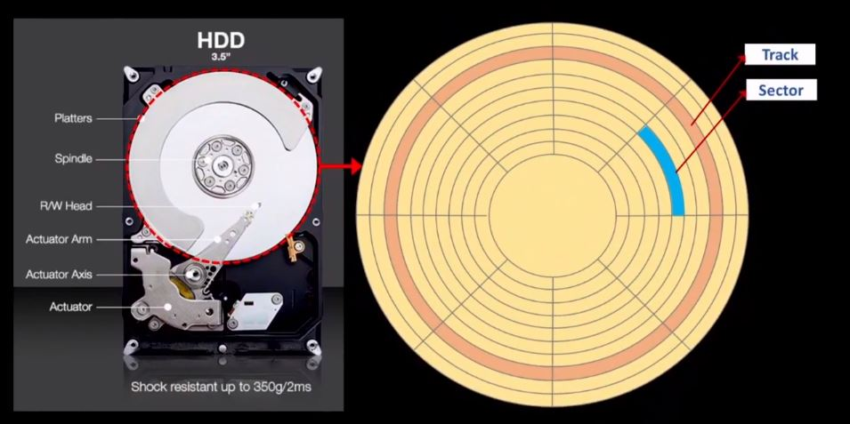

# HDD, SSD와 파일시스템

**목차** 
[1. HDD의 논리적 구조](#hdd의-논리적-구조)
[2. 파일이-저장되는-방법파일-시스템](#파일이-저장되는-방법파일-시스템)

# HDD의 논리적 구조

- 자기 디스크 원판에 자성정보를 저장한다.
- spindle motor가 고속으로 회전하고 있음
- 하드디스크의 스펙으로서 회전 속도가 빠를수록 읽기쓰기가 빨라짐
- 디스크 원판은 track과 sector로 논리적 구조를 나눈다.
- sector에 정보를 기술하며, 읽기 쓰기를 한다.
- **sector의 override가 대략 10만 번이 넘어가면 해당 sector가 손상될 가능성이 있고 사용하지 못하기 때문에 빈 자리에 정보를 저장하는게 우선한다.**
- 구조적으로 CPU나 1차 메모리와의 속도 차이가 날 수 밖에 없는 논리적 구조이다.

## 조각 모음의 의미

- sector 하나가 512byte라고 가정하면, 클러스터로 4개를 묶으면 2kB가 된다.
- 보조 기억장치는 대개 파일형태의 정보를 저장한다.

 

### sector보다 용량이 작을 경우

- sector하나를 온전히 할당한다.
    - 약간의 메모리 낭비가 발생한다.

 

### sector보다 용량이 큰 경우

- sector를 이어서 저장하지 못할 경우 빈 공간을 찾아서 저장하게 된다.
- 이처럼 여기서 문제는 트랙이 중간에 끊기는 경우 하드 디스크가 물리적으로 한 바퀴를 회전을 해야하고 입출력과정에서 성능이 저하된다.
- **이를 방지하기 위해 끊겨진 트랙을 이어주기 위해 sector들의 위치를 재조정하는 과정이 조각 모음이다 !**
- 최근엔 운영체제가 알아서 진행해준다.

 

---

# 파일이 저장되는 방법(파일 시스템)

주기억 장치 공간은 일련번호로 관리한다.

## 파일시스템

- 파일 시스템(file system)은 **운영체제에서 파일과 데이터를 저장, 구성, 관리하기 위한 구조 및 알고리즘**입니다
- 디스크, SSD, USB 드라이브, 네트워크 연결 스토리지(NAS) 등 다양한 저장 장치에서 사용

 

## 기능

1. 파일 저장: 파일 시스템은 데이터를 저장 장치에 구성되어 있는 블록으로 나누어 저장합니다. 이러한 블록들은 효율적인 저장 공간 활용을 위해 연속적으로 배치될 수도 있고, 분산되어 배치될 수도 있습니다.

2. 파일 관리: 파일 시스템은 파일의 메타데이터(파일 이름, 크기, 생성 및 수정 날짜, 소유자 등)를 관리합니다. 또한 디렉터리(폴더)를 사용하여 파일을 계층적으로 구조화하여 관리합니다.

3. 파일 접근 권한 및 보안: 파일 시스템은 파일에 대한 접근 권한을 설정할 수 있어, 사용자가 읽기, 쓰기, 실행 등의 작업을 수행할 수 있는지 여부를 제어합니다. 이를 통해 데이터 보안을 유지할 수 있습니다.

4. 데이터 무결성 및 회복: 파일 시스템은 데이터의 무결성을 보장하며, 장애가 발생한 경우 데이터를 복구할 수 있는 기능을 제공합니다. 일부 고급 파일 시스템은 데이터 백업, 스냅샷, 복제 등의 기능도 제공합니다.

## 종류

- FAT, NTFS, HFS, HFS+, APFS, ext2, ext3, ext4, XFS, Btrfs 등이 있으며, 각각의 파일 시스템은 특정 운영 체제와 호환되도록 설계되어 있습니다
    - FAT 및 NTFS는 주로 Windows에서 사용
    - HFS, HFS+, APFS는 macOS에서 사용
    - ext2, ext3, ext4, XFS, Btrfs는 주로 리눅스에서 사용

## 원리

 

### FAT(File Allocation Table)

- FAT에서 Track과 Sector로 파일명을 저장한다.

이를 삭제할 때는 파일명의 첫글자를 '#'으로 바꾸고, delete 컬럼에 삭제되었음을 마킹한다. 관리체계상에서 지워졌다고 마킹하는 것이다.

실제로 삭제하지 않기 때문에 복원이 가능하다.

## MBR(Master Boot Record)

- 0번 Track - 0번 sector에 저장된 파일명을 의미한다.
- 기본적으로 운영체제의 부트로드라는 코드가 저장된다.
- 컴퓨터 전원을 켰을 때 여러 자원을 체크하고 MBR를 찾아가서 OS 부트 레코드를 메모리에 적재해서 실행한다.
- 보통 virus는 disk를 손상시키는 게 많다.
    - MBR 손상 및 과도한 overwrite으로 disk 손상 등

## 빠른 포맷과 느린 포맷

### 빠른 포맷

- 파일 시스템을 초기화하고 새로운 파일 시스템을 생성하는 과정입니다.
    - **구체적으로 FAT 관리 체계를 날려서 reset한다는 의미입니다.**
-파일 및 디렉터리 구조와 메타데이터를 삭제하고, 새로운 파일 시스템의 메타데이터를 초기화하는 과정만을 수행합니다. 
- 이 방법은 기존 데이터에 대한 실제 접근을 차단하므로, 사용자에게 빈 저장 공간처럼 보이게 됩니다. 그러나 빠른 포맷으로는 저장 장치의 물리적 손상이나 이전 데이터의 잔여 흔적을 검사하거나 제거하지 않습니다. 
- 따라서 빠른 포맷은 시간이 상대적으로 덜 소요되지만, 데이터 복구와 관련된 보안 문제가 있을 수 있습니다.
 

### 느린 포맷

- 빠른 포맷과 비슷한 과정을 거치지만, 추가로 저장 장치의 모든 섹터를 검사하여 물리적 손상이 있는지 확인하고, 기존 데이터를 완전히 삭제하는 과정을 포함합니다. 
- 이 과정에서 저장 장치의 모든 섹터를 0으로 채우거나, 패턴을 사용하여 여러 번 덮어쓰는 작업을 수행할 수 있습니다.
- 느린 포맷은 저장 장치의 무결성을 확인하고 데이터 복구를 어렵게 만드는 데 도움이 되지만, 시간이 오래 걸립니다.

## summary

1. 레지스터는 정점에 있기 때문에 이름을 붙여서 관리한다. CPU 내부에 존재하고
2. 주기억장치는 공간을 일련번호로 관리한다.
3. 2차 메모리인 보조기억장치는 track과 sector로 공간을 관리한다.
4. SSD는 하드 디스크와 동일하게 관리하지만 디스크가 칩으로 변경된 것이며, 동일하게 트랙과 섹터로 관리한다.
    - 하지만 디스크가 회전하는 것이 아니기 때문에 조각 모음 개념이 없다. 그래서 디스크가 회전하는 것이 아니기 떄문에 빠르다.

