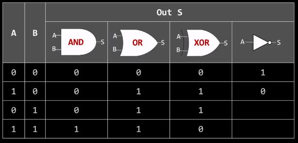
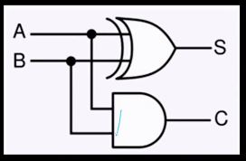
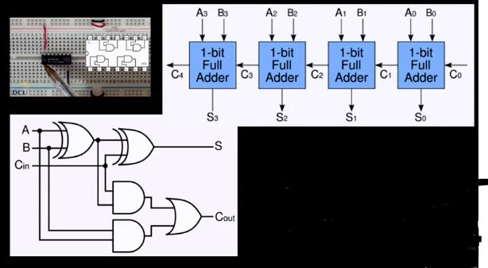

# 디지털 회로/ CPU 연산


## CPU 제작 방법



- CPU는 기본적으로 전자식 산수 계산기입니다.
    - +,-, *, /

## 컴퓨터가 덧셈하는 방법 # 1. 반가산기



- 2진수 1 + 1 = 2진수 10<sub>(2)
- A가 1, B가 1이면 XOR 연산 결과 S는 0이다
- 동시에 A가 1, B가 1이면 AND 연산 결과 C는 1이다.
    - 이 결과 1은 자리 올림(Carry)이다.

### 단점

- 해당 숫자 외에 자리올림 수까지 더해야 하는 비효율

## 컴퓨터가 덧셈하는 방법 # 2. 전가산기



- 반가산기를 늘려서 이어 전가산기를 만듦

## 컴퓨터가 뺄셈하는 방법 # 1. 10진수

- 6에 4를 더하면ㅁ 10이다. 즉, 4는 6에 대한 10의 보수이다.
- 13 - 6은 7이다.
- 13에 6에 대한 10의 보수 4를 더하고 10 자리에서 1을 빼도 역시 7이다.
- 쉽게 말해. 보수 덧셈이 뺄셈이다.

> 보수를 구한 다음 더하기.

## 컴퓨터가 뺄셈하는 방법 # 1. 2진수

- 2진수에선 0은 1로, 1은 0으로 뒤집으면 1의 보수가 된다.
- 1의 보수에 1을 더하면 2의 보수이다.
- 어떤 숫자에 2의 보수를 더하면 자동으로 2진수 뺄셈이 된다. 단, 자리올림은 버린다.

> 보수: 각 자리 숫자의 합이 자리올림이 되게 하는 최솟값

### 예시

```
a = 3
b = 2
a - b = 1

2의 보수
0 0 1 0(b)  ->   1 1 0 1 (~b)  ->   0 0 1 1  (a)
               + 0 0 0 1 (+1)     + 1 1 1 0  (b의 보수)
			  ----------           ---------
                 1 1 1 0            0 0 0 1  -> 결과 1
```
