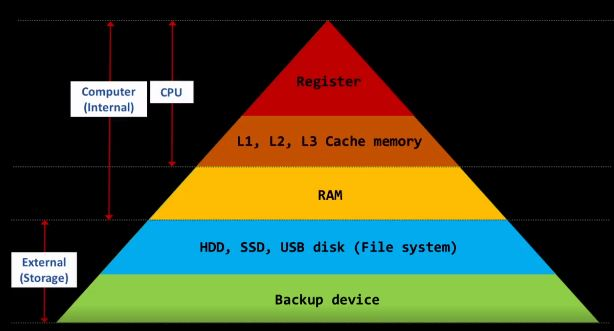

# 컴퓨터가 기억공간을 관리하는 방법

**목차**

[1. 기억장치의 종류와 역할](#기억장치의-종류와-역할)
[2. 컴퓨터-기억공간을-관리하는-방법](#컴퓨터-기억공간을-관리하는-방법)

 

# 기억장치의 종류와 역할

 

## 1. 컴퓨터 내부에 존재하는 기억장치

- 휘발성이라 전원이 꺼지면 삭제됨

### 1.1 CPU수준에서 보유하고 있는 기억장치

1.1.1 Register

    - 통상 4.x GHz
    - 굉장히 빠른 속도의 연산
    - 굉장히 소량의 메모리. 그래서 메모리로 분류하지 않고 CPU의 일부라고 취급함

1.1.2 L1, L2, L3 Cache memory
    - CPU에서 RAM에 저장되어있는 정보를 불러와서 연산할 때 거치게 되는 곳
    - CPU가 RAM보다 연산이 빠르기 때문에 프로세스 상 필요한 정보를 예측해서 미리 RAM에서 정보를 Cache memory로 불러와 복사해둠
    - CPU와 RAM 사이 속도 차이를 극복하기 위해 존재함

### 1.2 1차 메모리

- RAM
    - 1.xGHz 수준의 속도로 CPU 기억장치와 비교해서 느린 편
    - 1Byte라는 셀에 일련번호라는 메모리 주소가 붙어서 저장된다.
    - 주 기억장치 공간은 **일련번호(메모리 주소)**로 관리한다.
## 2. 컴퓨터 외부에 존재하는 기억장치

### 2차 메모리

- HDD, SSD(Solid State Drive), USB disk(File System)
- Backup Device

    - CPU 기억장치와의 속도 차이가 굉장히 많이 난다.(비행기와 사람수준)

# 켬퓨터 기억공간을 관리하는 방법

- 컴퓨터는 기본적으로 모든 것이 다 **숫자**이다.
- 정보가 저장된 위치도 **숫자로** 표시된다.(메모리 주소)
- 이 같은 관리 체계는 아파트 단지에서 각 가구를 동, 호, 숫자로 관리하는 것과 유사하다.
- 레지스터, 주 기억장치(RAM), 보조 기억장치(HDD, SSD)를 관리하는 방법은 조금씩 다르다.
    - *레지스터는 개발 기억공간마다 고유 이름을 붙인다.*
    - *주 기억장치는 일련번호를 붙인다.*
    - *보조 기억장치는 트랙(track) 번호와 섹터(Sector)번호를 붙여 관리한다.(파일(File)의 등장!)*