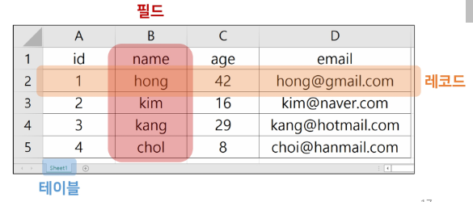

# 스프레드 시트를 이용한 데이터 관리
    - 스프레드 시트 : 컬럼을 통해 데이터의 유형을 지정하고 데코드를 통해 구체적인 데이터 값을 포함

## 1. 장점

- 운영체제에 상관없이 어디에서나 쉽게 사용 가능
- 이메일이나 메신저를 이용해 간편하게 전송 가능

## 2. 단점

- 성능과 보안적 측면에서 한계가 명확
- 대용량 데이터를 다루기에 적합하지 않음
- 데이터를 구조적으로 정리하기에 어려움
- 확장이 불가능한 구조

--- 

# 데이터

| 분류 | 설명 | 예 |
| --- | --- | --- |
|정형 데이터 | 구조화된 데이터, 즉 미리 정해진 구조에 따라 저장된 데이터 | 엑셀의 스프레드시트, 데이터베이스의 테이블 |
| 반정형 데이터 | 구조에 따라 저장된 데이터지만 데이터 내용 안에 구조에 대한 설명이 함께 존재. 구조를 파악하는 파싱 과정이 필요  | HTML, XML, json, 센서 데이터 |
| 비정형 데이터 | 정해진 구조가 없이 저장된 데이터 | 소셜 데이터의 텍스트, 영상, 이미지, 워드나 pdf 등 멀티미디어 데이터 |

# Database

### 목차

1. [데이터베이스 정의](#1-정의)

---

## 1. 정의

- 체계화된 데이터 모임
- 공유하고 사용할 목적으로 통함관리되는 정보의 집합
- 검색, 구조화같은 작업을 쉽게하도록 조직화된 데이터 수집-저장 시스템
    - 고도 구조화 >> 검색과 갱신의 효율성 향상
    - 자료 파일을 조직적으로 통합하여 자료 항목의 중복 제거

## 2. DBMS

- Oracle, MySQL, SQLite 등 DB륿 관리하는 프로그램

| 세대 | 예 | 설명 |
| --- | --- | --- |
| 1세대 | | 네트워크 DBMS(그래프 형태), 계층 DBMS(트리 형태) |
| 2세대 | 관계 DBMS | 데이터베이스를 테이블 형태로 구성 |
| 3세대 | 객체 지향 DBMS | 객체를 이용해 데이터베이스를 구성(오투, 온투스, 젬스톤) |
| | 객체 관계 DBMS | 객체DBMS + 관계 DBMS |
| 4세대 | NoSQL | 비정형 데이터를 처리하는데 적합하고 확장성이 뛰어남(MongoDB, Cassandra) |
|  | NewSQL | 관계 DBMS의 장점 + NoSQL의 확장성 및 유연성(구글 스패너, 볼트DB, 누오DB) |

### SQL

- DBMS에서 Database를 조직하기 위해 사용하는 언어

# RDB(관계형 데이터베이스)

## 1. 정의

- 데이터를 테이블, 행, 열로 나누어 구조화하는 방식
- 자료를 여러 테이블로 나눠서 관리하고 이 테이블간 관계를 설정해 여러 데이터를 쉽게 조작할 수 있다는 장점
- SQL를 사용하여 데이터를 조회하고 조작
  
## 2. 테이블간 관계 설정 예시

- 고객테이블에서 **고객ID** : 고객이 관계형 데이터베이스에서 고유하게 식별되는 기본키(primary key)
- 주문테이블에서 **주문ID** : 특정 주문을 식별하는 기본 키
    - 외래 키를 사용하여 고객 테이블의 고객 ID를 연결하여 고객을 주문과 연결할 수 있음

## 3. 기본 용어

1. 스키마
    - 데이터베이스에 저장되는 데이터 구조와 제약조건을 정의한 것
2. 인스턴스
    - 스키마에 따라 데이터베이스에 실제로 저장된 값
3. 데이터 독립성
    - 하위 스키마를 변경하더라도 상위 스키마가 영향을 받지 않는 특성
    - 논리적 데이터 독립성 : 개념 스키마가 변경되어도 외부 스키마는 영향을 받지 않음
    - 물리적 데이터 독립성 : 내부 스키마가 변경되어도 개념 스키마는 영향을 받지 않음
4. 테이블
    1. 필드
    2. 레코드
    3. 기본 키

### 3.1 스키마

- 테이블의 구조
- DB에서 구조, 표현 방법, 관계 등 전반적인 명세를 기술한 것#

### 3.2 테이블

- 필드와 레코드를 사용해 조직된 데이터 요소들의 집합
- 관계라고도 부름
1. 필드(field)
    1. 속성, 컬럼
2. 레코드(record)
    1. 튜플, 행
   

### 3.3 레코드

- 튜플 혹은 행(row)
- 테이블의 데이터는 레코드에 저장됨

### 3.5 PK(Primary Key)

- 기본 키
- 각 레코드의 고유한 값
    - 각각의 데이터를 구분할 수 있는 고윳값
- 기술적으로 다른 항목과 절대로 중복될 수 없는 단일 값

## 4. RDB 이점

- 데이터를 직관적으로 표현할 수 있음
- 관련한 각 데이터를 쉽게 접근할 수 있음
- 대량의 데이터도 효율적으로 관리 가능

## 5. RDBMS

- 관계형 데이터베이스를 만들고 업데이트하고 관리하는데 사용하는 프로그램
- SQLite, MySQL, PostgreSQL, Microsoft SQL, Server, Oracle Database

## 6. SQLite

- 응용프로그램에 파일 형식으로 넣어 사용하는 비교적 가벼운 데이터베이스
- 안드로이드, IOS, macOS에 기본적으로 탑재되어 있으며 임베디드 소프르웨어에서도 많이 활용됨
- 오픈 소스 프로젝트이기 때문에 자유롭게 사용 가능

### 6.1 단점

- 대규모 동시 처리 작업에 부적합
- 다른 RDBMS에서 지원하는 SQL기능을 지원하지 않을 수 있음

## 7. 언어

1. 데이터 정의어, DDL
    - 스키마를 정의하거나 수정 또는 삭제하기 위해서 사용
    - CREATE, ALTER, DROP, RENAME, TRUNCATE
2. 데이터 조작어, DML
    - 데이터 삽입, 삭제, 수정, 검색 등을 처리를 요구하기 위해 사용
    - 절차적 데이터 조작어와 비절차적 데이터 조작어로 구분됨
    - SELECT, INSERT, UPDATE, DELETE
3. 데이터 제어어, DCL
    - 내부적으로 필요한 규칙이나 기법을 정의하기 위해 사용
    - GRANT, REVOKE

## View ⭐️

### 정의

- RDB에서 SQL로 하나 이상의 테이블 또는 뷰에서 원하는 모든 데이터를 선택하여 사용자 정의에 따라 가상의 테이블로 나타낸 것
- 데이터를 실제로 저장하지 않고 **논리적으로만 존재하는 테이블**
- 일반 테이블과 동일하게 사용할 수 있음

