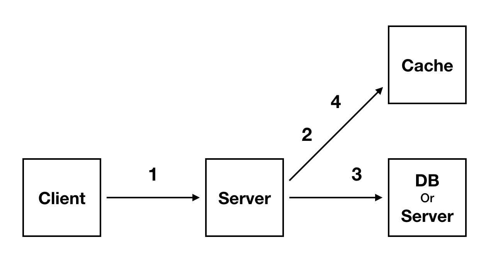
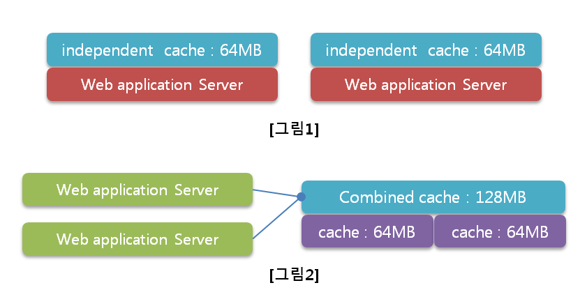
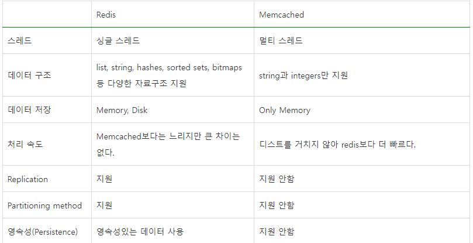

# 목차

[1. Redis](#redis)<br>
[2. Redis 설치 및 명령어](#redis-설치-및-명령어)<br>
[3. spring boot에서 Redis 사용하기](#spring-boot에서-redis-사용하기)<br>
---

# Cashe

## Cached 개념

- 나중에 요청할 결과를 미리 저장해둔 후 빠르게 서비스해 주는 것을 의미한다.
- 미리 결과를 저장하고 나중에 요청이 오면 그 요청에 대해서 DB 또는 API를 참조하지 않고 Cache를 접근하여 요청을 처리하는 기법

## cache 출현 배경

### 파레토 법칙

- 80%의 결과는 20%의 원인으로 인해 발생한다는 뜻
- 캐시는 모든 결과를 캐싱할 필요가 없으며 **서비스를 할 때 많이 사용되는 20%만 캐싱함**으로써 전체적으로 효율을 끌어올릴 수 있다.

## Cache를 고려해야 하는 순간

- 서비스를 처음 운영할 때는 WEB-WAS-DB 정도로 작게 인프라를 구축하는데, 사용자가 늘어나면 DB에 무리가 가기 시작한다.
- DB는 데이터를 물리 디스크에 직접 쓰기 때문에 서버에 문제가 발생해도 데이터가 손실되지는 않지만, 매 트랜잭션마다 디스크에 접근해야하므로 부하가 많아지면 성능이 떨어진다.

### 검토 방법

1. scale-in
2. scale-out
3. cache server

## cache architecture



- 클라이언트로부터 요청을 받는다.
- Cache와 작업을 한다.
- 실제 DB와 작업한다.
- 다시 Cache와 작업한다.

### 방식 1. Look Aside Cache (Lazy Loading)

- 캐시에 데이터 존재 유무 확인
- 데이터가 있다면 캐시의 데이터 사용
- 데이터가 없다면 캐시의 실제 DB 데이터 사용
- DB에서 가져 온 데이터를 캐시에 저장

### 방식 2. Write Back

- 모든 데이터를 캐시에 저장
- 캐시의 데이터를 일정 주기마다 DB에 한꺼번에 저장 (배치)
- DB에 저장한 데이터를 캐시에서 제거
- **단점**
    - DB에 데이터를 저장하기 전에 캐시 서버가 죽으면 데이터가 유실된다는 문제점


# Memcached

## Memcached의 개념

- 무료로 사용할 수 있는 오픈 소스이며 분산 메모리 캐싱 시스템
- DB의 부하를 줄여 동적 웹 애플리케이션의 속도 개선을 위해 사용
- DB나 API 호출 또는 렌더링 등으로부터 받아오는 결과 **데이터를 key - value 형태로 메모리에 저장**

## 장점

- 시스템의 사용되지 않는 일부 메모리를 활용할 수 있어 남는 자원을 효율적으로 사용하여 성능을 향상시킬 수 있다.



- [그림1] : 초창기의 캐시 시스템, 각 노드가 완전히 독립적으로 운영되어 데이터를 조회하거나 저장 시 어느 서버를 이용할지 관리해야 하고, 용량의 제한으로 인해 비생산적이며 자원 낭비적인 시스템으로 구성
- [그림2] : 
    - `Memcached`, 개발자는 서버가 몇 대든 상관없이 한 개의 객체만을 활용하여 저장 및 조회할 수 있으므로 능률적이고 대용량의 캐시 시스템을 갖게 되는 것
    - 기업의 입장에서는 오래된 저사양 서버의 남는 메모리를 활용할 수 있기 때문에 비용 면에서 효율적

## 단점

- 인 메모리 기반의 시스템이므로 재부팅 시 데이터가 소멸하고, 이로 인해 영구적인 저장용 시스템으로 활용할 수 없다는 문제
- 영구 저장이 필요하다면 해당 데이터를 DB에 저장해 두고, 재부팅 시 DB로부터 데이터를 받아야 한다.

# Redis

- 고성능 키-값 저장소로서 String, list, hash, set, sorted set 등의 자료 구조를 지원하는 NoSQL
- 빠른 속도와 간편한 사용법으로 인해 캐시, 인증 토큰, 세션 관리 등등 여러 용도로 사용

## Redis의 개념

- `Remote Dictionary Server`의 약자
- **외부에서 사용 가능한 Key-Value 쌍의 해시 맵 형태의 서버**
    -  별도의 쿼리 없이 Key를 통해 빠르게 결과 조회 가능
- 디스크에 데이터를 쓰는 구조가 아니라 메모리에서 데이터를 처리하기 때문에 작업 속도가 상당히 빠르다.
- 오픈 소스로서 NoSQL로 분류되기도 하고, Memcached와 같이 인 메모리 솔루션으로 분류되기도 한다.
- 성능은 Memcached에 버금가면서 다양한 데이터 구조체를 지원함
- DB, Cache, Message Queue, Shared Memory 용도로 사용

## Redis의 특징

- 영속성을 지원하는 인 메모리 데이터 저장소
- 다양한 자료 구조를 지원함.
- 싱글 스레드 방식으로 인해 연산을 원자적으로 수행이 가능함.
- 읽기 성능 증대를 위한 서버 측 리플리케이션을 지원
- 쓰기 성능 증대를 위한 클라이언트 측 `샤딩` 지원
    -  `샤딩` : 데이터를 여러 조각으로 나눠 저장하는 기술
- 다양한 서비스에서 사용되며 검증된 기술
 
## Redis의 영속성

- Redis는 영속성의 보장하기 위해 데이터를 디스크에 저장할 수 있다.
- 서버가 내려가더라도 디스크에 저장된 데이터를 읽어서 메모리에 로딩한다

### 데이터를 디스크에 저장하는 방식

1. RDB(Snapshotting) 방식
    - 순간적으로 메모리에 있는 내용 전체를 디스크에 옮겨 담는 방식
2. AOF(Append On File)방식
    - Redis의 모든 write/update 연산 자체를 모두 log 파일에 기록하는 형태

## Redis의 컬랙션

- key로 다양한 구조체를 지원함
- 개발의 편의성이 좋아지고 난이도가 낮아진다는 장점

## 싱글 스레드를 사용하는 Redis

- 싱글 스레드를 사용하므로 연산을 원자적으로 처리하여 `Race Condition`이 거의 발생하지 않는다(**Thread Safe**)
    - `Race Contdition` : 두 트랜잭션이 같은 데이터에 대해서 작성 작업을 할 때, 두 트랜잭션이 동시에 진행될 경우, 데이터 일관성이 깨지게 됨. 어떤 트랜잭션의 작업이 먼저 끝날지 모르기 때문
    - 이를 위해 다양한 고립기법이 존재하지만 redis의 경우 싱글스레드로 작업하기 때문에 다수의 `Race Condition`을 해결
        - 더블 클릭 이슈는 싱글 스레드만으로 해결 못함

## Redis VS Memcached




---

# Redis 설치 및 명령어

## 1. Redis 설치

- 도커로 설치 후 실행 가능합니다. (https://hub.docker.com/_/redis 참고)

### 이미지 다운(docker images 로 확인 가능)

- `$ docker pull redis`

### 컨테이너로 레디스 실행 (--name: 컨테이너 이름 설정, -p: 포트 포워딩, -d: 백그라운드에서 실행)

- `$ docker run --name some-redis -p 6379:6379 -d redis`

### redis-cli 접속

- `$ docker exec -it some-redis redis-cli`

## 2. Redis 명령어

- Redis 는 여러 개의 데이터 타입을 저장할 수 있기 때문에 각각의 명령어가 여러개 존재함
- 모든 명령어 참고 자료 : https://redis.io/commands/

> 주의 
> Redis 는 **Single Thread 기반**이기 때문에 keys, flushall, flushdb, getall 등 일반적으로 생각했을 때 **O(N) 의 시간복잡도를 가질 것 같은 명령어는 운영 환경에서 사용하면 위험**

### 2.1. String

가장 기본적인 Value 타입

value에 숫자를 입력해도 자동 형변환하여 저장함

<br>

- **저장**
    - `set {key} {value}` : key, value 를 저장
    - `mset {key} {value} [{key} {value} ...]` : 여러 개의 key, value 를 한번에 저장
    - `setex {key} {seconds} {value}` : key, seconds, value 저장 (설정한 시간 뒤에 소멸)

- **조회**

    - `keys *` : 현재 저장된 키값들을 모두 확인 (부하가 심한 명령어라 운영중인 서비스에선 절대 사용하면 안됨)
    - `get {key}` : 지정한 key 에 해당하는 value 를 가져옴
    - `mget {key} [{key} ...]` : 여러 개의 key 에 해당하는 value 를 한번에 가져옴
    - `ttl {key}` : key 의 만료 시간을 초 단위로 보여줌 (-1 은 만료시간 없음, -2 는 데이터 없음)
    - `pttl {key}` : key 의 만료 시간을 밀리초 단위로 보여줌
    - `type {key}` : 해당 key 의 value 타입 확인

- **삭제**
    - `del {key} [{key} ...]` : 해당 key 들을 삭제
- **수정**
    - `rename {key} {newKey}` : key 이름 변경
    - `expire {key} {seconds}` : 해당 키 값의 만료 시간 설정
- **기타**
    - `randomkey` : 랜덤한 key 반환
    - `ping` : 연결 여부 확인 ("ping" 만 입력하면 "PONG" 이라는 응답이 옴)
    - `dbsize` : 현재 사용중인 DB 의 key 의 갯수 리턴
    - `flushall` : 레디스 서버의 모든 데이터 삭제
    - `flushdb` : 현재 사용중인 DB 의 모든 데이터 삭제

<br>

## 2.2. Set

Redis 에서는 Set 에 포함된 값들을 멤버라고 표현합니다.

여러 멤버가 모여 집합 (Set) 을 구성합니다.

진짜 집합처럼 교집합, 차집합 등도 구할 수 있는데 여기선 간단하게 CRUD 만 알아봅니다.

<br>

- `sadd {key} {member} [{member} ...]`
  - key 에 새로운 멤버들을 추가. key 가 없으면 새로 만듬
- `smembers {key}`
  - key 에 설정된 모든 멤버 반환
- `srem {key} {member [{member} ...]}`
  - key 에 포함된 멤버들 삭제. 없는 멤버 입력하면 무시됨
- `scard {key}`
  - key 에 저장된 멤버 수를 반환
- `sismember {key} {member}`
  - member 가 해당 key 에 포함되는지 검사

<br>

## 2.3. Hash

Redis 에서 저장가능한 자료구조 중에 Hash 도 있습니다.

Hash 자체를 나타내는 key 와 해당 key 에 포함된 field 까지 사용해서 값을 조회/저장할 수 있습니다.

- `hset {key} {field} {value} [{field} {value} ...]`
  - key 를 이름으로 한 Hash 자료 구조에 field 와 value 값을 저장
- `hget {key} {field}`
  - key Hash 값에 포함된 field 의 value 를 가져옴
- `hdel {key} {field} [{field} ...]`
  - field 값으로 데이터 삭제
- `hlen {key}`
  - Hash 가 갖고 있는 field 갯수 반환
- `hkeys {key}`
  - Hash 가 갖고 있는 모든 field 출력
- `hvals {key}`
  - Hash 가 갖고 있는 모든 value 출력
- `hgetall {key}`
  - Hash 가 갖고 있는 모든 field 와 value 출력

<br>

# Spring boot에서 Redis 사용하기

- `spring-data-redis` 라이브러리 사용

## 1. java의 Redis Client

- Spring Boot 2.0 부터 `Jedis`가 기본 클라이언트에서 deprecated 되고 `Lettuce`가 탑재

### 1.1 Jedis

- 단점 많음(멀티 쓰레드 불안정, Pool 한계 등)

### 1.2 Lettuce

- 장점 : Netty 기반이라 비동기 지원 가능

## 2. Spring Boot 에서 Redis 설정

### 2.1 공통 세팅

- build.gradle 에 spring-boot-starter-data-redis 추가하고 빌드해줍니다.

```gradle
implementation 'org.springframework.boot:spring-boot-starter-data-redis'
```

- application.yml에 redis의 host와 port 설정
    - localhost:6379 는 기본값
```yml
spring:
  redis:
    host: localhost
    port: 6379
```
- configuration에서 Bean 등록
    - Redis 사용을 위한 기본 Configuration

```java
@Configuration
public class RedisConfig {

    @Value("${spring.redis.host}")
    private String host;

    @Value("${spring.redis.port}")
    private int port;

    @Bean
    public RedisConnectionFactory redisConnectionFactory() {
        return new LettuceConnectionFactory(host, port);
    }
}
```
<br>

### 2.2 RedisRepository

- `Spring Data Redis` 의 `Redis Repository` 를 이용하면 간단하게 **Domain Entit**y 를 **Redis Hash** 로 만들 수 있음
- 다만 트랜잭션을 지원하지 않기 때문에 만약 트랜잭션을 적용하고 싶다면 `RedisTemplate` 을 사용해야 함

<br>

**Entity**

<br>

- Redis 에 저장할 자료구조인 객체를 정의
```java

@Getter
@RedisHash(value = "people", timeToLive = 30)
public class Person {

    @Id
    private String id;
    private String name;
    private Integer age;
    private LocalDateTime createdAt;

    public Person(String name, Integer age) {
        this.name = name;
        this.age = age;
        this.createdAt = LocalDateTime.now();
    }
}
```

- 일반적인 객체 선언 후 `@RedisHash` 를 붙이면 됩니다.
    - `value` : **Redis 의 keyspace 값**으로 사용
    - `timeToLive` : **만료시간을 seconds 단위로 설정**
        - 기본값은 만료시간이 없는 -1L

- `@Id` 어노테이션이 붙은 필드 : **Redis Key 값**
    - null 로 세팅하면 랜덤값이 설정됨

- 레디스에 저장된 최종 키 : keyspace와 id 조합, (`keyspace:id`)

<br>

**Repository**

- CrudRepository 를 상속받는 Repository 클래스 추가

```java
public interface PersonRedisRepository extends CrudRepository<Person, String>{

}

```

**example**

<br>

```java
@SpringBootTest
public class RedisRepositoryTest {

    @Autowired
    private PersonRedisRepository repo;

    @Test
    void test() {
        Person person = new Person("Park", 20);

        // 저장
        repo.save(person);

        // `keyspace:id` 값을 가져옴
        repo.findById(person.getId());

        // Person Entity 의 @RedisHash 에 정의되어 있는 keyspace (people) 에 속한 키의 갯수를 구함
        repo.count();

        // 삭제
        repo.delete(person);
    }
}
```

- JPA 와 동일하게 사용
- 여기서는 id 값을 따로 설정하지 않아서 랜덤한 키값이 들어감.
- 저장할때 save() 를 사용하고 값을 조회할 때 findById() 를 사용합니다.

<br>

**redis-cli로 데이터 확인**

- id를 따로 설정하지 않은 null 값이라 랜덤한 키 값이 들어감
- 데이터를 저장하면 member 와 member:{randomKey} 라는 두개의 키값이 저장되었습니다.
- member 키값은 Set 자료구조이며, Member 엔티티에 해당하는 모든 Key 를 갖고 있습니다.
- member:{randomKey} 값은 Hash 자료구조이며 테스트 코드에서 작성한 값대로 field, value 가 세팅한 걸 확인할 수 있습니다.
- timeToLive 를 설정했기 때문에 30초 뒤에 사라집니다. ttl 명령어로 확인할 수 있습니다.

<br>

### 2.3 RedisTemplate

- `RedisTemplate`을 사용하면 특정 entity뿐만 아니라 여러가지 원하는 타입을 넣을 수 있습니다.
- template을 선언한 후 원하는 타입에 맞는 operations을 꺼내서 사용합니다.

<br>

**config 설정 추가**

- RedisTemplate 에 LettuceConnectionFactory 을 적용해주기 위해 설정해줍니다.

```java

@Configuration
public class RedisConfig {

    @Value("${spring.redis.host}")
    private String host;

    @Value("${spring.redis.port}")
    private int port;

    @Bean
    public RedisConnectionFactory redisConnectionFactory() {
        return new LettuceConnectionFactory(host, port);
    }

    @Bean
    public RedisTemplate<?, ?> redisTemplate() {
        RedisTemplate<?, ?> redisTemplate = new RedisTemplate<>();
        redisTemplate.setConnectionFactory(redisConnectionFactory());
        return redisTemplate;
    }
}
```

**test code**

```java
@SpringBootTest
public class RedisTemplateTest {

    @Autowired
    private RedisTemplate<String, String> redisTemplate;

    @Test
    void testStrings() {
        // given
        ValueOperations<String, String> valueOperations = redisTemplate.opsForValue();
        String key = "stringKey";

        // when
        valueOperations.set(key, "hello");

        // then
        String value = valueOperations.get(key);
        assertThat(value).isEqualTo("hello");
    }


    @Test
    void testSet() {
        // given
        SetOperations<String, String> setOperations = redisTemplate.opsForSet();
        String key = "setKey";

        // when
        setOperations.add(key, "h", "e", "l", "l", "o");

        // then
        Set<String> members = setOperations.members(key);
        Long size = setOperations.size(key);

        assertThat(members).containsOnly("h", "e", "l", "o");
        assertThat(size).isEqualTo(4);
    }

    @Test
    void testHash() {
        // given
        HashOperations<String, Object, Object> hashOperations = redisTemplate.opsForHash();
        String key = "hashKey";

        // when
        hashOperations.put(key, "hello", "world");

        // then
        Object value = hashOperations.get(key, "hello");
        assertThat(value).isEqualTo("world");

        Map<Object, Object> entries = hashOperations.entries(key);
        assertThat(entries.keySet()).containsExactly("hello");
        assertThat(entries.values()).containsExactly("world");

        Long size = hashOperations.size(key);
        assertThat(size).isEqualTo(entries.size());
    }
}

```

- 위에서부터 차례대로 Strings, Set, Hash 자료구조에 대한 Operations 입니다.
- redisTemplate 을 주입받은 후에 원하는 Key, Value 타입에 맞게 Operations 을 선언해서 사용할 수 있습니다.
- 가장 흔하게 사용되는 RedisTemplate<String, String> 을 지원하는 StringRedisTemplate 타입도 따로 있습니다.