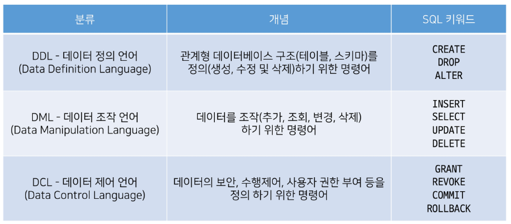
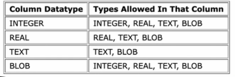
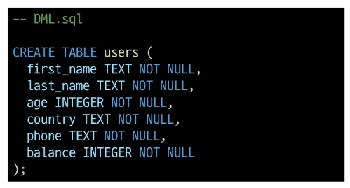
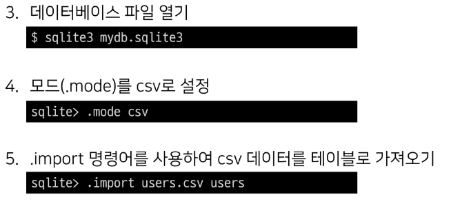

# SQL

- “Structured Query Language”
- RDBMS의 데이터를 관리하기 위해 설계된 특수 목적의 프로그래밍 언어
- 데이터베이스와 상호작용하는 방법

## 2.1 SQL commands

1. DDL(Data Definition Language)
2. DML(Data Manipulation Language)
3. DCL(Data Control Language)



- SQLite는 파일로 관리되는 DB이기 때문에 SQL을 이용한 접근 제한이 아닌 운영체제의 파일 접근 권한으로만 제어 가능
  
    **DCL을 지원하지 않음**

## 2.2 SQL Syntax

- statement 종료는 세미콜론(;)
- 대소문자를 구분하지 않지만 **대문자 권장**
- **statement(문)**
  - 독립적으로 실행할 수 있는 완전한 코드 조각
  - statement, clauese로 구성됨
- clause(절)
  - statement의 하위 단위
- 예시
  - `SELECT column_name FROM table_name;`
  - SELECT statement라 부름
  - 2개의 Clause
    1. SELECT column_name
    2. FROM table_name

---

# DDL

- Data Definition Language
- 테이블 구조를 관리
  - CREATE, ALTER, DROP

## - 사전준비

1. vscode - mydb,sqlite3 파일 생성
2. DDL.sql 파일 생성
3. vscode 실행 후 DDL.sql 화면에 마우스 우측 버튼 클릭
   - use Database 선택
4. 데이터베이스 목록에서 mydb.sqlite3 선택

## - index

- SQLite Data Types
- CREATE TABLE
- Constraints
- ALTER TABLE
- DROP TABLE

## 1. <mark>SQLite Data Types</mark>

1. **NULL**
   
   1. NULL value
   2. 정보가 없거나 알 수 없음을 의미

2. **INTEGER**
   
   1. 정수
   2. 크기에 따라 0, 1, 2, 3, 4, 5, 6 또는 8byte와 같은 가변 크기를 가짐

3. **REAL**
   
   1. 실수
   2. 8byte 부동소수점을 사용하는 10진수 값이 있는 실수

4. **TEXT**
   
   1. 문자 데이터

5. **BLOB(Binary Large Object)**
   
   1. 입력된 그대로 저장된 데이터 덩어리(대용 타입 없음)
   2. binary 등 멀티미디어 파일
   3. 예
      1. 이미지 데이터

6. Boolean type
   
   1. SQLite에는 없음
   2. 0, 1로 표현

7. date & time datatype
   
   1. 날짜, 시간을 저장하는 타입 없음
   2. built-in ‘Date and Time Functions’dmfh TEXT, REAL 또는 INTEGER값으로 저장할 수 있음
      1. https://www.sqlite.org/lang_datefunc.html

### 1.1 데이터 타입 결정 규칙

1. 값에 둘러싸는 따옴표와 소수점 또는 지수가 없으면 - INTEGER
2. 값이 작은 따옴표나 큰 따옴표로 묶이면 - TEXT
3. 값에 따옴표나 소수점, 지수가 있으면 - REAL
4. 값이 따옴표 없이 NULL이면 - NULL

### 1.2 SQLite DATA types 특징

- <mark>**동적 타입 시스템(dynamic type system)**</mark> 사용
  - 컬럼에 선언된 데이터 타입에 의해서가 아니라 <mark>**컬럼에 저장된 값에 따라 데이터 타입이 결정**</mark>됨
- 컬럼에 대해 특정 데이터 타입을 선언하지 않아도 됨
  - 엄격한 데이터베이스에서 불가능한 작업을 유연하게 수행할 수 있음
- 다른 데이터베이스와의 호환성 문제가 있기 때문에 테이블 생성 시, <mark>데이터 타입을 지정하는 것을 권장</mark>
- static, rigid typing 데이터 베이스
  - 입력된 데이터 타입을 지정된 데이터 타입으로 형변환도 지원



### 1.3 Type Affinity

- **타입 선호도**
- 특정 컬럼에 저장된 데이터에 권장되는 타입
- 다른 데이터베이스와 호환성을 위해 비슷한 데이터타입명을 선언하면 5가지 선호도로 인식함
  1. INTEGER
  2. TEXT
  3. BLOB
  4. REAL
  5. NUMERIC

## 2. <mark>CREATE TABLE</mark>

- 데이터베이스에 새 테이블을 만듦

```sql
CREATE TABLE contacts (
    name TEXT NOT NULL,
    age INTEGER NOT NULL,
    email TEXT NOT NULL
);
```

- Query 실행하기
  - 실행하고자 하는 명령문에 커서를 두고 마우스 우측 버튼
  - → ‘Run Selected Query’ 선택
- Query 실행 후 테이블 및 스키마 확인
- id 컬럼은 우리가 직접 기본 키 역할의 컬럼을 정의하지 않으면 자동으로 `rowid`라는 컬럼으로 만들어짐

## 3. Constraints

- 제약조건
- 입력하는 데이터에 대해 제약을 정함
- 제약에 맞지않다면, 입력 거부
- **데이터 무결성 유지**
  - 사용자가 원하는 조건의 데이터만 유지하기 위한 보편적인 방법
- 테이블의 특정 컬럼에 설정하는 제약

### 3.1 데이터 무결성

- DB 내에  데이터에 대한 **정확성 일관성을** 보장하는 것을 의미

### 3.2 종류

1. NOT NULL
   - 컬럼에  NULL 허용 안함
   - 기본적으로 모든 컬럼은 NOT NULL 명시적 사용
2. UNIQUE
   - 컬럼의 모든 값이 서로 구별되거나 고유한 값이 되도록 함
3. PRIMARY KEY
   - 테이블에서 행의 고유성을 식별하는 데 사용하는컬럼
   - 각 테이블에는 하나의 기본 키만 있음
   - 암시적으로 NOT NULL 제약조건이 포함되어 있음(INTEGER 타입에서만 가능)
4. AUTOINCREMENT
   - 사용되지 않는 값이나 이전에 삭제된 행의 값을 재사용하는 것을 방지
   - `id INTEGER PRIMARY KEY AUTOINCREMENT` : 다시 재사용 불가
   - id 컬럼에 기본적으로 사용하는 제약 조건
5. 그 외 기타 constraints

### rowid 특징

- 테이블 생성할 때마다 rowid라는 암시적 자동 증가 컬럼이 자동 생성됨
- 테이블의 행을 고유하게 식별하는 64비트 부호 있는 정수 값
- 테이블에 새 행을 삽입할 때마다 정수 값을 자동으로 할당
  - 값은 1에서 시작
  - 데이터 삽입 시 ROWID 또는 INTEGER PRIMARY KEY 컬럼에 명시적으로 값이 지정되지않은 경우, SQLite는 가장 큰 rowid보다 하나 큰 다음 순차 정수를 자동으로 할당
- 만약 **INTEGER PRIMARY KEY** 키워드를 가진 컬럼을 직접 만들면 이 컬럼은 rowid컬럼의 별칭(alias)이됨
  - 즉, 새 컬럼 이름으로  rowid에 액세스할 수 있으며, rowid 이름으로도 여전히 액세스 가능
- 데이터가 최대 값에 도달하고 새행을 삽입하려고 하면, 사용되지 않은 정수를 찾아 사용
  - 찾을 수 없으면 SQLITE_FULL 에러
    - 일부 행 삭제 후 새 행을 삽입하면, 삭제된 행의 rowid 값을 재사용하려고 시도(오토인크리먼트가 없다면)

## 4. ALTER TABLE

- 기존 테이블의 구조를 수정
- 활용법
  1. Rename a table
  2. Rename a column
  3. Add a new column to a table
  4. Delete a column

### 4.1 Alter Table statement

```sql
-- 1. Rename table
ALTER TABLE contacts RENAME TO new_contacts;
```

### 4.2 ALTER TABLE  RENAME COLUMN

```sql
-- 2. Rename a column
ALTER TABLE new_contacts RENAME COLUMN name TO last_name;
```

### 4.3 ALTER TABLE  ADD COLUMN

```sql
ALTER TABLE new_contants 
ADD COLUMN address TEXT NOT NULL;
```

- 테이블에 기존 데이터가 있을 경우
  
  - `cannot add not null column with default value null`
  
  - 이전에 이미 저장된 데이터들은 새롭게 추가되는 컬럼에 값이 없기 때문에 NULL이 작성됨
  
  - 디폴트값이 없이 추가할 수없다는 에러
    
    ```sql
    ALTER TABLE new_contants
    ADD COLUMN address TEXT NOT NULL DEFAULT 'no address';
    ```
  
  - default 제약조건으로 해결

### 4.4 ALTER TABLE DROP COLUMN

```sql
ALTER TABLE new_contants DROP COLUMN address;
```

- **삭제하지 못하는 상황**
  - 컬럼이 다른 부분에서 참조되는 경우
    - FOREIGN KEY(외래 키) 제약조건에서 사용되는 경우
  - PRIMARY KEY 인 경우
  - UNIQUE 제약조건이 있는 경우


## 5. DROP TABLE

- 데이터베이스에서 테이블제거
- 존재하지 않는 테이블을 제거하면 SQLite에서 오류가 발생
  - `no such table: table_name`

```sql
DROP TABLE new_contants;
```

### 5.1 특징

- 한 번에 하나의 테이블만 삭제할 수 있음
- 여러 테이블을 제거하려면 여러 DROP TABLE 문을 실행해야 함
- DROP TABLE 문은 실행 취소하거나 복구할 수 없음

---

# Summary

## DDL

- 데이터 정리 언어
- CREATE TABLE
  - 데이터 타입과 제약조건
  - ALTER TABLE
    - RENAME
    - RENAME COLUMN
    - ADD COLUMN
    - DROP COLUMN
- DROP COLUMN

---

# DML

## -INDEX

- Simple query
- sorting rows
- flitering data
- grouping data
- changing data

## - 사전 준비

- data.csv 파일 준비

- 테이블에 해당 csv 파일 데이터를 import 해서 사용

- sqlite3 사용

- 데이터 베이스 파일열기
  
    

- DML.sql 파일 생성

- 테이블 생성
  
  - 
  - 

## 1. Simple query

- `SELECT` 문을 사용해서 테이블에 데이터 조회하기

### 1.1 SELECT statement

- `SELECT column1, column2 from table_name;`
- Query data from a table
- 문법 규칙
  1. SELECT절에서 컬럼 또는 쉼표로 구분된 컬럼 목록을 지정
  2. FROM절에서 데이터를 가져올 테이블 지정
- 다양한 절
  - ORDER BY
  - DISTINCT
  - WHERE
  - LIMIT
  - LIKE
  - GROUP BY

### 실습

- 전체 데이터 조회
  
  ```sql
  SELECT * FROM users;
  ```

## 1.2 sorting rows_ <mark>ORDER BY</mark>

```sql
SELECT select_list FROM table_name
ORDER BY column_1 ASC, COLUMN_2 DESC;
```

- **ORDER BY 위치**
  
  - FROM 절 뒤에 위치

- 하나 이상의 컬럼을 기준으로 결과를 정렬할 수 있음
  
  - `ASC` : 기본
  - `DESC`

- sorting NULLS
  
  - SQLlite는 NULL을 다른 값보다 작은 값으로 간주

- **실습**
  
  - 이름과 나이를 나이가 어린 순서대로 조회
    
    ```sql
    SELECT first_name, age FROM users ORDER BY age; --ASC;
    ```
  
  - 이름, 나이, 계좌 잔고를 나이가 어린 순으로, 만약 같은 나이라면, 계좌 잔고가 많은 순으로 조회
    
    ```sql
    SELECT first_name, age, balance FROM users
    ORDER BY age ASC, balance DESC;
    ```

## 2. Filtering data

- 데이터를 필터링하여 중복 제거, 조건 설정 등 쿼리를 제어하기
- **Clause**
  - SELECT DISTINCT
  - WHERE
  - LIMIT
- **Operator**
  - LIKE
  - IN
  - BETWEEN

### 2.1 `SELECT DISTINCT` Clause

- `SELECT DISTINCT select_list FROM table_name;`

- 조회 결과에서 중복된 행 제거

- `DISTINCT` : SELECT절에서 선택적으로 사용할 수 있는 절

- 문법규칙
  
  1. `DISTINCT` 절은 `SELECT` 키워드 바로 뒤에 나타나야 함
  2. `DISTINCT` 키워드 뒤에 컬럼 또는 컬럼 목록을 작성

- **실습**
  
  - 모든 지역 중복없이 조회하기
    
    ```sql
    SELECT DISTINCT country FROM users;
    ```
  
  - 지역 순으로 내림차순 정렬하여 중복없이 모든 지역 조회하기
    
    ```sql
    SELECT DISTINCT country FROM users ORDER BY country DESC;
    ```
  
  - 이름과 지역이 중복없이 모든 이름과 지역 조회하기
    
    ```sql
    SELECT DISTINCT first_name, country FROM users;
    -- 두 컬럼을 하나의 집합으로 보고 중복을 제거
    ```
  
  - 이름과 지역 중복 없이 지역 순으로 내림차순 정렬하여 모든 이름과 지역 조회하기
    
    ```sql
    SELECT DISTINCT first_name, country FROM users ORDER BY country DESC;
    ```

- 참고
  
  - **NULL with DISTINCT**
    - SQLite는 NULL 값을 중복으로 간주
      - NULL값이 존재하는 컬럼에 `DISTINCT` 절을 사용하면  SQLite는 NULL값의 한 행을 유지

### 2.2 `WHERE` clause

```sql
SELECT column_list FROM table_name
WHERE search_condition;
```

- 조회 시 특정 검색 조건을 조정

- **<mark>SELECT, UPDATE, DELETE절에서 선택적으로 사용할 수 있는 절</mark>**

- FROM절 뒤에 작성

- 예시
  
  ```sql
  WHERE column_1 = 10
  WHERE column_2 LIKE 'ko%'
  WHERE column_3 IN (1, 2)
  WHERE column_4 BETWEEN 10 and 20
  ```
  
  - 비교 연산자
    - `=`
    - `<>` or `!=`
    - <
    - > 
    - `<=`
    - `>=`

- 실습
  
  - 나이가 30살 이상인 사람들의 이름, 나이, 계좌, 잔고 조회
    
    ```sql
    SELECT first_name, age, balance FROM users WHERE age >= 30;
    ```
  
  - 나이가 30살 이상이고 계좌 잔고가 50만원 초과인 사람들의 이름, 나이, 계좌, 잔고 조회
    
    ```sql
    SELECT first_name, age, balance FROM users WHERE age >= 30 AND balance >500000;
    ```

<h4> SQLite Logical Operators</h4>

- 일부 표현식의 truth를 테스트할 수 있음
- 1, 0, or NULL을 반환
- `ALL, AND, ANY, BETWEEN, IN, LIKE, NOT, OR` 등

<h4>`IS NOT NULL`</h4>

- 값이 NULL이 아닐 때 선택

```sql
-- IS NOT NULL : NULL이 아닐 때
SELECT first_name, balance FROM users 
WHERE first_name IS NOT NULL AND balance > 400;
```

### 2.3 `LIKE` operators

- 패턴 일치를 기반으로 데이터를 조회
- `SELECT, DELETE, UPDATE` 문의 WHERE절에서 사용
- 대소문자 구분 안함

<h4>**와일드카드</h4>**

1. `%` (percent) : 0개 이상의 문자가 올 수 있음을 의미

2. `_` (underscore) : 단일 문자가 있음을 의미 
- **특이 예시**
  
  - 2로 시작하고 최소 3자리인 패턴
    
    ```sql
     WHERE column_name LIKE '2_%_%'; --'2__%';
    ```
  
  - **실습**
    
    - 이름에 ‘호’가 포함되는 사람들의 이름과 성 조회하기
      
      ```sql
      SELECT first_name, last_name FROM users WHERE first_name LIKE '%호%';
      ```
    
    - 서울 지역 전화번호를 가진 사람들의 이름과 전화번호 조회하기
      
      ```sql
      SELECT first_name, phone FROM users WHERE phone LIKE '02-%';
      ```
    
    - 전화번호 중간 4자리가 51로 시작하는 사람들의 이름과 전화번호 조회
      
      ```sql
      SELECT first_name, phone FROM users WHERE phone LIKE '%-51__-%';
      ```

### 2.4 `IN` operators

- **실습**
  
  - 경기도 혹은 강원도 사는 사람들의 이름과 지역 조회
    
    ```sql
    SELECT first_name, country FROM users WHERE country IN ('경기도', '강원도');
    ```

### 2.5 `BETWEEN` operators

- 값이 값 범위에 있는 테스트

- **종류**
  
  - `BETWEEN` OR `NOT BETWEEN`

- **실습**
  
  - 나이가 **20살 이상 30살 이하** 인 사람들의 이름 나이 조회
    
    ```sql
    SELECT first_name, age FROM users WHERE age BETWEEN 20 AND 30;
    ```

### 2.6 `LIMIT` clause

```sql
    SELECT column_list FROM table_name LIMIT row_count
```

- 쿼리에서 반환되는 행 수를 제한

- SELECT문에서 선택적으로 사용할 수 있는 절

- row_count  : **반환되는 행 수**를 지정하는 **양의 정수**

- **실습**
  
  - 첫 번째부터 열 번째 데이터까지 rowid와 이름 조회하기
    
    ```sql
    SELECT rowid, first_name FROM users LIMIT 10;
    ```
  
  - 계좌 잔고가 가장 많은 10명의 이름과 계좌 잔고 조회하기
    
    ```sql
    SELECT first_name, balance FROM users ORDER BY balance DESC LIMIT 10;
    -- 위와 같은 지정된 순서로 작성해야 함
    --  LEMIT절에 지정된 행 수를 가져오기 전에 결과를 정렬하기 때문
    ```

### 2.7 `OFFSET` keyword

- LIMIT절을 사용하면 첫 번째 대이터부터 지정 수만큼 추출

- `OFFSET`과 함께 사용하면 특정 지정된 위치에서부터 데이터를 조회

- 11번째 20번째 데이터의 rowid와 이름 조회
  
  ```sql
  SELECT rowid, first_name FROM users LIMIT 10 OFFSET 10;
  ```

---

# Grouping data

## 1. `GROUP BY` clause

```sql
SELECT column_1, aggregate_function(column_2)
FROM table_name
GROUP BY column_1, column_2;
```

- 특정 그룹으로 묶인 결과를 생성
  - 선택된 컬럼값을 기준으로 데이터의 공통값을 묶어서 결과로 나타냄
- SELECT FROM절 뒤에 작성
  - **WHERE절이 있는 경우 WHERE절 뒤에 작성해야 함**
- 각 그룹에 대해 `MIN, MAX, SUM, COUNT` 또는 `AVG`'와 같은 집계함수(Aggregate function)를 적용하여 각 그룹에 대한 추가적인 정보를 제공할 수 있음

### 1.1 Aggregate function

- “집계 함수”

- 계산 후 단일 값 반환

- SELECT 문의 GROUP BY절과 함께 종종 사용

- **함수 목록**
  
  - AVG(), COUNT(), MAX(), MIN(), SUM()

- 계산이 이뤄지기 때문에 반드시 컬럼의 데이터 타입이 숫자(INTEGER)일 때만 사용 가능

- **실습**
  
  - users 테이블 전체 행 수 조회
    
    ```sql
    SELECT COUNT(*) FROM users;
    ```
  
  - 나이가 30살 이상인 사람들의 평균 나이 조회
    
    ```sql
    SELECT AVG(age) FROM users WHERE age >= 30;
    ```
  
  - 각 지역별로 몇 명 살고 있는지 조회하기
    
    ```sql
    SELECT country, COUNT(*) FROM users GROUP BY country;
    -- 각 지역별로 그룹이 나누어졌기 때문에 COUNT(*)는 지역별로 개수를 세게 됨
    -- COUNT(*)라는 이름의 컬럼이 생성됨
    ```
  
  - 각 성씨가 몇 명씩 있는지 조회
    
    ```sql
    SELECT last_name, COUNT(*) FROM users GROUP BY last_name;
    ```
    
    - 컬럼명을 임시로 변경하여 조회
      
      ```sql
      SELECT last_name, COUNT(*) AS number_of_name FROM users GROUP BY last_name;
      -- AS 키워드를 사용해 컬럼명을 임시로 변경하여 조회할 수 있음
      ```
  
  - 인원이 가장 많은 성씨 순으로 조회하기
    
    ```sql
    SELECT last_name, COUNT(*) FROM users 
    GROUP BY last_name ORDER BY COUNT(*) DESC;
    ```

---

# changing data

- 데이터 삽입, 수정, 삭제하기
  - INSERT, UPDATE, DELETE

## - 사전 준비

- 실습 편의를 위해 새 테이블 생성

```sql
CREATE TABLE classmates (
    name TEXT NOT NULL,
    age INTEGER NOT NULL,
    address TEXT NOT NULL
);
```

## 1. `INSERT` statement

```sql
INSERT INTO table_name (column_1, column_2, ... )
VALUES (values1, values2, ''');
```

- 새 행을 테이블에 삽입
- **문법 규칙**
  1. 먼저 INSERT INTO 키워드 뒤에 데이터를 삽입할 테이블의 이름을 지정
  2. 데이블 이름 뒤에 쉼표로 구분된 목록을 추가
     - 컬럼 목록은 선택 사항이지만 컬럼 목록을 포함하는 것을 권장
  3. VALUES 키워드 뒤에 쉼표로 구분된 값 목록을 추가
     1. `만약 컬럼 목록을 생략하는 경우 값 목록의 모든 컬럼에 대한 값을 지정해야 함`
     2. 값 목록의 값 개수는 컬럼 목록의 컬럼 개수와 같아야 함

### `INSERT` 실습

- 단일 행 삽입

```sql
INSERT INTO classmates (name, age, address)
VALUES ('홍길동', 23, '서울');

INSERT INTO classmates
VALUES ('홍길동', 23, '서울');
```

- 여러 행 삽입

```sql
INSERT INTO classmates (name, age, address)
VALUES 
    ('김철수', 30, '경기'),
    ('이영미', 31, '강원'),
    ('박진성', 26, '전라'),
    ('최지수', 12, '충청'),
    ('정요한', 28, '경상');
```

## 2. `UPDATE` statement

```sql
UPDATE table_name
SET column_1 = new_value_1,
        column_2 = new_value_2
WHERE
    search_condition;
```

- 테이블에 있는 기존 행의 데이터를 업데이트
- 문법 규칙
  1. UPDATE절 이후에 업데이트할 테이블 이름 지정
  2. SET절에서 테이블의 각 컬럼에 대해서 새 값 지정
  3. WHERE절의 조건을 이용하여 업데이트할 행을 지정
  4. 선택적으로 ORDER BY, LIMIT 활용한 업데이트 대상 제어 가능

### `UPDATE` 실습

- 2번 데이터의 이름을 ‘김철수한무두루미’, 주소를 ‘제주도’로 수정하기

```sql
UPDATE classmates
SET name = '김철수한무두루미',
    address = '제주도'
WHERE
    rowid = 2;
  -- WHERE이 없으면 전체 레코드가 변경됨
```

## 3. `DELETE` statement

```sql
DELETE FROM table_name WHERE search_condtion;
```

- 테이블에서 행을 제거
- 테이블의 한 행, 여러 행 및 모든 행을 삭제할 수 있음
- 문법규칙
  1. DELETE FROM 키워드 뒤에 행을 제거하려는 테이블의 이름 지정
  2. ㄴWHERE절에 검색 조건 추가하여 제거할 행 식별
     - 생략하면 모든 행 삭제
  3. 선택적으로 ORDER BY, LIMIT 활용한 업데이트 대상 제어 가능

### `DELETE` 실습

- 5번 데이터 삭제하기

```sql
DELETE FROM classmates WHERE rowid = 5;
```

- 삭제된 것 확인

```sql
SELECT rowid, * FROM classmates;
```

- 이름에 ‘영’이 포함되는 데이터 삭제

```sql
DELETE FROM classmates WHERE name LIKE '%영%';
```

---

## MySQL

### 전체 용량 확인

- 재 DB의 남은 디스크 용량(free_MB)과 사용중인 디스크 용량(used_MB)을 다음 쿼리를 통해 알 수 있습니다

```sql
SELECT SUM(data_length+index_length)/1024/1024 "used_MB", SUM(data_free)/1024/1024 "free_MB" FROM information_schema.tables;
```


### database 별 용량 확인
```sql
SELECT table_schema "Database", ROUND(SUM(data_length+index_length)/1024/1024,1) "used_MB" FROM information_schema.TABLES GROUP BY 1;
```

---

# 마무리

- Database
  - RDB
- SQL
- DDL
  - CREATE TABLE
    - Data Type
    - Constraints
  - ALTER TABLE
  - DROPTABLE
- DML
  - SELECT
    - SELECT DISTINCT
  - ORDER BY
  - WHERE
    - LIKE, IN, BETWEEN
  - LIMIT, OFFSET
  - GROUP BY
    - Aggregate Function
  - INSERT/ UPDATE/ DELETE
