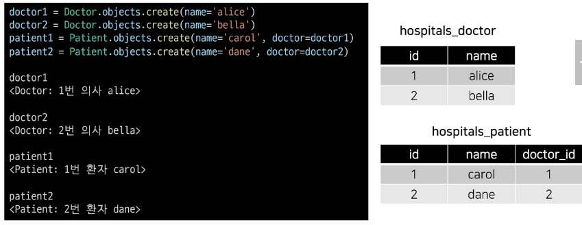
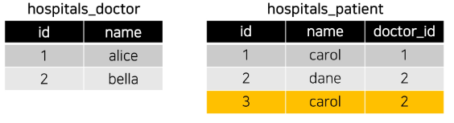
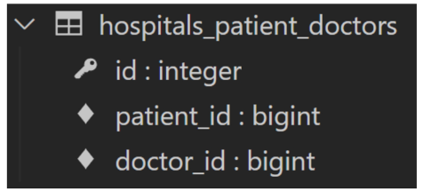

# Many to Many relationship

# RDB에서의 관계 복습

1. 1:1
    - many To one relationship
    - 한 테이블의 0개 이상의 레코드가 다른 테이블의 레코드 한 개와 관련된 경우
2. N:1
    - many To one relationship
    - 한 테이블의 0개 이상의 레코드가 다른 테이블의 레코드 한 개와 관련된 경우
    - 기준 테이블에 따라 1:N이라고도 함
3. M:N
    - many-to-many relationship
    - 한 테이블의 0개 이상의 레코드가 다른 테이블의 0개 이상의 레코드와 관련된 경우
    - 양쪽 모두에서 N:1관계를 가짐

# 개요

- 병원에서 내원하는 환자와 의사의 예약 시스템을 구축하라는 업무를 지시받음
    - 필요한 데이터 베이스 모델을 고민해보고 모델링 진행하기
    - 모델링하는 이유는 현실 세계를 최대한 유사하게 반영
- 고민해야할 것
    - 병원 시스템에서 핵심이 되는 것 → 의사와 환자
    - 이 둘의 관계를 어떻게 표현할 수 있을까?
- 우리 일상에서 가까운 예시를 통해 DB를 모델링하고 그 내부에서 일어나는 데이터의 흐름을 어떻게 제어할 수 있을지 고민해보기

> [참고] 데이터모델링
> 주어진 개념으로부터 논리적인 데이터 모델을 구성하는 작업
> 물리적인 데이터베이스 모델로 만들어 고객의 요구에 따라 특정 정보 시스템의 데이터베이스에 반영하는 작업

# N:1 한계

- 의사와 환자간 예약 시스템을 구현
- 지금까지 배운 N:1관계를 생각해 한 명의 의사에게 여러 환자가 예약할 수 있다로 모델 관계를 설정
- 각각 2명의 의사와 환자를 생성하고 환자는 서로 다른 의사에게 예약을 했다고 가정



- 1번 환자가 두 의사 모두에게 방문하려 함
    - `patient3 = Patient.objects.create(name='carol',doctor=doctor2)`



- 동일한 환자지만 다른 의사에게  예약하기 위해서는 객체를 하나 더 만들어서 예약을 진행해야 함
    - 새로운 환자 객체를 생성할 수 밖에 없음
- 외래 키 컬럼에 ‘1, 2’ 형태로 참조하는 것은 integer 타입이 아니기에 불가능
- 그렇다면 “예약 테이블을 따로 만들자”

# 1. 중계 모델

- 환자 모델의 외래 키를 삭제하고 별도의 예약 모델을 새로 작성
- 예약 모델은 의사와 환자에 각각 N:1관계를 가짐

```python
from django.db import models

# Create your models here.
class Doctor(models.Model):
    name = models.TextField()

    def __str__(self):
        return f'{self.pk}번 의사 {self.name}'

class Patient(models.Model):
    name = models.TextField()

    def __str__(self):
        return f'{self.pk}번 환자 {self.name}'

class Reservation(models.Model):
    doctor = models.ForeignKey(Doctor, on_delete=models.CASCADE)
    patient = models.ForeignKey(Patient, on_delete=models.CASCADE)

    def __str__(self):
        return f'{self.doctor_id}번 의사의 {self.patient_id}번 환자'
```

```bash
In [1]: doctor1 = Doctor.objects.create(name='alice')

In [2]: patient1 = Patient.objects.create(name='carol')

In [3]: Reservation.objects.create(doctor=doctor1, patient=patient1)
```

- 예약 정보 조회

```bash
In [5]: doctor1.reservation_set.all()
Out[5]: <QuerySet [<Reservation: 1번 의사의 1번 환자>]>

In [6]: patient1.reservation_set.all()
Out[6]: <QuerySet [<Reservation: 1번 의사의 1번 환자>]>
```

- 1번 의사에게 새로운 환자 예약이 생성된다면

```bash
In [8]: patient2 = Patient.objects.create(name='dane')

In [9]: Reservation.objects.create(doctor=doctor1, patient=patient2)
Out[9]: <Reservation: 1번 의사의 3번 환자>

```

- 1번 환자 의사의 예약 정보 조회

```bash
In [10]: doctor1.reservation_set.all()
Out[10]: <QuerySet [<Reservation: 1번 의사의 1번 환자>, <Reservation: 1번 의사의 
3번 환자>]>
```

# 2. Django ManyToManyField

- 환자 모델에 Django ManyToManyField 작성

```python
class Patient(models.Model):
    doctors = models.ManyToManyField(Doctor)
    name = models.TextField()

    def __str__(self):
        return f'{self.pk}번 환자 {self.name}'
```
- 생성된 중계 테이블 hospitals_patient_doctors 확인



- Reservation 스키마 없이 자동 생성됨
- **테이블명 생성 규칙**
    - `Appname_modelname_fieldname`

- 예약 생성(환자가 의사에게 예약)
    
    ```bash
    # patient1이 doctor1에게 예약
    In [5]: patient1.doctors.add(doctor1)
    
    # patient1 - 자신이 예약한 의사 목록 확인
    In [6]: patient1.doctors.all()
    Out[6]: <QuerySet [<Doctor: 1번 의사 alice>]>
    
    # doctor1 - 자신이 예약한 의사 목록 확인
    In [7]: doctor1.patient_set.all()
    Out[7]: <QuerySet [<Patient: 1번 환자 carol>]>
    ```
    
- 예약 생성(의사가 환자를 예약)
    
    ```bash
    In [8]: doctor1.patient_set.add(patient2)
    
    In [9]: doctor1.patient_set.all()
    Out[9]: <QuerySet [<Patient: 1번 환자 carol>, <Patient: 2번 환자 
    dane>]>
    ```
    
- 예약 취소하기(삭제)
    
    ```bash
    # 역참조
    In [10]: doctor1.patient_set.remove(patient1)
    # 참조
    In [11]: patient2.doctors.remove(doctor1)
    ```

## 2.1 ‘related_name’ argument

- target model이 source model을 참조할 때 사용할 manager name
- ForeignKey()의 related_name과 동일

```python
class Patient(models.Model):
    doctors = models.ManyToManyField(Doctor, related_name='patients')
    name = models.TextField()

    def __str__(self):
        return f'{self.pk}번 환자 {self.name}'
```

```bash
In [1]: doctor1 = Doctor.objects.create(name='alice')

# set manager 이름 변경
In [2]: doctor1.patients.all()
Out[2]: <QuerySet []>
```

## 2.2 ‘through’ argument

- 중계 테이블을 수동으로 지정하려고하는 경우
- `through` 옵션을 사용해서 중계테이블을 나타내는 django모델을 지정할 수 있음
- 예 > 중계테이블에 추가 데이터를 사용해 다대다관계를 연결하려는 경우

```python
class Patient(models.Model):
    # Reservation이 주체가 되지 않지만 Reservation 필드를 추가할 수 있다.
    doctors = models.ManyToManyField(Doctor, related_name='patients', through='Reservation')
    name = models.TextField()

    def __str__(self):
        return f'{self.pk}번 환자 {self.name}'

class Reservation(models.Model):
    doctor = models.ForeignKey(Doctor, on_delete=models.CASCADE)
    patient = models.ForeignKey(Patient, on_delete=models.CASCADE)
    symptom = models.TextField()
    reserved_at = models.DateTimeField(auto_now_add=True)

    def __str__(self):
        return f'{self.doctor_id}번 의사의 {self.patient_id}번 환자'
```

- 예약생성 1(Reservation 클래스를 이용한 예약 생성)

```python
In [1]: doctor1 = Doctor.objects.create(name='alice')

In [2]: patient1 = Patient.objects.create(name='carol')

In [3]: patient2 = Patient.objects.create(name='dane')

In [4]: reservation1 = Reservation(doctor=doctor1, patient=patient1, symptom='headache')

In [5]: reservation1
Out[5]: <Reservation: 1번 의사의 1번 환자>
```

- 예약 생성 2(Patient 객체를 통한 예약 생성)
    - `through_defaults`값에 딕셔너리 타입으로 입력

```python
In [6]: patient2.doctors.add(doctor1, through_defaults={'symptom':'flu'})

In [7]: doctor1.patients.all()
Out[7]: <QuerySet [<Patient: 2번 환자 dane>]>
```

## 정리

- M:N관계로 맺어진 두 테이블에는 변화가 없음
- Django의 ManyToManyField는 중개 테이블을 자동으로 생성함
- Django의 ManyToManyField는 M:N관계를 맺는 두 모델 어디에 위치해도 상관없음
    - 대신 필드 작성 위치에 따라 `참조와 역참조 방향을 주의`할 것
- N:1은 완전한 종속의 관계였지만 M:N은 의사에게 진찰받은 환자, 환자를 진찰하는 의사의 두 가지 형태로 모두 표현이 가능한 것

# 3. ManyToManyField

- ManyToManyField(to, **options)
- 다대다 관계 설정 시 사용하는 모델 필드
`- 필드생성이아니라 중계테이블이 생성됨`
- 하나의 필수 위치인자가 필요
- 모델 필드의 RelatedManager를 사용하여 관련 개체를 추가, 제거 또는 만들 수 있음
    - add(), remove(), create(), clear() …

## 3.2 ManyToManyField’s Arguments

1. **related_name**
    - target model이 source model을 참조할 때 사용할 manager name
    - ForeignKey의 related_name과 동일

2. **through**
    - 중계 테이블을 직접 작성하는 경우, through옵션을 사용하여 중계 테이블을 나타내는 Django 모델을 지정
    - 일반적으로 중계 테이블에 추가 데이터를 사용하는 다대다 관계와 연결하려는 경우(extra data with a many-to-many relationship)에 사용됨

3. **symmetrical**
    - 기본값 : True
    - 서로 source를 가지고 있기 때문에 역참조 manager 사용 못함
    - ManyToManyField가 동일한 모델(on self)을 가르키는 정의에서만 사용
    - True일 경우
        - _set 메니저를 추가하지 않음
        - source 모델의 인스턴스가 target모델의 인스턴스를 참조하면 target도 자동 참조
    - 팔로우-팔로잉 개념
        - 누군가 나를참조하면 나도 상대방을 자동으로 참조하도록 함
        - False 설정 시 - 자동 참조 해제

## 3.3 Related Manager

- N:1 혹은 M:N관계에서 사용가능한 문맥(context)
- 같은 이름의 메서드여도 각 관계에 따라 다르게 사용 및 동작됨
    - N:1에서는 target모델 객체만 사용 가능
    - `M:N관계에서는 관련된 두 객체에서 모두 사용 가능`
- 메서드 종류
    - add(), remove(), create(), clear(), set() 등

## 3.4 methods

- **add()**
    - ‘지정된 객체를 관련 객체 집합에 추가’
    - 이미 존재하는 관계에 사용하면 관계가 복제되지 않음
    - 모델 인스턴스, 필드 값(PK)을 인자로 허용
- **remove()**
    - ‘관련 객체 집합에서 지정된 모델 개체를 제거’
    - 내부적으로 QuerySet.delete()를 사용하여 관계가 삭제됨
    - 모델 인스턴스, 필드값(PK)을 인자로 허용

## 3.5 중계 테이블 필드 생성 규칙(쭝요)

1. 소스(source model) 및 대상(target model)이 다른 경우
    1. id
    2. \<containing_model\>_id
    3. \<other_model\>_id
        
        
        
2. ManyToManyField가 동일한 모델을 가르키는 경우
    1. id
    2. from_\<model\>_id
    3. to_\<model\>_id`

