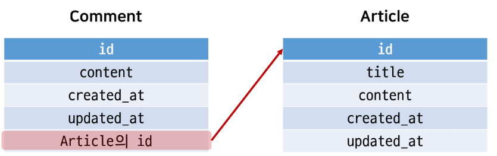
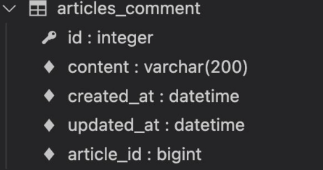
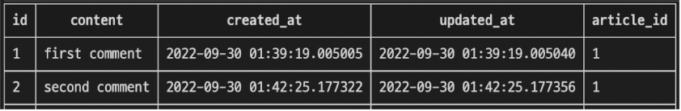
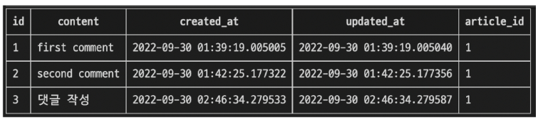

# N : 1(comment - article)

- comment 모델과 article 모델 간 관계 설정
- 0개 이상의 댓클은 1개의 게시글에 작성될 수 있음

## 1. 모델 관계 설정

게시판의 게시글과 N:1관계를 나타낼 수 있는 댓글을 구현해보자

N:1 관계에서 댓글을 담당할 comment 모델은 N, article모델은 1



## 2. Django Relationdship fields 종류

1. OneToOneField()
    - A one-to-one relationship
2. ForeignKey()
    - A many-to-one relationship
3. ManyToManyField()
    - A many-to-many relationship

### 2.2 ForeignKey(to, on_delete, **options)

- A many-to-one relationship을 담당하는 django의 모델 필드 클래스
- Django모델에서 관계형 데이터베이스의 **외래 키 속성을 담당**
- 2개의 필수 위치 인자
    1. 참조하는 `model class`
    2. `on_delete` 옵션

## 3. Comment Model

## comment model 정의

```python
# articles/models.py

from django.db import models
# Create your models here.
class Comment(models.Model):
    article = models.ForeignKey(Article, on_delete=models.CASCADE)
    content = models.CharField(max_length=200)
    created_at = models.DateTimeField(auto_now_add=True)
    updated_at = models.DateTimeField(auto_now=True)

    def __str__(self):
        return self.content
```

- **외래 키 필드는 ForeignKey 클래스를 작성하는 위치와 관계없이 필드의 마지막에 작성됨**
- **ForeignKey()클래스의 인스턴스 이름은** **참조하는 모델 클래스 이름의 단수형(소문자)으로 작성**하는 것을 관장

### 3.1 ForeignKey arguments - `on_delete`

- **외래 키가 참조하는 객체가 사라졌을 때 외래 키를 가진 객체를 어떻게 처리할 지를 정의**
- 데이터 무결성을 위해서 매우 중요한 설정
- 옵션값
    - `CASCADE` : 부모 객체(참조된 객체)가 삭제됐을 때 이를 참조하는 객체도 삭제
        - `PROTECT, SET_NULL, SET_DEFAULT` 등 여러 옵션 값 존재
        - 

<h4>**[참고] 데이터 무결성(DATA intergrity)</h4>**

- 데이터의 정확성이나 일관성을 유지하고 보증하는 것
- 데이터 베이스나 RDBMS의 중요한 기능
- 무결성 제한 기능
    1. 개체 무결성(entity integrity)
    2. 참조 무결성(referential integrity)
    3. 범위 무결성(domain integrity)
    

### 3.2 migration 진행

- `python manage.py makemigrations`
- `python manage.py migrate`
- migrate 후  Comment 모델 클래스 테이블 확인



- ForeignKey 모델 필드로 인해 작성된 컬럼의 이름이 `article_id인 것을 확인`
- ForeignKey 인스턴스를 article이 아닌 abcd로 생성했다면, abcd_id로 만들어짐
    - 이처럼 **명시적인** **모델 관계 파악을 위해** **참조하는 클래스 이름의 소문자로 작성하는 것을 권장함**
    - 
    - 

### 3.3 댓글 생성 연습

- shell_plus 실행
- `python manage.py shell_plus`
1. 댓글 생성
```shell
# Comment 클래스의 인스턴스 comment 생성
comment = Comment()
# 인스턴스 변수 저장
comment.content = 'first comment'
# db에 댓글 저장
comment.save()
# 에러 발생
django.db.utils.IntegerityError : NOT NULL constranint failled : articles_comment_article_id
# articles_comment 테이블의 ForeignKeyField, article_id 값이 저장 시 누락되었기 때문
```
2. 댓글 속성값 확인
```shell
comment.pk
=> 1
comment.content
=> 'first comment'

# 클래스 변수명인 article로 조회 시 해당 참조하는 게시물 객체를 조회할 수 있음
comment.article
=> <Article: title>
# article_pk는 존재하지 않는 필드이기 때문에 사용 불가
comment.article_id
=> 1
```

3. comment 인스턴스를 통한 article 값 접근하기
```shell
# 1번 댓글이 작성된 게시글의 pk 조회
comment.article.pk
=> 1

# 1번 댓글이 작성된 게시물의 content 조회
comment.article.content
=> 'content'
```
4. 두 번째 댓글 작성해보기
```shell
comment = Comment(content='second comment', article=article)
comment.save()

comment.pk
=> 2

comment
=> <Comment: second comment>

comment.article_id
=> 1
```
5. 결과
   


- 

## 4. 관계 모델 참조

### 4.1 Related manager

- related manager는 N : 1 혹은 M : N관계에서 사용 가능한 문맥(context)
- django에서 제공하는 역참조할 떄 사용할 수 있는 manager
    - 이전에 모델 생성 시 objects라는 매니저를 통해 queryset api를 사용한 것과 동일
    - related manager를 통해 queryset api 사용 할 수 있게 됨

### 4.2 역참조

- 나를 참조하는 테이블(나를 외래 키로 지정한 테이블)을 참조하는 것
- 즉, 본인을 외래 키로 참조 중인 다른 테이블에 접근하는 것
- N : 1에서 1이 N을 참조하는 상황
    - **외래 키를 가지지 않은 1이 외래 키를 가진 N을 참조**
- `article.comment_set.method()`
    - Article 모델이 comment 모델을 참조(역참조)할 때 사용하는 매니저
    - article.comment 형식으로는 댓글 객체를 참조할 수 없음
        - 실제로 Article 클래스에는 Comment와의 어떠한 관계도 작성되어 있지 않음
    - 대신 `comment_set` 매니저를 자동 생성
        - `article.comment_set` 형태로 댓글 객체를 참조할 수 있음(`모델명_set`)
    - 반면 참조 상황(comment → Article)에서는 실제 ForeignKey 클래스로 작성한 인스턴스가 comment클래스의 클래스 변수이기 때문에 comment.article 형태로 작성 가능

### 4.2.1 Related manager

1. 1번 글 조회하기
    - `article = Article.objects.get(pk=1)`
2. dir() 함수를 사용해 클래스 객체가 사용할 수 있는 메서드를 확인
    - `dir(article)`
3. 1번 게시글에 작성된 모든 댓글 조회(역참조)
    - `article.comment_set.all()`
    - >> <QuerySet [<Comment:first comment>, <Comment:second comment>]>
4. 1번 게시글에 작성된 모든 댓글출력하기
    
    ```python
    comments = article.comment_set.all()
    
    for comment in comments:
    	print(comment.content)
    ```
    

### 4.3 ForeingKey arguments - `related_name`

```python
# articles/models.py

from django.db import models

class Article(models.Model):
    # 참조하고 있는 모델의 단수형
    user = models.ForeignKey(settings.AUTH_USER_MODEL, on_delete=models.CASCADE,
    related_name='comments')
   ...,
```

- ForeignKey 클래스 선택옵션
- 역참조 시, 사용하는 매니저 이름 변경
- 작성 후, migration 과정 필요

---

## 5. Comment 구현

### 5.1 CREATE

- 사용자로부터 댓글 데이터를 입력받기 위한 CommentForm 작성

```python
# articles/foirms.py

from django import forms
from .models import Article, Comment

class ArticleForm(forms.ModelForm):
    
    class Meta:
        model = Article
        fields = '__all__'

class CommentForm(forms.ModelForm):
    
    class Meta:
        model = Comment
        fields = '__all__'
```

- detail페이지에서 CommentForm 출력(view)

```python
@require_safe
def detail(request, pk):
    article = Article.objects.get(pk=pk)
    comment_form = CommentForm()

    # article = get_object_or_404(Article, pk=pk)
    context = {
        'article': article,
        'comment_form':comment_form,
    }
    return render(request, 'articles/detail.html', context)
```

- detail 페이지에서 CommentForm 출력

```html



	...
  <a href="">[back]</a>
  <hr>
    <form action="#" method="POST">
    
    {{ comment_form }}
    <input type="submit">
    </form>

```

- 실행 결과
    - 직접 게시글 번호를 선택하게 됨
    - Comment 클래스의 외래 킬 필드 article 또한 데이터 입력을 받아야 하기 때문
    - 사용자 입력이 아니라 `**view 함수 내에서 받아 별도로 처리되어 저장**하도록 해야 함`
        - **variable routing : url을 통해 변수를 넘김**
    - 외래 키 필드를 출력에서 제외 후 확인
    
    ```python
    class CommentForm(forms.ModelForm):
        
        class Meta:
            model = Comment
            # fields = '__all__'
    				
            # modelform에서 제외시켰기 때문에 입력안해도 is_valid 통과
            exclude = ('article',)
    ```
    
    - urls.py
    
    ```python
    from django.urls import path
    from . import views
    
    app_name = 'articles'
    urlpatterns = [
        ...,
        path('<int:pk>/comments/', views.comments_create, name='comments_create'),
    ]
    ```
    
    - view.py
    
    ```python
    def comments_create(request, pk):
        article = Article.objects.get(pk=pk)
        comment_form = CommentForm(request.POST)
        # modelform에서 제외시켰기 때문에 입력안해도 통과
        if comment_form.is_valid():
            comment_form.save() 
    
        return redirect('article:detail', article.pk)
    ```
    
    - detail.html
    
    ```python
    
    
    
      ...
      <a href="">[back]</a>
      <hr>
      <form action="" method="POST">
        
        {{ comment_form }}
        <input type="submit">
      </form>
    
    ```
    
- 여기서 article 객체 저장이 이루어질 타이밍이 보이지 않음**(NOTNULLconstraint에러)**

- <h4> save 메서드 `commit` argument </h4>
    - **데이터베이스에 저장하기 전**에 객체에 대한 추가적인 작업을 진행할 수 있도록 **인스턴스만을 반환**해주는 옵션
    - `save(commit=False)` : 아직 저장되지 않은 인스턴스를 반환
    - save메서드의 commit 옵션을 사용해 db에 저장되기 전 article 객체 저장하기
    
    ```python
    def comments_create(request, pk):
        article = Article.objects.get(pk=pk)
        comment_form = CommentForm(request.POST)
        # modelform에서 제외시켰기 때문에 입력안해도 통과
        if comment_form.is_valid():
            comment = comment_form.save(commit=False) # 저장은 당장 하지않고 저장하고 나올 객체를 미리 준다.
            comment.article = article
            comment.save()
    
        return redirect('article:detail', article.pk)
    ```

- 댓글 작성 후 테이블 확인
    
    

### 5.2 READ

- 작성한 댓글 목록 출력하기
- 특정 article에 있는 모든 댓글을 가져온 후 context에 추가
    
    ```python
    @require_safe
    def detail(request, pk):
        article = Article.objects.get(pk=pk)
        comment_form = CommentForm()
        # 해당 게시글이 가진 모든 댓글 반환
        comments = article.comment_set.all()
        # article = get_object_or_404(Article, pk=pk)
        context = {
            'article': article,
            'comment_form':comment_form,
            'comments':comments,
        }
        return render(request, 'articles/detail.html', context)
    ```
    
    ```python
    
    
    
      ...,
      <a href="">[back]</a>
      <hr>
      **<h4>댓글 목록</h4>
      <ul>
        
        <li>{{ comment.content }}</li>
        
      </ul>**
      <hr>
      <form action="" method="POST">
        
        {{ comment_form }}
        <input type="submit">
      </form>
    
    ```
    

### 5.2 DELETE

- 댓글 삭제 구현하기
- url.py
    
    ```python
    from django.urls import path
    from . import views
    
    app_name = 'articles'
    urlpatterns = [
        path('', views.index, name='index'),
        path('create/', views.create, name='create'),
        path('<int:pk>/', views.detail, name='detail'),
        path('<int:pk>/delete/', views.delete, name='delete'),
        path('<int:pk>/update/', views.update, name='update'),
        path('<int:pk>/comments/', views.comments_create, name='comments_create'),
        # path('<int:comment_pk>/delete', views.comments_delete, name='comments_delete'),
        path('<int:article_pk>/comments/<int:comment_pk>/delete', views.comments_delete, name='comments_delete'),
    ]
    # url구성에 따라 view 함수에서 처리방식이 달라짐
    
    ```
    
- view.py
    
    ```python
    def comments_delete(request, comment_pk):
        comment = Comment.objects.get(pk=comment_pk)
        article_pk = comment.article.pk
        comment.delete()
        return redirect('articles:detail', article_pk)
    
    def comments_delete(request, article_pk, comment_pk):
        comment = Comment.objects.get(pk=comment_pk)
        comment.delete()
        return redirect('articles:detail', article_pk)
    ```
    
- detail.html : 댓글 삭제 할 수 있는 버튼을 각각의 댓글 옆에 출력할 수 있도록 함
    
    ```python
    
    
      ...,
      <a href="">[back]</a>
      <hr>
      **<h4>댓글 목록</h4>
      <ul>
        
        <li>
          {{ comment.content }}
          <form action="  ">
            
            <input type="submit" value="DELETE">
          </form>
        </li>
        
      </ul>**
      <hr>
      ...
    
    ```
    
- 댓글 수정
    - 수정 페이지로 이동 없이 현재 페이지가 유지된 상태로 댓글 작성 Form 부분만 변경되어 수정할 수 있도록 함
    - 페이지 일부 내용만 업데이트하는 것은 JavaScript 영역

### 5.4 comment 추가 사항

1. 댓글 개수 출력하기
    1. DTL filter - length 사용
    2. QuerySet API - count() 사용
2. 댓글이 없는 경우 대체 컨텐츠 출력하기

```html


  ...
  <a href="">[back]</a>
  <hr>
  <h4>댓글 목록</h4>
  
  <p>{{ comments|length }}개의 댓글이 있습니다.</p>
  
  <ul>
    
    <li>
      {{ comment.content }}
      <form action="  ">
        
        <input type="submit" value="DELETE">
      </form>
    </li>
    
    <li>댓글이 없어요..<li>
    
  </ul>
  <hr>
  ...

```