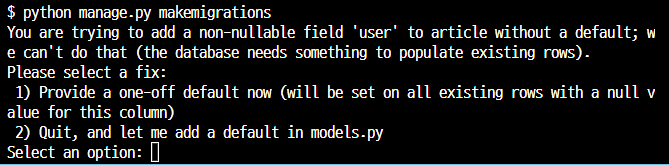
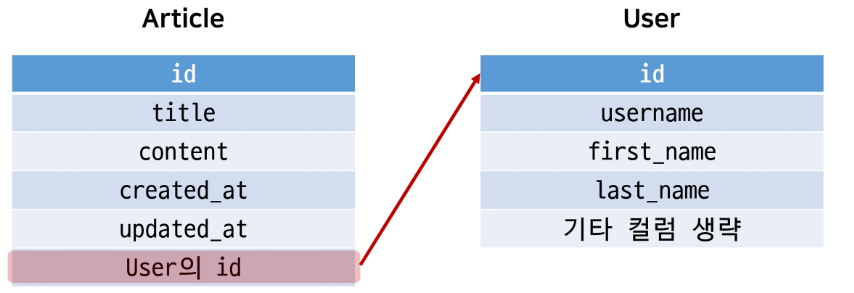

# N:1(Article-User)

- 0개 이상의 게시글은 1개의 회원에 의해 작성될 수 있음

## 1. Referencing the User Model

1. settings.AUTH.USER.MODEL
2. get_user_model()

### 1.1 settings.AUTH_USER_MODEL

- 반환값 : ‘accounts.User’(문자열)
- User 모델에 대한 외래 키 또는 M:N관계를 정의할 때 사용
- `models.py 모델 필드에서 User 모델을 참조할 때 사용`

### <mark>장고에서 User모델을 참조하는 방법 정리</mark>

- 문자열과 객체를 반환하는 특징과 Django의 내부적인 실행원링 관련된 것**(외우기)**
- 내부 실행 순서 차이로 아래와 같이 구분해서 참조해야한다.
- <mark>User모델을 참조할 때</mark>
    - **models.py 에서는** `settings.AUTH_USER_MODEL`
    - 다른 모든 곳에서는 `get_user_model()`
- migrations과정
    
    
    
    - **기존 데이터와 테이블이 있기 때문에 갑자기 컬럼이 추가되면 기존 레코드에 채울 값 뭔지 묻는 것**
    - 1 입력
    - 한 번더 1 입력
    
    ## 2. 모델 관계 설정
    
    - aritcle과 user간 모델 관계 설정
        
        


    ```python
    # articles/models.py
    
    from django.db import models
    from django.conf import settings
    class Article(models.Model):
        # 참조하고 있는 모델의 단수형
        user = models.ForeignKey(**settings.AUTH_USER_MODEL**, on_delete=models.CASCADE)
        title = models.CharField(max_length = 10)
        content = models.TextField()
        created_at = models.DateTimeField(auto_now_add=True)
        updated_at = models.DateTimeField(auto_now=True)
        
        def __str__(self):
            return self.title
    ```

## 2. CREATE

- 인증된 회원의 게시글 작성 구현하기
- ArticleForm 출력 - create 탬플릿에서 불필요한 필드 출력
- variable routing 처리하기
- form.py: ArticleForm의 출력 필드 수정

```python
# articles/forms.puy

class ArticleForm(forms.ModelForm):
    
    class Meta:
        model = Article
        # fields = '__all__'
        **exclude = ('user',)**
```

- views.py : NOT NULL constraint failed 해결하기

```python
@require_http_methods(['GET', 'POST'])
def create(request):
    if request.method == 'POST':
        form = ArticleForm(request.POST) 
        if form.is_valid():
            **article = form.save(commit=False)
            article.user = request.user
            article.save()
            return redirect('articles:detail', article.pk)**
    else:
        form = ArticleForm()
    # print(form.errors)
    context = {
        'form': form,
    }
    return render(request, 'articles/create.html', context)
```

## 3. DELETE

- 게시글 삭제시 작성자 확인
    - 게시글 작성자 정보와 삭제요청하려는 사람 비교 후 삭제하도록 함

```python
@require_POST
def delete(request, pk):
    article = Article.objects.get(pk=pk)
    if request.user.is_authenticated:
        if request.user == article.user:
            article.delete()
            return redirect('articles:index')
    return redirect('articles:detail', article.pk)
```

### 4. UPDATE `수정하기`

- 게시글 수정 시 작성자 확인
    - 게시글 작성자정보와 삭제요청하려는 사람 비교 후 삭제하도록 함
    
    ```python
    # articles/views.py
    
    @require_http_methods(['GET', 'POST'])
    def update(request, pk):
        article = get_object_or_404(Article, pk=pk)
    # 일치하는지 확인
        **if request.user == article.user:**
            if request.method == 'POST':
                # Create a form to edit an existing Article,
                # but use POST data to populate the form.
                form = ArticleForm(request.POST, instance=article)
                if form.is_valid():
                    form.save()
                    return redirect('articles:detail', article.pk)
            else:
                # Creating a form to change an existing article.
                form = ArticleForm(instance=article)
    # 아닐 때 화면 이동
        **else:
            return redirect('articles:index')**
        context = {
            'article': article,
            'form': form,
        }
        return render(request, 'articles/update.html', context)
    ```
    
    - 추가로 해당 게시글의 작성자가 아니라면, 수정. 삭제 버튼 출력 안함
    
    ```python
    
    
    
       ...,
      <hr>
      ** 작성자 아닐 때 출력 안함 
      
        <a href="">UPDATE</a><br>
        <form action="" method="POST">
          
          <input type="submit" value="DELETE">
        </form>
      **
      <a href="">[back]</a>
      <hr>
      <h4>댓글 목록</h4>
      ...
    
    ```
    

### 5. READ

- 게시글 작성자 출력
    - index 탬플릿과 detail 탬플릿에서 각 게시글의 작성자 출력
    
    ```python
    <!-- index.html -->
    
    
    
      ...,
      <hr>
      
      **<p><b>작성자 : {{ article.user }}</b></p>**
        <p>글 번호: {{ article.pk }}</p>
        <p>글 제목: {{ article.title }}</p>
        <p>글 내용: {{ article.content }}</p>
        <a href="">[detail]</a>
        <hr>
      
    
    ```
    
    ```python
    <!-- detail.html -->
    
    
    
    
      <h2>DETAIL</h2>
      <h3>{{ article.pk }} 번째 글</h3>
      <hr>
      **<p><b>작성자 : {{ article.user }}</b></p>**
      <p>제목: {{ article.title }}</p>
      <p>내용: {{ article.content }}</p>
      <p>작성 시각: {{ article.created_at }}</p>
      <p>수정 시각: {{ article.updated_at }}</p>
      <hr>
      ...,
    
    ```