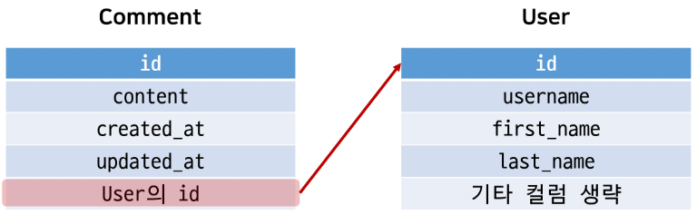

# N:1(Comment-User)
- 0 개 이상의 댓글은 1개의 회원에 의해 작성될 수 있음

## 1. 모델 관계 설정



- comment모델에 User 모델을 참조하는 외래 키 작성

```python
# articles/modes.py

from django.conf import settings
# Create your models here.
class Comment(models.Model):
    article = models.ForeignKey(Article, on_delete=models.CASCADE)
    **user = models.ForeignKey(settings.AUTH_USER_MODEL, on_delete=models.CASCADE)
   ...,**
```

### 1.1 migration 과정

- 새로운 컬럼이 추가되었기 때문에 기존 레코드에 값 넣어주는 과정
- 1 enter - 1 enter
- cooment테이블 스키마 변경 및 확인
    - **user_id 컬럼 추가**

## 2. CREATE

- 인증된 회원의 댓글 작성 구현하기
- 작성하기 전 로그인을 먼저 진행한 상태로 진행
- CommentForm 출력 : 불필요한 create 탬플릿에서 불필요한 필드 출력됨
- views.py에 외래 키를 전달하기
    
    ```python
    class CommentForm(forms.ModelForm):
        
        class Meta:
            model = Comment
            # fields = '__all__'
            exclude = ('article','user',)
    ```
    
- 외래 키 데이터 누락
    
    ```python
    def comments_create(request, pk):
        article = Article.objects.get(pk=pk)
        comment_form = CommentForm(request.POST)
        # modelform에서 제외시켰기 때문에 입력안해도 통과
        if comment_form.is_valid():
            comment = comment_form.save(commit=False) # 저장은 당장 하지않고 저장하고 나올 객체를 미리 준다.
            # 현재 요청하려는 문서에 요청한 유저 정보 넣기
            comment.article = article
            **comment.user = request.user**
            comment.save()
    
        return redirect('articles:detail', article.pk)
    ```
    

## 3. READ

- 댓글 작성자 출력

```python

  ...,
  <hr>
  <h4>댓글 목록</h4>
  
  <p>{{ comments|length }}개의 댓글이 있습니다.</p>
  
  <ul>
    
    <li>
      **{{ comment.user }} - {{ comment.content }}**
      <form action="  ">
        
        <input type="submit" value="DELETE">
      </form>
    </li>
    
    <li>댓글이 없어요..<li>
    
  </ul>
  <hr>
   ...

```

## 4. DELETE

- 댓글에는 작성자 정보가 함께 들어있기 때문에 현재 삭제 요청하는 사람과 댓글 작성자를 비교하여 본인의 댓글만 삭제할 수 있도록 함

```python
# articles.views.py

def comments_delete(request, article_pk, comment_pk):
    comment = Comment.objects.get(pk=comment_pk)
    **if request.user == comment.user:**
        comment.delete()
    return redirect('articles:detail', article_pk)
```

- 댓글 삭제버튼을 작성자만 볼 수 있도록 하기

```python



... 
  <hr>
  <h4>댓글 목록</h4>
  
  <p>{{ comments|length }}개의 댓글이 있습니다.</p>
  
  <ul>
    
    <li>
      {{ comment.user }} - {{ comment.content }}
      **
        <form action="  ">
          
          <input type="submit" value="DELETE">
        </form>
      **
    </li>
    
    <li>댓글이 없어요..<li>
    
  </ul>
  <hr>
...,

```

# 인증된 사용자에 대한 접근 제한

- is_authenticated
- View decorator

## 1. 인증된 사용자인 경우만 댓글 작성 및 삭제하기

- 댓글작성

```python
# views.py

@require_POST
def comments_create(request, pk):
    **# 로그인한 유저만 접근 허용
    if request.user.is_authenticated:**
        article = Article.objects.get(pk=pk)
        comment_form = CommentForm(request.POST)
        # modelform에서 제외시켰기 때문에 입력안해도 통과
        if comment_form.is_valid():
            comment = comment_form.save(commit=False) # 저장은 당장 하지않고 저장하고 나올 객체를 미리 준다.
            # 현재 요청하려는 문서에 요청한 유저 정보 넣기
            comment.article = article
            comment.user = request.user
            comment.save()
        return redirect('articles:detail', article.pk)
# 로그아웃이면 로그인 화면으로 보내기
    **else:
        return redirect('accounts"login')**
```

- CommentForm을 볼 수 없도록 하기

```python



  ..., 
  <hr>
   댓글 form 
  
    <form action="" method="POST">
      
      {{ comment_form }}
      <input type="submit">
    </form>
	# 로그아웃 상태일 때 로그인창으로 하이퍼링크
  
  <a href="">댓글을 작성하려면 로그인 하세요.</a>

  


```

- 댓글 삭제

```python
@require_POST
def comments_delete(request, article_pk, comment_pk):
    if request.user.is_authenticated:
        comment = Comment.objects.get(pk=comment_pk)
        if request.user == comment.user:
            comment.delete()
    return redirect('articles:detail', article_pk)
```