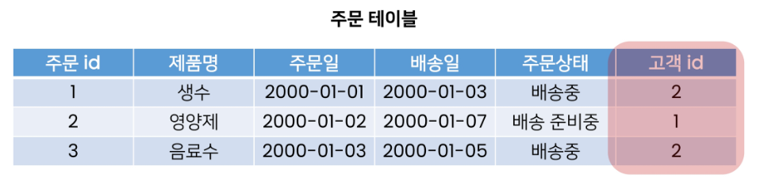

### 관계란

- 테이블 간의 상호작용을 기반으로 설정되는 여러 테이블 간의 논리적 연결

# many-to-one relationship

- **외래 키 : foreign key, FK)** : 관계형 데이터 베이스에서 한 테이블의 필드 중 다른 테이블을 감식

## 1. RDB에서의 관계

1.1 **1:1**

- one-to-one relationship
- 한 테이블의 레코드 하나가 다른 테이블 레코드 한 한 개와 관련된 경우

2.1 N : 1

- many-to-one relationship
- 한 테이블의 0개 이상의 레코드가 다른 테이블의 레코드 한 개와 관련된 경우
- 기준테이블에 따라 1:N이라고도 함
- 예) 주문테이블 - 고객 테이블
    - 여러 개의 주문 입장에서 각각 어떤 주문에 속해 있는지 표현해야 함
    - **고객 테이블의 pk를 주문 테이블에 FK로** 집어 넣어 관계를 표현
    - 고객 1은 여러 주문을 진행할 수 있음

2.3 M : N

- many-to many relationship
- 한 테이블의 0개 이상의 레코드가 다른 테이블의 0개 이상의 레코드와 관련된 경우
- 양쪽 모두 n : 1의 관계를 가짐
- 

# Foreign Key

- 외래 키
- RDB에서 한 테이블의 필드 중 다른 테이블의 행을 식별할 수 있는 키
- 참조하는 테이블에서 1개의 key에 해당
    - 참조되는 측 테이블의 기본 키(primary key) 또는 유일한 키를 가르킴
- 참조하는 테이블의 행 1개는 - 참조되는 측 테이블의 행 값에 대응됨
- 참조하는 테이블 행 여러 개가 참조되는 테이블의 동일한 행을 참조할 수 있음

## 특징

- 키를 사용하여 부모 테이블의 유일한 값 참조(by 참조 무결성)
- **외래 키의 값이 반드시 부모테이블의 기본키일 필요는 없지만 유일한 값이어야  함**