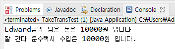

# 13. 객체 간의 협력 (collabration)

## 객체 지향 프로그래밍에서의 협력

- 객체 지향 프로그램에서 객체 간에는 협력이 이루어짐

- **협력을 위해서는 필요한 메세지를 전송하고 이를 처리하는 기능이 구현되어야 함**

- 매개 변수로 객체가 전달되는 경우가 발생

- 객체 협력의 예 


# 14. 버스 타고 학교 가는 학생의 과정을 객체 지향 프로그래밍으로 구현해보기


## 버스와 지하철을 타는 예제 프로그래밍

    James와 Tomas는 각각 버스와 지하철을 타고 학교에 갑니다.
    James는 5000원을 가지고 있었고, 100번 버스를 타면서 1000원을 지불합니다.
    Tomas는 10000원을 가지고 있었고, 초록색 지하철을 타면서 1200원을 지불합니다.

    두 학생이 버스와 지하철을 타는 상황을 구현해 봅시다.
Student.java
```java
public class Student {
	
	String studentName;
	int grade;
	int money;
	
	public Student(String studentName, int money) {
		this.studentName = studentName;
		this.money = money;
	}
	
	public void takeBus(Bus bus) {
		bus.take(1000);
		this.money -= 1000;
	}
	
	public void takeSubway(Subway subway) {
		subway.take(1200);
		this.money -= 1200;
	}
		
	public void showInfo() {
		System.out.println(studentName +"님의 남은 돈은 " + money + "원 입니다");
	}
}
```
Bus.java
```java
public class Bus {
	
	int busNumber;
	int passengerCount;
	int money;
	
	public Bus(int busNumber) {
		this.busNumber = busNumber;
	}
	
	public void take(int money) {  //승차
		this.money += money;
		passengerCount++;
	}
	
	public void showBusInfo() {
		System.out.println(busNumber + "번 버스의 승객은 " + passengerCount + "명 이고, 수입은 " + money + "원 입니다");
	}
}
```

Subway.java
```java
public class Subway {

	int lineNumber;
	int passengerCount;
	int money;
	
	public Subway(int lineNumber) {
		this.lineNumber = lineNumber;
	}
	
	public void take(int money) {
		this.money += money;
		passengerCount++;
	}
	
	public void showSubwayInfo() {
		System.out.println(lineNumber + "번 지하철의 승객은 " + passengerCount + "명 이고, 수입은 " + money + "원 입니다");
	}
}
```

TakeTransTest.java
```java
public class TakeTransTest {

	public static void main(String[] args) {
		Student studentJ = new Student("James", 5000);
		Student studentT = new Student("Tomas", 10000);
		
		Bus bus100 = new Bus(100);
		
		Subway subwayGreen = new Subway(2);
		
        // 객체를 파라미터로 전달
		studentJ.takeBus(bus100);
		studentT.takeSubway(subwayGreen);
		
		studentJ.showInfo();
		studentT.showInfo();
		
		bus100.showBusInfo();
				
		subwayGreen.showSubwayInfo();
//		James님의 남은 돈은 4000원입니다.
//		Tomas님의 남은 돈은 8800원입니다.
	}

}
```


# 15. 복습해봅시다 (객체 협력)

## 다음과 같은 상황을 구현해 봅시다.

    앞의 예제에서 Edward는 지각을 해서 택시를 타야 했습니다. 
    20000원을 가지고 있었는데 10000원을 택시비로 사용했습니다.
    택시는 '잘나간다 운수' 회사 택시를 탔습니다.

Taxi.java
```java

package ch14;

public class Taxi {
	int TaxiNumber;
	int money;
	
	public Taxi(int TaxiNumber) {
		this.TaxiNumber = TaxiNumber;
	}
	public void take(int money) {
		this.money += money;
	}
	public void ShowTaxiInfo() {
		System.out.println("챠량번호 " + TaxiNumber + " 택시의 수익은 "+ money + "원 입니다");
	}
}


```
Student.java
```java
package ch14;

public class Student {
	String name;
	int grade;
	int money;
	
	public Student(String name, int money) {
		this.name = name;
		this.money = money;
	}
	public void takeBus(Bus bus) {
		bus.take(1000);
		money -= 1000;
	}
	public void takeSubway(Subway subway) {
		subway.take(1200);
		money -= 1200;
	}
	public void takeTaxi(Taxi taxi, int fee) {
		taxi.take(fee);
		money -= fee;
	}
	public void showInfo() {
		System.out.println(name + "님의 남은 돈은 " + money + "원입니다.");
	}
}

```
TakeTransTest.java
```java
package ch14;

public class TakeTransTest {

	public static void main(String[] args) {
		Student James = new Student("James", 5000);
		Student Tomas = new Student("Tomas", 10000);
		Student Edward = new Student("Edward", 20000);
		
		Bus bus100 = new Bus(100);
		Subway subwayGreen = new Subway(2);
		Taxi taxi1 = new Taxi(4885);
		
		// 객체를 파라미터로 전달
		James.takeBus(bus100);
		Tomas.takeSubway(subwayGreen);
		Edward.takeTaxi(taxi1, 10000);
		
		James.showInfo();
		Tomas.showInfo();
		Edward.showInfo();
	
//		James님의 남은 돈은 4000원입니다.
//		Tomas님의 남은 돈은 8800원입니다.
//		Edward님의 남은 돈은 10000원입니다.

	}

}

```


출력결과 <br>


