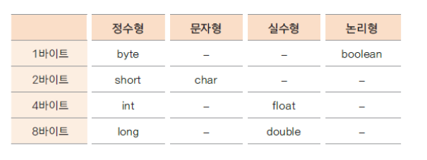
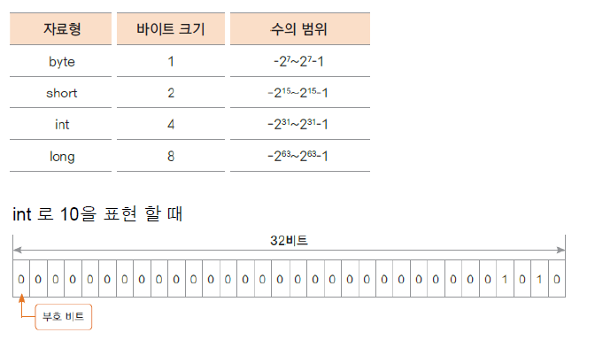
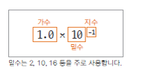
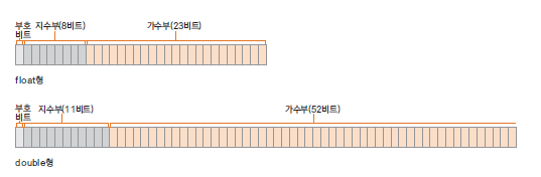
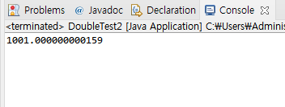
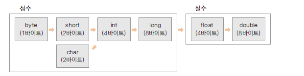

# 06. 자료형(data type) - 정수

## 변수와 메모리
    
    변수를 선언하면 해당되는 자료형의 크기 만큼 메모리가 할당
    변수는 할당된 메모리를 가리키는 이름

    int level = 10; // 4바이트 정수형 메모리가 level 이라는 이름으로 할당 됨
    

## 기본 자료형(primitive data type)의 종류


## 정수 자료형의 종류와 크기


## byte와 short
+ byte : 1바이트 단위의 자료형 
         동영상, 음악 파일, 실행 파일의 자료를 처리할 때 사용

+ short: 2바이트 단위의 자료형 
         C/C++ 언어와 호환 시 사용

## int 

+ 자바에서 사용하는 정수에 대한 기본 자료 형

+ 4바이트 단위의 자료형

+ 프로그램에서 사용하는 모든 숫자(리터럴)은 int 로 저장됨

+ 32 비트를 초과하는 숫자는 long 자료형으로 처리

## long

+ 8바이트 자료형

+ 숫자의 뒤에 알파벳 L 또는 l 을 써서 long 형임을 표시 함

+ 예) int num = 12345678900; // 오류 <br>
      long lnum = 12345678900; //오류 <br>
      long lnumber = 12345678900L; // ok


# 07. 자료형(data type) - 실수

## - 부동 소수점 방식
   -  실수는 정수 보다 정밀하기 때문에 정수와는 다른 방식으로 표현해야 함
   
   -  부동 소수점 방식으로 실수 값 0.1 표현 

      

   -  지수부와 가수부로 표현 함

   - 컴퓨터에서는 밑수를 2로 사용

   - 정규화 : 가수가 밑수보다 작은 한 자리까지 가수로 표현 되는 것

   - 컴퓨터에서는 밑수가 2 이므로 정규화를 하게 되면 가수부분의 첫 번째 자리 숫자는 항상 1임 <br>
     예) 0.2 표현 0.4 X 2<sup>-1</sup>  정규화 하면 1.6 X 2<sup>-3</sup> 

## - float형과 double형 

   

   자바에서는 실수의 기본 타입은 dobule을 사용 함


## - float 와 double 예제
```
   package ch07;

   public class DoubleTest {

	   public static void main(String[] args) {
		   double dnum = 3.14;
		   float fnum = 3.14F;
		
		   System.out.println(dnum);
		   System.out.println(fnum);
	   }
   }
```


## - 부동 소수점 방식의 오류
   지수와 가수로 나타내는 부동 소수점 방식에서는 지수부가 0을 표현할 수 없기 때문에 약간의 오차가 발생할 수 있다

```
   public class DoubleTest2 {

	public static void main(String[] args) {

		double dnum = 1;
		
		for(int i = 0; i<10000; i++) {
			dnum = dnum + 0.1;
		}
		System.out.println(dnum);
	}
    // 1001.000000000159

}
```

   출력 결과 

   


# 08. 자료형(data type) - 프로그램에서 문자 표현 방법

## - 정수로 표현!
+ 어떤 문자를 컴퓨터 내부에서 표현하기 위해 특정 정수 값을 정의
+ A 는 65

+ 문자세트 : 각 문자를 얼마로 표현할 것인지 코드 값을 모아둔 것을 문자세트(charater set)라 함 <br>
            (ex. ASKII, euc-kr, utf-8, utf-16)

## - 자바에서 문자 표현

+ 자바는 문자를  나타내기 위해 전세계 표준인 UNICODE를 사용

+ utf-16 인코딩을 사용 (모든 문자를 2바이트로 표시)


## - 문자형 변수 선언과 사용하기
+ 문자를 위한 데이터 타입
  **char** ch = 'A';

+ 내부적으로 숫자료 표현되므로 숫자를 넣어도 문자가 출력될 수 있음

  char ch2 = 66;

```java
    package ch08;

    public class CharacterTest {

        public static void main(String[] args) {
            char ch1 = 'A';
            System.out.println(ch1); // A
            System.out.println((int)ch1); // 65
            
            char ch2 = 66;
            System.out.println(ch2); // B
            
            int ch3 = 67;
            System.out.println(ch3); // 67
            System.out.println((char)ch3); // C
            
    //		char ch4 = -66; // 음수 대입 불가
            
            char ch5 = '한';
            char ch6 = '\uD55C';
            
            System.out.println(ch5); // 한
            System.out.println(ch6); // 한
            
        }
}
```

> 참고

    character set: 문자를 숫자로 변환한 값의 세트

    encoding: 문자가 숫자로 변환되는 것
    decoding: 숫자에서 다시 문자로 변환되는 것

    ASKII code: 알파벳과 숫자 특수 문자등을 1바이트에 표현하는데 사용하는 문자세트

    UNICODE: 전 세계 표준으로 만든 문자 세트

    UTF-8: 1바이트에서 4바이트까지 다양하게 문자를 표현할 수 있음

    UTF-16: 2바이트로 문자를 표현


 # 09. 자료형(data type)- 논리형과 자료형 없이 변수 사용하기

##  논리형
 - true(참), false(거짓) 두 가지만 나타냄

 - 1바이트를 사용 함

 - 값이 존재하는지, 배열이 비었는지, 결과가 참인지 거짓인지등을 표현


```
package ch09;

public class BooleanTest {

	public static void main(String[] args) {
		
		boolean isMarried = true;
		System.out.println(isMarried);
	}
}
```

## 지역 변수 자료형 없이 사용하기 (  자바 10 지원 됨 ) 

 - Local variable type inference

 - 추론 가능한 변수에 대한 자료형을 선언하지 않음
 
 - 한번 선언하여 추론 된 변수는 다른 타입의 값을 대입 할 수 없음

 - 지역 변수만 사용 가능


```java
package ch08;

public class LocalVariableType {

	public static void main(String[] args) {
		var i = 10;
		var j = 10.0;
		var str = "hello";
		
		System.out.println(i);
		System.out.println(j);
		System.out.println(str); // hello
		
		str = "test";
		System.out.println(str); // test
//		str = 3;

	}
}
```


# 10. 변하지 않는 상수와 리터럴, 변수의 형 변환

## 상수(constant) 선언하기

- 상수는 변하지 않는 수

- 원주률 3.14, 1년 12개월 등

- final 예약어를 사용하여 선언

- 상수를 사용하면 변하지 않는 값을 반복하여 사용할 때 의미있는 문자로 인식하기 쉽고<br> 
  혹, 변하더라도 선언한 부분만 변경하면 되므로 여러부분을 수정할 필요가 없음

```java
package ch10;

public class ConstantTest {

	public static void main(String[] args) {

		final int MAX_NUM = 100;
		final int MIN_NUM;
		
		MIN_NUM = 0;
		
		System.out.println(MAX_NUM); // 100
		System.out.println(MIN_NUM); // 0
		// MAX_NUM = 1000; // 에러 발생
	}
}
		
```

## 리터럴(literal)

- 프로그램에서 사용하는 숫자, 문자, 논리값을 뜻함

- 리터럴은 상수 풀(constant pool)에 있음 

- 정수 리터럴은 int 로 실수 리터럴은 double 로 저장됨<br>
  정수의 범위가 넘어가는 경우는 L,l을 float로 사용하려는 경우는 F,f 식별자를 써줘야 함


## 형 변환 (type conversion)

- 서로 다른 자료형 간에 연산등의 수행을 위해 하나의 자료형으로 통일하는 것

- 묵시적 형 변환(implicit type conversion, 자동 형 변환)과 명시적 형 변환(explicit type conversion, 강제 형 변환)이 있음

- **바이트 크기가 작은 자료형에서 큰 자료형으로 형 변환은 자동으로 이루어 짐**

- **덜 정밀한 자료형에서 더 정밀한 자료형으로의 형 변환은 자동으로 이루어 짐**



```java
package ch10;

public class TypeConversionTest {

	public static void main(String[] args) {
		byte bNum = 10;
		int iNum = bNum;
		System.out.print(iNum); // 10
		
		int iNum1 = 20;
		float fNum = iNum1;
		System.out.print(fNum); //20.0 암시적 형변환
		
		int iNum2 = 10;
		byte bNum1 = (byte)iNum2;
		System.out.print(bNum1); // 10 명시적 형변환
		
		double dNum = 3.14;
		int iNum3 = (int)dNum;
		System.out.print(iNum3); // 3 명시적 형변환
	}
}

```

## 연산 중 형 변환 예제

```java
package ch10;

public class TypeConversion {

	public static void main(String[] args) {

		double dNum = 1.2;
		float fNum = 0.9F;
		
		int iNum1 = (int)dNum + (int)fNum;
		int iNum2 = (int)(dNum + fNum);
		
		System.out.println(iNum1); // 1 
		System.out.println(iNum2); // 2
	}
}
```

