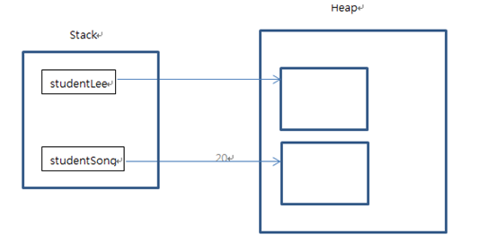

# 03. 함수와 메서드

## 함수란 (function) 

- 하나의 기능을 수행하는 일련의 코드

- 구현된(정의된) 함수는 호출하여 사용하고 호출된 함수는 기능이 끝나면 제어가 반환됨

- 함수로 구현된 하나의 기능은 여러 곳에서 동일한 방식으로 호출되어 사용될 수 있음


## 함수 정의하기

* 함수 구성 : **이름, 매개 변수, 반환 값, 함수 몸체(body)**

```java
// 함수의 이름, 매개변수, 
int add(int num1, int num2) {
    // 몸체
	int result;
	result = num1 + num2;
    // 반환값
	return result;
}
```

## 함수 구현하기 예제

```java
package ch03_function_method;

public class FunctionTest {
	
	public static int addNum(int num1, int num2) {
		
		int result;
		result = num1 + num2;
		
		return result;
	}

	public static void sayHello(String greeting) {
		
		System.out.println(greeting);
	}
	
	public static int calcSum() {
		
		int sum = 0;
		int i;
		
		for(i = 0; i <= 100; i++) {
			sum += i;
		}

		return sum;
	}

	public static void main(String[] args) {
		int n1 = 10;
		int n2 = 20;
		
        // addNum 함수가 호출되면 지역변수를 위한 메모리공간, 스택이 생성되고 반환이 되면 해당 메모리는 사라진다.
		int total = addNum(n1, n2);
		
		sayHello("안녕하세요!");
		int num = calcSum();
		
		System.out.println(total);
		System.out.println(num);
		
//		안녕하세요!
//		30
//		5050
	}
}
```

## 함수 호출과 스택 메모리 

- 스택 : **함수가 호출될 때 지역 변수들이 사용하는 메모리**  

    - 함수의 수행이 끝나면 자동으로 반환 되는 메모리


## 메서드 (method) 

- **객체의 기능을 구현하기 위해 클래스 내부에 구현되는 함수**

- 멤버 함수 (member function)이라고도 함

- 메서드를 구현함으로써 객체의 기능이 구현 됨

- 메서드의 이름은 그 객체를 사용하는 객체(클라이언트)에 맞게 짓는것이 좋음

   예) getStudentName() 


# 04. 객체의 속성은 멤버 변수로, 객체의 기능은 메서드로 구현한다

## 학생 클래스를 정의 하고 이를 사용하기

- 학생 클래스의 속성을 멤버 변수로 선언
-  메서드를 구현한다

```java
public class Student {
	
	public int studentID;
	public String studentName;  
	public String address;
			
	public void showStudentInfo() {
		System.out.println(studentName + "," + address);
	}
	
	public String getStudentName() {
		return studentName;
	}
}
```

- 학생 클래스를 생성하여 생성된 객체(인스턴스)에 각각 다른 이름과 주소를 대입한다

```java
package ch03_function_method;

public class StudentTest {

	public static void main(String[] args) {
		
		Student studentLee = new Student();
		studentLee.studentName = "이원일";
		studentLee.address = "구미";
		
		Student studentKim = new Student();
		studentKim.studentName = "김유신";
		studentKim.address = "경주";
		
		studentKim.showStudentInfo();
		
		System.out.println(studentLee);
		System.out.println(studentKim);
		
//		김유신,경주
//		ch03_function_method.Student@7c30a502
//		ch03_function_method.Student@49e4cb85

	}
}
```


# 05. 인스턴스 생성과 힙 메모리 (heap memory)

## 인스턴스 (instance)

- 클래스는 객체의 속성을 정의 하고, 기능을 구현하여 만들어 놓은 코드 상태

- 실제 클래스 기반으로 생성된 객체(인스턴스)는 각각 다른 멤버 변수 값을 가지게 됨 
  
  가령, 학생의 클래스에서 생성된 각각의 인스턴스는 각각 다른 이름, 학번, 학년등의 값을 가지게 됨

- new 키워드를 사용하여 인스턴스 생성


## 힙 메모리

- 생성된 인스턴스는 동적 메모리(heap memory) 에 할당됨 

- C나 C++ 언어에서는 사용한 동적 메모리를 프로그래머가 해제 시켜야 함 ( free() 난 delete 이용)

- 자바에서 Gabage Collector 가 주기적으로 사용하지 않는 메모리를 수거 

- **하나의 클래스로 부터 여러개의 인스턴스가 생성되고 각각 다른 메모리 주소를 가지게 됨**
   
   

## 참조 변수, 참조 값

```java
  Student studentLee = new Student();
  studentLee.studentName = "홍길동";

  System.out.println(studentLee);
```

## 용어 정리

* 객체 : 객체 지향 프로그램의 대상, 생성된 인스턴스

* 클래스 : 객체를 프로그래밍 하기위해 코드로 정의해 놓은 상태

* 인스턴스 : new 키워드를 사용하여 클래스를 메모리에 생성한 상태

* 멤버 변수 : 클래스의 속성, 특성

* 메서드 : 멤버 변수를 이용하여 클래스의 기능을 구현한 함수

* 참조 변수 : 메모리에 생성된 인스턴스를 가리키는 변수

* 참조 값 : 생성된 인스턴스의 메모리 주소 값

