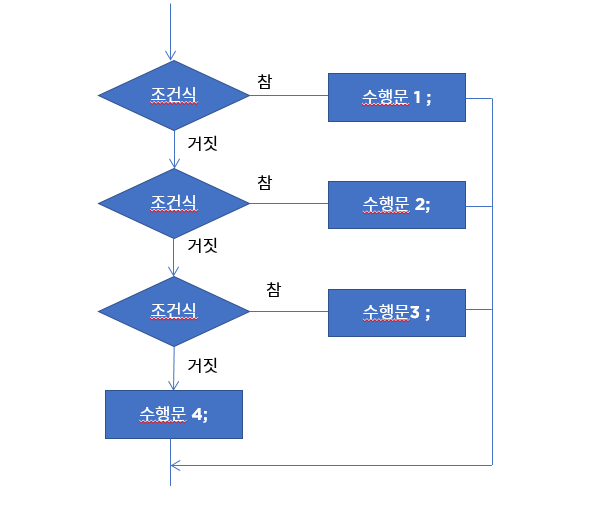
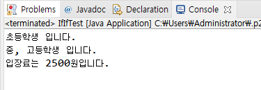

# 14. 조건문 - if 문(만약에... 라면)

## 조건문 이란?

- 주어진 조건에 따라 다른 실행이 이루어 지도록 구현

- '재산이 1억 이상이면 100만원을 세금으로 낸다 그렇지 않으면 내지 않는다' 를 구현 한다면

   만약에 (재산이 1억 이상이면){ <br>
       세금을 100만원 낸다  <br>
   } <br>
   그렇지 않으면 {  <br>
       세금을 내지 않는다 <br>
   }

- if문 문법
    
      if(조건식){
        수행문;      // 조건식이 '참'인 경우에(조건에 맞는 경우) 수행문이 수행됨 
       }             // 조건식이 '참'이 아니면(조건에 맞지 않는 경우) 수행문이 수행되지 않음


- if - else 문 문법

      if( 조건식) {

          수행문1;   // 조건식이 '참'인 경우에 수행됨
      }
      else{
          수행문2;    // 조건식이 '참'이 아닌 경우에 수행됨
      }
  

- if - else 예제

```java
package ch14;

import java.util.Scanner;

public class IfElseTest {

	public static void main(String[] args) {
		
//		int age = 7;
		
		Scanner scanner = new Scanner(System.in);
		int age = scanner.nextInt();
		
		if (age >= 8) {
			System.out.println("학교에 다닙니다.");
		}else {
			System.out.println("학교에 다니지 않습니다.");
		}
	}
}
//8
//학교에 다닙니다.
```

# 15. 조건이 여러 개 일 때의 if 문

## if-else if-else 문

- 하나의 상황에 대한 조건이 여러개로 나뉘고 각 조건에 다른 수행이 이루어져야 할 경우 사용

- 각 조건은 상호 배타적임 


        if(조건식1){
            수행문1;        // 조건식1이 '참'인 경우 수행하고 전체 조건문을 빠져나감
        }
        else if(조건식2){
            수행문2;        // 조건식2이 '참'인 경우 수행하고 전체 조건문을 빠져나감
        }
        else if(조건식3){
            수행문3;        // 조건식3이 '참'인 경우 수행하고 전체 조건문을 빠져나감
        }
        else{
            수행문4;        // 위 조건이 모두 해당되지 않는 경우 수행됨 (디폴트 조건)
        }

        수행문5;            // if-else if-else 문이 끝나면 수행됨

        가령 조건식2가 만족되면 수행문2 -> 수행문5  순으로 수행됨

 

 ```java
package ch15;

public class IfElseIfElseTest {

	public static void main(String[] args) {
	  	int age = 12;
	   	int charge;
	   	
	   	if(age < 8){
	   		charge = 1000; 
	   		System.out.println("미 취학 아동입니다.");
	   	}
	   	else if(age < 14){
	   		charge = 2000;
	   		System.out.println("초등학생 입니다.");
	   	}
	   	else if(age < 20){
	   		charge = 2500;
	   		System.out.println("중, 고등학생 입니다.");
	   	}
	   	else{
	   		charge = 3000;
	   		System.out.println("일반인 입니다.");
	   	} 
	   	
	   	System.out.println("입장료는 " + charge + "원입니다.");
	}

}

```


## if-else if 문과 if - if 문의 차이점

- if- else if 를 사용하는 경우 하나의 조건이 만족 되면 나머지 else if 부분은 수행되지 않음

- if - if 로 사용하게 되면 각각 다른 조건 문으로 해석되어 각각 수행하게 됨

```java
package ch15;

public class IfIfTest {

	public static void main(String[] args) {
		int age = 12;
		int charge;
		
		if(age < 8){
			charge = 1000; 
			System.out.println("미 취학 아동입니다.");
		}
		if(age < 14){
			charge = 2000;
			System.out.println("초등학생 입니다.");
		}
		if(age < 20){
			charge = 2500;
			System.out.println("중, 고등학생 입니다.");
		}
		else{
			charge = 3000;
			System.out.println("일반인 입니다.");
		} 
		
		System.out.println("입장료는 " + charge + "원입니다.");
	}
}
```


