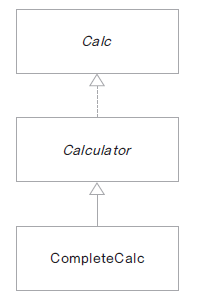
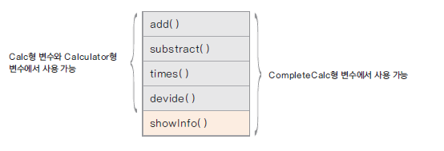
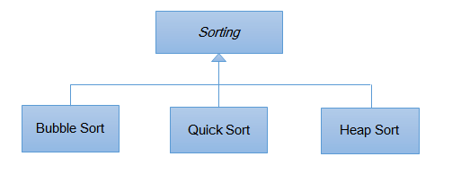
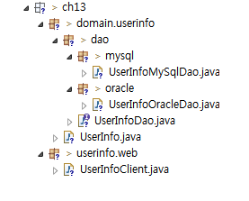
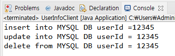
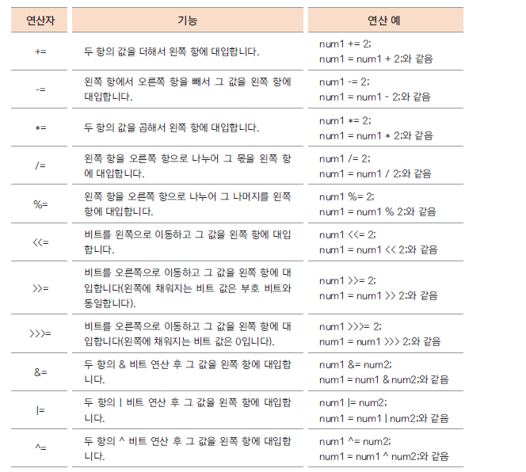
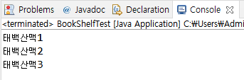
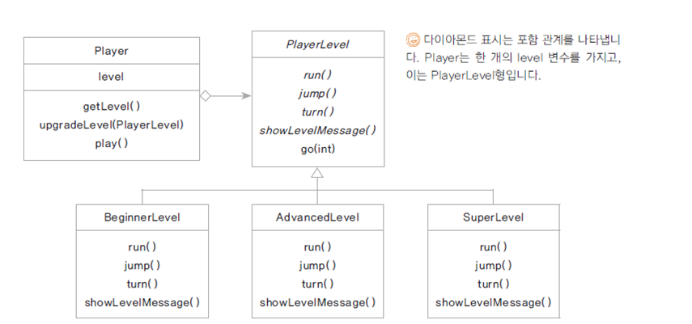
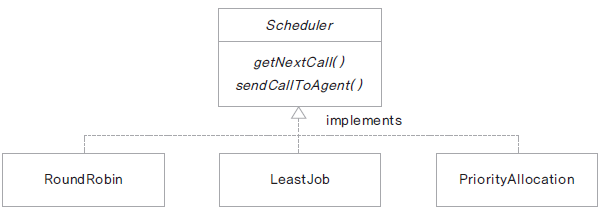
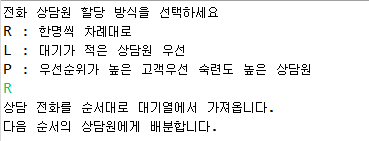

# 11. 인터페이스(interface)

## 인터페이스란?


- 모든 메서드가 추상 메서드로 선언됨 **public abstract**

- 모든 변수는 상수로 선언됨 **public static final**

```java
interface 인터페이스 이름{

    public static final float pi = 3.14F;
    public void makeSomething();
}
```

- 자바 8 부터 디폴트 메서드(default method)와 정적 메서드(static method) 기능의 제공으로 일부 구현 코드가 있음

## 인터페이스 정의와 구현



Calc.java
```java
public interface Calc {

	double PI = 3.14;
	int ERROR = -99999999;
	
	int add(int num1, int num2);
	int substract(int num1, int num2);
	int times(int num1, int num2);
	int divide(int num1, int num2);
	
}
```

Calculator.java
```java
public abstract class Calculator implements Calc{

	@Override
	public int add(int num1, int num2) {
		return num1 + num2;
	}

	@Override
	public int substract(int num1, int num2) {
		return num1 - num2;
	}
}
```

CompleteCalc.java
```java
public class CompleteCalc extends Calculator{
	
	@Override
	public int times(int num1, int num2) {
		return num1 * num2;
	}

	@Override
	public int divide(int num1, int num2) {
		if( num2 == 0 )
			return ERROR;
		else 
			return num1 / num2;
	}
	
	public void showInfo() {
		System.out.println("모두 구현하였습니다.");
	}
}
```

CalculatorTest.java
```java
public class CalculatorTest {

	public static void main(String[] args) {
		Calc calc = new CompleteCalc();
		int num1 = 10;
		int num2 = 2;
		
		System.out.println(num1 + "+" + num2 + "=" + calc.add(num1, num2));
		System.out.println(num1 + "-" + num2 + "=" +calc.substract(num1, num2));
		System.out.println(num1 + "*" + num2 + "=" +calc.times(num1, num2));
		System.out.println(num1 + "/" + num2 + "=" +calc.divide(num1, num2));
	}
}
```


## 인터페이스 구현과 형 변환

- 인터페이스를 구현한 클래스는 인터페이스 형으로 선언한 변수로 형 변환 할 수 있음

Calc calc = new CompleteCalc();

- 상속에서의 형 변환과 동일한 의미

- 클래스 상속과 달리 구현 코드가 없으므로 여러 인터페이스를 구현할 수 있음 ( cf. extends)

- 형 변환되는 경우 인터페이스에 선언된 메서드만을 사용가능함 




# 12. 인터페이스는 왜 쓰는가?

## 인터페이스가 하는 일

- 클래스나 프로그램이 제공하는 기능을 명시적으로 선언

- 일종의 클라이언트 코드와의 약속이며 클래스나 프로그램이 제공하는 명세(specification)

- 클라이언트 프로그램은 인터페이스에 선언된 메서드 명세만 보고 이를 구현한 클래스를 사용할 수 있음

- 어떤 객체가 하나의 인터페이스 타입이라는 것은 그 인터페이스가 제공하는 모든 메서드를 구현했다는 의미임

- 인터페이스를 구현한 다양한 객체를 사용함 - 다형성

- 예) JDBC 인터페이스


# 13 인터페이스를 활용한 다형성 구현 (dao 구현하기)

## 인터페이스와 다형성

- 하나의 인터페이스를 여러 객체가 구현하게 되면 클라이언트 프로그램은 인터페이스의 메서드를 활용하여 여러 객체의 구현을 사용할 수 있음 ( 다형성)

- 여러가지 예




## 인터페이스를 활용한 dao 구현하기

- DB에 회원 정보를 넣는 dao(data access object)를 여러 DB 제품이 지원될 수 있게 구현함

- 환경파일(db.properties) 에서 database의 종류에 대한 정보를 읽고 그 정보에 맞게 dao 인스턴스를 생성하여 실행될 수 있게 함

- source hierachy



UserInfo.java (사용자 정보 클래스)
```java
package ch13.domain.userinfo;

public class UserInfo {
	private String userId;
	private String password;
	private String userName;
	
	public String getUserId() {
		return userId;
	}
	
	public void setUserId(String userId) {
		this.userId = userId;
	}
	
	public String getPasswd() {
		return password;
	}
	
	public void setPasswd(String password) {
		this.password = password;
	}
	
	public String getUserName() {
		return userName;
	}
	
	public void setUserName(String userName) {
		this.userName = userName;
	}

}

```

UserInfoDao.java ( dao 에서 제공되어야 할 메서드를 선언한 인터페이스 )
```java
package ch13.domain.userinfo.dao;

import ch13.domain.userinfo.UserInfo;

public interface UserInfoDao {
	
	void insertUserInfo(UserInfo userInfo);
	void updateuserInfo(UserInfo userInfo);
	void deleteUserInfo(UserInfo userInfo);
	
}

```

UserInfoMySqlDao.java (UserInfoDao 인터페이스를 구현한 MySql 버전 dao)
```java
public class UserInfoMySqlDao implements UserInfoDao{

	@Override
	public void insertUserInfo(UserInfo userInfo) {
		System.out.println("insert into MYSQL DB userId =" + userInfo.getUserId() );		
	}

	@Override
	public void updateUserInfo(UserInfo userInfo) {
		System.out.println("update into MYSQL DB userId = " + userInfo.getUserId());		
	}

	@Override
	public void deleteUserInfo(UserInfo userInfo) {
		System.out.println("delete from MYSQL DB userId = " + userInfo.getUserId());
		
	}

}
```

UserInfoOracleDao.java (UserInfoDao 인터페이스를 구현한 Oracle 버전 dao)
```java
public class UserInfoOracleDao implements UserInfoDao{

	public void insertUserInfo(UserInfo userInfo){
		System.out.println("insert into ORACLE DB userId =" + userInfo.getUserId() );
	}
	
	public void updateUserInfo(UserInfo userInfo){
		System.out.println("update into ORACLE DB userId = " + userInfo.getUserId());
	}
	
	public void deleteUserInfo(UserInfo userInfo){
		System.out.println("delete from ORACLE DB userId = " + userInfo.getUserId());
	}
}
```

UserInfoClient.java (UserInfoDao 인터페이스를 활용하는 클라이언트 프로그램)
```java
package ch13.userinfo.web;

import java.io.FileInputStream;
import java.io.IOException;
import java.util.Properties;

import ch13.domain.userinfo.UserInfo;
import ch13.domain.userinfo.dao.UserInfoDao;
import ch13.domain.userinfo.dao.mysql.UserInfoMySqlDao;
import ch13.domain.userinfo.dao.oracle.UserInfoDaoOracle;

public class UserInfoClient {

	public static void main(String[] args) throws IOException {
        // db.properties 파일을 바이트스트림으로 읽기위한 객체 생성
		FileInputStream fis = new FileInputStream("db.properties");
		// [ Properties 클래스 ]

        //     MAP 계열의 컬렉션 프레임워크와 비슷하게 동작하는 파일
        //     "Key = Value" 형태로 된 "파일이름.properties" 파일 또는 Xml 파일
        //     key를 주면 Value를 반환하는 기능을 가짐
        //     DB의 연결정보 등을 저장해두는 용도로 많이 쓰임
		Properties prop = new Properties();
		prop.load(fis);
		
		// db.properties 파일 안에 DBTYPE 키의 value 가져오기
		String dbType = prop.getProperty("DBTYPE");
		
		UserInfo userInfo = new UserInfo();
		userInfo.setUserId("12345");
		userInfo.setPassword("!@#$%");
		userInfo.setUserName("이순신");
		
		UserInfoDao userInfoDao = null;

		if(dbType.equals("ORACLE")){
			userInfoDao = new UserInfoDaoOracle();
		}
		else if(dbType.equals("MYSQL")){
			userInfoDao = new UserInfoMySqlDao();
		}
		else{
			System.out.println("db support error");
			return;
		}

		userInfoDao.insertUserInfo(userInfo);
		userInfoDao.updateUserInfo(userInfo);
		userInfoDao.deleteUserInfo(userInfo);

	}

}
```

db.properties 환경파일이 MYSQL 일때
```
DBTYPE=MYSQL
```
실행결과 


db.properties 환경파일이 ORACLE 일때
```
DBTYPE=ORACLE
```
실행결과 


# 14. 인터페이스의 여러가지 요소


## 1. 상수

- 모든 변수는 상수로 변환 됨 public static final 
```java
double PI = 3.14;
int ERROR = -999999999;
	
```

##  네 가지의 메서드

- 추상 메서드

- 디폴트 메서드

- 정적 메서드

- private 메서드

## 2. 추상 메서드

- 모든 선언된 메서드는 추상 메서드 public abstract

## 3. 디폴트 메서드 (자바 8이후)

- 구현을 가지는 메서드, 인터페이스를 구현하는 클래스들에서 공통으로 사용할 수 있는 기본 메서드 

- default 키워드 사용
```java
default void description() {
	System.out.println("정수 계산기를 구현합니다.");
	myMethod();
}
```
- 구현 하는 클래스에서 재정의 할 수 있음
```java
@Override
public void description() {
	System.out.println("CompleteCalc에서 재정의한 default 메서드");
	//super.description();
}
```

- 인터페이스를 구현한 클래스의 인스턴스가 생성 되어야 사용 가능함


## 4. 정적 메서드 (자바 8이후)

- 인스턴스 생성과 상관 없이 인터페이스 타입으로 사용할 수 있는 메서드
```java
static int total(int[] arr) {
	int total = 0;
		
	for(int i: arr) {
		total += i;
	}
	mystaticMethod();
	return total;
}
```

## 5. private 메서드 (자바 9이후)

- 인터페이스를 구현한 클래스에서 사용하거나 재정의 할 수 없음

- **인터페이스 내부에서만 사용하기 위해 구현하는 메서드** 

- default 메서드나 static 메서드에서 사용함 

```java
private void myMethod() {
	System.out.println("private method");
}
	
private static void mystaticMethod() {
	System.out.println("private static method");
}
```

# 15. 여러 인터페이스 구현하기, 인터페이스의 상속

## 여러 인터페이스 구현

- 자바의 인터페이스는 구현 코드가 없으므로 하나의 클래스가 **여러 인터페이스는 구현 할 수 있음** 

- **디폴트 메서드가 중복 되는 경우는 구현 하는 클래스에서 재정의 하여야 함**

- **여러 인터페이스를 구현한 클래스는 인터페이스 타입으로 형 변환 되는 경우 해당 인터페이스에 선언된 메서드만 사용 가능 함**





Sell.java
```java
public interface Sell {

	void sell();
	
}
```

Buy.java
```java
public interface Buy {

	void buy();

}
```

Customer.java
```java
public class Customer implements Buy, Sell{ // 여러 인터페이스를 구현

	@Override
	public void sell() {
		System.out.println("customer sell");
	}

	@Override
	public void buy() {
		System.out.println("customer buy");		
	}

	public void sayHello() {
		System.out.println("Hello");
	}
}
```
CustomerTest.java
```java
public class CustomerTest {

	public static void main(String[] args) {

		Customer customer = new Customer();
		customer.buy();
		customer.sell();
		customer.sayHello();
		
        // 구매자에게는 구매 메서드만 가능
		Buy buyer = customer;
		buyer.buy();
		// 판매자는 판매 메서드만 가능
		Sell seller = customer;
		seller.sell();

	}
}
```

## 디폴트 메서드가 중복 되는 경우

- 구현 코드를 가지고 인스턴스 생성된 경우만 호출되는 **디폴트 메서드의 경우 두 개의 인터페이스에서 중복되면 구현하는 클래스에서 반드시 재정의를 해야 함**

Sell.java
```java
public interface Sell {

	void sell();
	
	default void order() {
		System.out.println("판매 주문");
	}
}
```

Buy.java
```java
public interface Buy {

	void buy();

	default void order() {
		System.out.println("구매 주문");
	}
}
```

Customer.java
```java
public class Customer implements Buy, Sell{

	@Override
	public void sell() {
		System.out.println("customer sell");
	}

	@Override
	public void buy() {
		System.out.println("customer buy");		
	}

	public void sayHello() {
		System.out.println("Hello");
	}

    // 두 인터페이스의 디폴트 메서드가 겹치기 때문에 구현하는 클래스에서 재정의해야 함
	@Override
	public void order() {
		System.out.println("customer order");
	}

}
```
CustomerTest.java
```java
public class CustomerTest {

	public static void main(String[] args) {

		Customer customer = new Customer();
		customer.buy();
		customer.sell();
		customer.sayHello();
		
		Buy buyer = customer;
		buyer.buy();
		
		Sell seller = customer;
		seller.sell();
    
        // Costomer 클래스에서 재정의했기 때문에 "customer order"가 출력된다.
		buyer.order();
		seller.order();
	
	}
}
```


## 인터페이스간의 상속

- 인터페이스 사이에도 상속을 사용할 수 있음

- extends 키워드를 사용

- 인터페이스는 다중 상속이 가능하고 구현 코드의 상속이 아니므로 타입 상속 이라고 함


X.java
```java
public interface X {

	void x();
}
```

Y.java
```java
public interface Y {

	void y();
}
```

MyInterface.java
```java
public interface MyInterface extends X, Y{ // 인터페이스들을 타입상속한다

	void myMethod();
}
```

MyClass.java
```java
public class MyClass implements MyInterface{

	@Override
	public void x() {
		System.out.println("x()");
	}

	@Override
	public void y() {
		System.out.println("y()");		
	}

	@Override
	public void myMethod() {
		System.out.println("myMethod()");		
	}
}
```

MyClassTest.java
```java
public class MyClassTest {

	public static void main(String[] args) {

		MyClass mClass = new MyClass();
		
		X xClass = mClass;
		xClass.x();
		
		
		Y yClass = mClass;
		yClass.y();
		
		MyClass iClass = mClass;
		iClass.x();
		iClass.y();
		iClass.myMethod();
	}

}
```

## 클래스 상속과 인터페이스 구현 함께 쓰기

- 실무에서 프레임워크나 오픈소스와 함께 연동되는 구현을 하게 되면 클래스 상속과 인터페이스의 구현을 같이 사용하는 경우가 많음


- 책이 순서대로 대여가 되는 도서관 구현

- 책을 보관하는 자료 구조가 Shelf에 구현됨 (ArrayList)

- Queue 인터페이스를 구현함

- Shelf 클래스를 상속 받고 Queue를 구현한다.

Shelf.java
```java
public class Shelf {

	 protected ArrayList<String> shelf;
	 
	 public Shelf() {
		 shelf = new ArrayList<String>();
	 }
	 
	 public ArrayList<String> getShelf(){
		 return shelf;
	 }
	 
	 public int getCount() {
		 return shelf.size();
	 }
	 
}
```

Queue.java
```java
public interface Queue {

	void enQueue(String title);
	String deQueue();
	
	int getSize();
}
```

BookShelf.java
```java
public class BookShelf extends Shelf implements Queue{

	@Override
	public void enQueue(String title) {
		shelf.add(title);
	}

	@Override
	public String deQueue() {
		return shelf.remove(0);
	}

	@Override
	public int getSize() {
		return getCount();
	}

}
```

BookShelfTest.java
```java
public class BookShelfTest {

	public static void main(String[] args) {

		Queue bookQueue = new BookShelf();
		bookQueue.enQueue("태백산맥1");
		bookQueue.enQueue("태백산맥2");
		bookQueue.enQueue("태백산맥3");
		
		System.out.println(bookQueue.deQueue());
		System.out.println(bookQueue.deQueue());
		System.out.println(bookQueue.deQueue());
	}

}
```




# 16. 복습해보세요

## 추상 클래스와 템플릿 메서드

Player가 있고 Player는 GameLevel 속성을 가집니다. 각 GameLevel 단계 마다 run(), jump(), turn() 세 가지 기능이 업그레이드 됩니다. 

초보자 레벨 : 천천히 달립니다. run() 만 가능

중급자 레벨 : 빠르게 달리고, 점프할 수 있습니다. run(), jump() 가능

고급자 레벨 : 엄청 빠르게 달리고, 높게 점프하고, 턴할 수 있습니다. run(), jump(), turn() 가능

Player는 한번에 하나의 레벨 상태만을 가질 수 있습니다.

Player가 play() 중에 레벨에 있는 go(int count) 라는 메서드를 호출하면 run() 하고 count 횟수 만큼 jump() 하고 turn() 합니다. 다음 클래스 다이어그램을 참고하여 각 레벨에서 go() 가 호출 될때 다음과 같이 출력 되도록 하세요



Player.java
```java
package ch16;

public class Player {
	PlayerLevel level;

	
	public void getLevel() {
		
		level.showLevelMessage();
		
	}
	
	public void updateLevel(PlayerLevel playerLevel) {
		
		level = playerLevel;
	}
	
	final public void play(int count) {
		getLevel();
		level.go(count);
		
	}
	
}
```

PlayerLevel.java
```java
package ch16;

public abstract class PlayerLevel {
	
	public abstract void run();
	public abstract void jump();
	public abstract void turn();
	public abstract void showLevelMessage();
	
	final public void go(int count) {
		
		run();
		
		for (int i=0; i<count; i++) {
			jump();	
		}
		turn();
		
	}
}
```
BeginnerLevel.java
AdvancedLevel.java
SuperLevel.java
```java
package ch16;

public class BeginnerLevel extends PlayerLevel{

	@Override
	public void run() {
		System.out.println("천천히 달립니다.");
		
	}

	@Override
	public void jump() {
		System.out.println("jump 못하지롱");
		
	}

	@Override
	public void turn() {
		 System.out.println("turn 못하지롱");
		
	}

	@Override
	public void showLevelMessage() {
		System.out.println("****** 초급자 레벨입니다. *******");
		
	}

}

```
PlayerTest.java

```java
package ch16;

public class PlayerTest {

	public static void main(String[] args) {
		Player player = new Player();
		
		int count = 0;
		
		BeginnerLevel beginnerLevel = new BeginnerLevel(); count++;
		player.updateLevel(beginnerLevel);
		player.play(count);
		
		AdvancedLevel advancedLevel = new AdvancedLevel(); count++;
		player.updateLevel(advancedLevel);
		player.play(count);
		
		SuperLevel superLevel = new SuperLevel(); count++;
		player.updateLevel(superLevel);
		player.play(count);
		
		
	}
//	****** 초급자 레벨입니다. *******
//	천천히 달립니다.
//	jump 못하지롱
//	turn 못하지롱
//	****** 중급자 레벨입니다. *******
//	빨리 달립니다.
//	높이 jump합니다.
//	높이 jump합니다.
//	turn 못하지롱
//	****** 고급자 레벨입니다. *******
//	천천히 달립니다.
//	아주 높이 jump 합니다.
//	아주 높이 jump 합니다.
//	아주 높이 jump 합니다.
//	turn 합니다.

}

```


## 인터페이스를 활용한 정책 프로그래밍

고객 센터에 전화 상담을 하는 상담원들이 있습니다. 일단 고객에게서 전화가 오면 대기열에 저장되고 각 상담원에게 배분이 됩니다. 

배분이 되는 정책은 크게 세 가지가 있습니다.

1. 모든 상담원이 동일한 상담 건수를 처리하도록 상담원 순서대로 배분합니다.

2. 쉬고 있거나 상담원에게 할당된 통화 수가 가장 적은 상담원에게 배분합니다.

3. 고객의 등급에 따라 등급이 높은 고객은 업무능력이 우수한 상담원에게 배분합니다. 

세 가지 정책은 필요에 따라 바뀌어 운영될 수 있습니다. 다음 클래스 다이어그램을 참고하여 각 배분 규칙이 적용되도록 구현해 보세요




테스트 프로그램은 다음과 같습니다. 문자를 입력 받아 입력되는 문자에 따라 배분 규칙을 수행하도록 합니다.

Scheduler.java
```java
package ch16;

public interface Scheduler {
	public default void getNextCall() {
		System.out.println("상담 전화를 순서대로 대기열에서 가져옵니다.");

	};
	public abstract void sendCallToAgent();
	
}

```

RoundRobin.java

```java
package ch16;

public class RoundRobin implements Scheduler{

	@Override
	public void sendCallToAgent() {
		System.out.println("다음 순서의 상담원에게 배분합니다.");
		
	}
}
```

LeastJob.java
```java
package ch16;

public class LeastJob implements Scheduler {
	
	@Override
	public void sendCallToAgent() {
		System.out.println("대기가 적은 상담원에 우선적으로 상담전화를 배치합니다.");
		
	}
}


```


```java
public class SchedulerTest {

	public static void main(String[] args) throws IOException {

		System.out.println("전화 상담원 할당 방식을 선택하세요");
		System.out.println("R : 한명씩 차례대로");
		System.out.println("L : 대기가 적은 상담원 우선");
		System.out.println("P : 우선순위가 높은 고객우선 숙련도 높은 상담원");
		
		int ch = System.in.read();
		Scheduler scheduler = null;
		
		if ( ch == 'R' || ch =='r') {
			scheduler = new RoundRobin();
		}
		else if ( ch == 'L' || ch =='l') {
			scheduler = new LeastJob();
		}
		else if ( ch == 'P' || ch =='p') {
			scheduler = new PriorityAllocation();
		}
		else {
			System.out.println("지원되지 않는 기능입니다.");
			return;
		}
		
		scheduler.getNextCall();
		scheduler.sendCallToAgent();
	}

}
```
