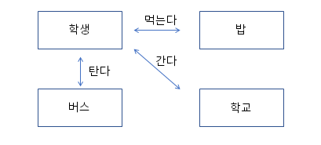

# 01. 객체와 객체 지향 프로그래밍

## 객체 (Object)

- 의사나 행위가 미치는 대상 ( 사전적 의미 )

- 구체적, 추상적 데이터의 단위 ( 학생, 회원, 생산, 주문, 배송 )


## 객체 지향 프로그램과 절차 지향 프로그래밍

- 아침에 일어나 학교를 가는 과정을 예를 들어 봅시다.

- 절차 지향 프로그래밍

   -시간이나 사건의 흐름에 따른 프로그래밍<br>

     일어난다 -> 씻는다 -> 밥을 먹는다 -> 버스를 탄다-> 요금을 지불한다 -> 학교에 도착

- 객체 지향 프로그래밍
  
  


## 객체 지향 프로그램은 어떻게 구현하는가?

- 객체를 정의 하고 

- 각 객체 제공하는 기능들을 구현하고

- 각 객체가 제공하는 기능들 간의 소통(메세지 전달)을 통하여 객체간의 협력을 구현 


# 02. 생활 속에서 객체 찾아 클래스로 구현해 보기

## 객체를 찾아 봅시다

- 온라인 쇼핑몰에 회원 로그인을 하고 여러 판매자가 판매하고 있는 제품 중 하나를 골라 주문을 한다

- 아침에 회사에 가는 길에 별다방 커피숍에 들려 아이스 카페라떼를 주문했다

- 성적확인을 위해 학사 관리 시스템에 로그인 하여 수강 한 과목들의 성적을 확인했다


## 클래스는 객체의 청사진(blueprint) 입니다

- 객체의 속성은 클래스의 <b>멤버 변수(member variable)</b>로 선언 함

- 학생 클래스
```java
public class Student {

	int studentNumber;
	String studentName;
	int majorCode;
	String majorName;
	int grade;
}
```

- 주문 클래스
```java
public class Order {

	int orderId;
	String buyerId;
	String sellerId;
	int productId;
	String orderDate;
}
```

- 회원 클래스
```java
public class UserInfo {

	String userId;
	String userPassWord;
	String userName;
	String userAddress;
	int phoneNumber;
}
```

## 객체 지향 프로그램을 할 때는 

- 객체를 정의 하고

- 각 객체의 속성을 멤버 변수로 역할을 메서드로 구현하고

- 각 객체간의 협력을 구현합니다.

## 클래스 코딩하기

- **클래스는 대문자로 시작하는것이 좋음**

- java 파일 하나에 클래스는 여러 개가 있을 수 있지만, public 클래스는 하나이고, public 클래스와 .java 파일의 이름은 동일함

- camel notation 방식으로 명명


# 3. 객체 설계하기

## 객체의 3가지 요소

1. 상태유지（객체의상태）
   
객체는 상태 정보를 저장하고, 유지되어져야 하며  이러한 속성（Variable）은 변수로 정의 되어져야 한다. 이러한 속성값이 바뀜으로 인하여, 객체의 상태가 변경 될 수 있어야 한다.

2. 기능 제공（객체의책임）

객체는 기능을 제공해야 한다. 이 부분은 Method의 제공으로 이루어진다.
이 부분은 캡슐화와 연관이 있으며, 외부로 부터 직접 속성에 접근하여 변경 하는 것이 아닌 객체가 제공하는 Method로 기능이 제공되어져야 한다.

3. 고유 식별자 제공（객체의유일성

각각의 객체는 고유한 식별자를 가져야 한다.
예를 들면 카드번호, 계좌번호, 자동차 번호와 같은 속성을 통해서 각각 고유한 값을 줄 수 있으며, 이는 이후 Db에서 Unique Key, 또는 Primary key 로도 작성이 가능하다.

## 물리 객체와 개념 객체

### 1. 물리객체

- 물리적 객체는 실제로 사물이 존재하며, 이를 **클래스로 정의한 객체를 의미**한다.

## 2. 개념객체

- 이후 우리가 개발할 웹 시스템에서 Service에 해당되며, 이는 business logic을 처리하는 부분을 의미 합니다.
- Business logic에서는 여러 객체를 서로 상호작용 하도록 하며, **객체가 제공하는 오퍼레이션 method를 통하여 객체의 속성을 변경 시킵**니다.


# 객체지향의 4대 특성

## 1. 캡슐화

- **캡슐화는 객체의 속성(Variable) 을 보호하기 위해서 사용 합니다**.
- 객체의 캡슐화는 현실 세계에서도 볼 수 있습니다. 컴퓨터 본체 안에 수 많은 부품이 있지만, 
- 전원을 켜기 위해서는 메인보드에 전기 신호를 직접 주는 것이 아닌, 외부 케이스에 있는 전원 버튼을 통해서 상태 속성을 On/Off 하도록 변경 합니다.

### 1.1 Method 설계
- 속성이 선언되었으나, 이의 상태를 변경하는 method가 없다면, 잘못 선언된 속성이다. 즉, 자신이 가지고 있는 속성에 대해서는 **해당 상태를 변경하는 기능을 제공해야 한다**.
- 실물 객체가 가진 기능을 모두 제공 해야 한다.
예를 들면, 자동차의 렌탈, 반납, 주행거리 계산 등등 
- 각각의 Method는 서로 관련성이 있어야 한다.
  - 차량의 렌탈/반납, 자동차 등록증 등록/해지 등 각 속성의 상대되는 기능을 제공해야 한다.
- 객체 안의 Method는 객체 안의 속성을 처리해야 하며, 다른 객체를 전달받아 해당 다른 객체에 정의된 속성을 직접 처리하면 안 된다.
  - 단, Method에 실행에 필요한 값들은 객체의 형태가 아닌 매개변수의 형태로 전달되어져야 한다.

**Getter / Setter Method**

- 외부에서 내부 속성(variable)에 직접 접근 하는 것이 아닌 Getter/Setter Method* 통해서 접근 하도록 적용

**CRUD Method**

- 데이터 처리를 위한 기본적인 CRUD Methodfi 제공 

**Business Logic Method**

- 비즈니스 로직 처리를 위한 Method! 제공

**객체의 생명 주기 처리 Method**

- 흔히 destroyO, disconnect() 등 quit() 등 소멸에 대한 method

**객체의 영구성 관리 Method**

- 영구성(유효성) 속성에 대한 변경이 필요한 경우 외부에서는 접근이 불가능하도록 private로 선언하며, 내부의 다른 Method! 통해서 사용 되도록 한다.
- Method의 속성은 반드시 1개에 속할 필요는 없으며, 여러 속성에 해당될 수 있다.


### 1.2 장점

> 객체지향의 패러다임 중 하나인 **추상화를 제공한다**.

실제로 Method가 어떻게 동작하는지는 외부에서는 이해할 필요가 없으며, 이를 단순 호출만으로 해 당 기능을 실행 할 수 있고, 이를 통해서 객체 단위로 프로그램 설계가 가능하다.

> 재사용성 항상

한 객체에 관련된 속성 및 Method는 모두 캡슐화의 형태로 제공됨으로, 객체의 모듈성과 응집도가 높아진다. 이를 통하여 재사용성이 높아진다.

만일 절차적 프로그래밍에서, Method 를 재사용한다면, 함수가 참조하고 있는 전역변수 및 내부에서 호출하는 Method가 미치는 영향을 모두 체크 해야 하나, **객체의 경우는 단일 객체에만 영향을 주기에 재사용성이 높다.**

> 앞선 이유로 인하여, 유지보수의 효율성이 향상된다.


> 무결성

보통의 캡슐화 코딩이라고 한다면, 주로 변수는 private 로 선언하고, Method를 public으로 선언하는 형태를 많이 가지게 됩니다.
이는 **객체의 무결성을 위함** 입니다. Getter/Setter를 제외 하고는 public method는 입력된 매개변수를 Validation을 한 후에 실행 하는 것을 기본으로 합니다.
Validation을 통하여, 객체의 값을 바꾸거나, 값의 대한 유효성을 가질 수 있습니다.


## 2.상속

- 객체지향에서의 상속은, 속성의 상속이 아닌, **하위로 내려갈수록 구체화 되는 것이다.**

### 상속의 효과

- 프로그램 구조에 대한 이해도 향상

최상위 클래스의 구조를 보고, 하위 클래스의 동작을 이해 할 수 있다. 

- 재시용성 향상

상속을 이용하여, 해당 클래스에 필요한 속성 및 메소드를 모두 정의 하지 않고, 상속을 받아서 사용 할 수 있다. 

- 확장성 향상
 
일관된 형태의 클래스 객체를 추가할 수 있어, 간단하게 프로그램 학장이 가능하다.

- 유지보수성 향상

각 객체마다 자신의 메소드를 정의 하고 있다면, 코드 수정에서 많은 작업이 필요 하지만, 상속을 사용 한 경우 일관된 형태로 작성이 가능하다.


3. 다형성
4. 
- 다형성은 하나의 개체가 여러 개의 형태로 변화 하는것을 말하며, 이를 객체지향 에서도 유사하게 사용하고 있습니다.
- 다형성을 하기 위해서는 **오버라이딩**을 통해서 가능 합니다.

4. 추상화

-    객체지향에서의 추상화는 **모델링** 이다.
-    구체적으로 공통적인 부분, 또는 특정 특성을 분리해서 재조합하는 부분이 추상화 입니다. -    앞에서 배운 **다형성, 상속 모두 추상화에 속한다.**


# 객체 지향 설계  5 원칙, SOLID

## 응집도와 결합도
좋은 소프트웨어 설계를 위해서는 **결합도(coupling)는 낮추고** **응집도 (cohesion) 는 높여야 한다**.

**결합도**

- 모듈(클래스)간의 상호 의존 정도를 나타내는 지표
- 결합도가 낮으면 모듈간의 상호 의존성이 줄어들어서 **객체의 재사용 및 유지보수가 유리하다.**

**응집도**

- 하나의 모듈 내부에 존재하는 구성 요소들의 기능적 관련성
- 응집도가 높은 모듈은 하나의 책임에 집중하고 독립성이 높아져, **재사용 및 유지보수가 용이하다.**

## 1. SRP(Single Responsibility Principle) 단일 책임 원칙

어떠한 클래스를 변경해야 하는 이유는 한가지 뿐 이여야 한다.

해당 모듈이 여러 대상 또는 액터들에 대해 책임을 가져서는 안되고, 오직 하나의 액터에 대해서만 책임을 져야 한다는 것을 의미

- bad case


- good case
  


## 2. OCP (Open Closed Principle) 개방 폐쇄 원칙

- 자신의 확장에는 열려 있고, 주변의 변화에 대해서는 닫혀있어야 한다.

  - 확장에 대해 열려 있다: 요구사항이 변경될 때 새로운 동작을 추가하여 애플리케이션의 기능을 확장할 수 있다.
  - 수정에 대해 닫혀 있다: 기존의 코드를 수정하지 않고 애플리케이션의 동작을 추가하거나 변경할 수 있다.
 
- 상위 클래스 또는 인터페이스를 중간에 듬으로써, 자신은 변화에 대해서는 폐쇄적이지만, 인터페이스는 외부의 변화에 대해서 확장을 개방해 줄 수 있다.
- 추상화를 통해 변하는 것들은 숨기고 변하지 않는 것들에 의존하게 하면 우리는 기존의 코드 및 클래스들을 수정하지 않은 채로 애플리케이션을 확장할 수 있다.
- 이러한 부분은 JDBC 와 Mybatis, Hibernate 등 JAVA에서는 Stream(lnput,Out)에서 찾아볼 수 있다. 


## 3. LSP (Liskov Substitution Principle) 리스코프 치환 원칙

- 서브 타입은 언제나 자신의 기반（상위》타입으로 교체 할 수 있어야 한다.
  - 상위 타입의 퍼블릭 인터페이스를 통해 서브 클래스를 사용할 수 있어야 한다는 것
  


## 4. ISP (Interface Segregation Principle) 인터페이스 분리 원칙

- 클라이언트는 자신이 사용하지 않는 메서드에 의존 관계를 맺으면 안된다.
- 프로젝트 요구 사항과 설계에 따라서 SRP（단일책임원칙） / ISP（인터페이스분리원칙)를 선택 한다.
- 모든 클라이언트가 자신의 관심에 맞는 퍼블릭 인터페이스(외부에서 접근 가능한 메세지)만을 접근하여 불필요한 간섭을 최소화
- 인터페이스 분리 원칙을 지킨다는 것은 어떤 구현체에 부가 기능이 필요하다면 이 인터페이스를 구현하는 다른 인터페이스를 만들어서 해결할 수 있다.
  


## 5. DIP (Dependency Inversion Principle) 의존 역전 원칙

- 자신보다 변하기 쉬운 것에 의존하지 말아야 한다.

