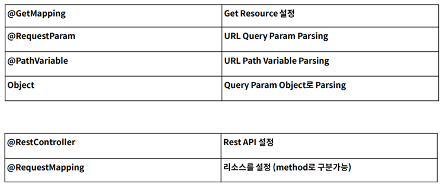
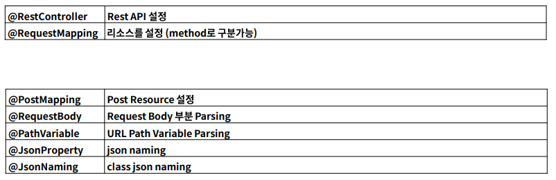
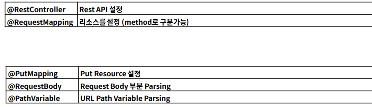
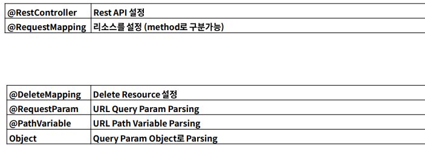
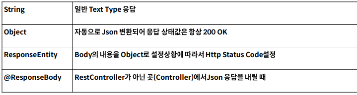

# Spring Boot

## 공식문서

- https://docs.spring.io/spring-boot/docs/2.1.x/referecne/html/getting-started-introducing-spring-boot.html

## spring initializer

- https://start.spring.io

## GET API

## POSt API

## PUT API

## DELETE API

## Response 내려주기

# 스프링의 핵심

> Spring 1.0버전은 2004년 3월 출시
>   - 지난 20년 가까지의 세월 동안 단 한번도 자바 엔터프라이즈 어플리케이션 개발의 최고의 자리를 차지 
> 스프링 프레임워크의 구성은 20여가지로 구성 (https://spring.io/projects/spring-framework)
>   - 이러한 모듈들은 스프링의 핵심기능 (미, AOP, etc)을 제공해 주며, 필요한 모듈만 선택하여 사용 가능.
> 현재 단일 아키텍처(모놀리스) 마이크로서비스 아키텍처로 변환 중
>   - 여기에 맞취서 스프링도 진화하고 있는 상태.
> 여러 가지 모듈이 있지만 그 중에서 단연 **스프링 부트, 스프링 클라우드, 스프링 데이터, 스프링 배치, 스프링 시큐리티**에 중점을 둔다

## 스프링의 과제

- “테스트의 용이성”, “느슨한 결합”에 중점을 두고 개발
  
