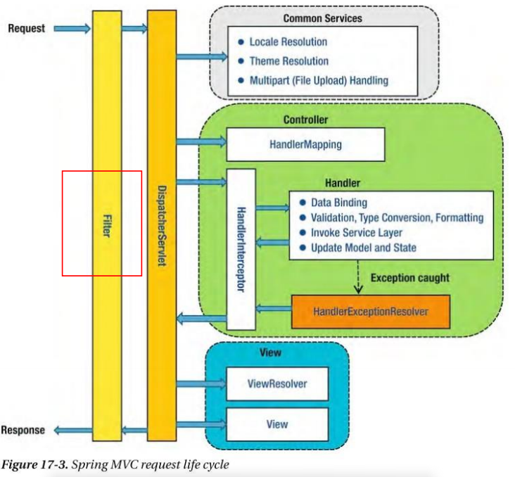
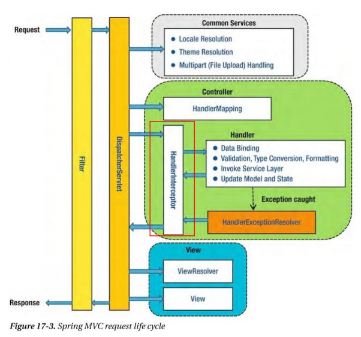

# Spring Boot Filter와 Interceptor

## Filter

- Web Application에서 관리되는 영역
- Spring Boot Framework 에서 Client로 부터 오는 요청/응답에 대해서 최초/최종 단계의 위치에 존재
- **요청/응답의 정보를 변경하거나, Spring에 의해서 데이터가 변환되기 전의 순수한 Client의 요청/응답 값을 확인 할 수 있다.**
- **유일하게 ServletRequest, ServletResponse 의 객체를 변환 할 수 있다.**
- 주로 Spring Framework에서는 request / response의 Logging 용도로 활용하거나, 인증과 관련된 Logic 들을 해당 Filter에서 처리한다.
- 이를 선/후 처리함으로써, Service business logic과 분리 시킨다.



## Interceptor

- Filter와 매우 유사한 형태로 존재 하지만, 차이점은 Spring Context에 등록된다. 
- AOP와 유사한 기능을 제공 할 수 있으며, 주로 **인증 단계를 처리** 하거나, **Logging를 하는 데에 사용**한다. 
- 이를 선/후 처리함으로써, Service business logic과 분리시킨다.




## Filter 실습

### lombok library 활용

- `@Data` : 클래스에 붙어 해당 클래스 변수의 `getter`, `setter`, `toString` method를 overridding
- dependencies에서 `annotationProcessor`와 `compileOnly`로 선언.
  - 컴파일할 때만 lombok 사용
  - 유저 클래스에 붙여 놓으면 컴파일 실행할 때, 함께 Getter setter를 생성하기 때문

```java
package com.example.filter.dto;

import lombok.*;

// lombok library의 annotation
//@Setter
//@Getter
@Data // getter + setter + toString 메서드까지 overriding
@NoArgsConstructor
@AllArgsConstructor
public class User {

    private String name;
    private int age;

}
```


### filter 구현 
```java
package com.example.filter.filter;

@Slf4j
@Component
public class GlobalFilter implements Filter {

    @Override

    public void doFilter(ServletRequest request, ServletResponse response, FilterChain chain) throws IOException, ServletException {

        // 전처리
        // request interface 변경하기
        HttpServletRequest httpServletRequest = (HttpServletRequest) request;
        HttpServletResponse httpServletResponse = (HttpServletResponse) response;


        String url = httpServletRequest.getRequestURI();
        BufferedReader br = httpServletRequest.getReader();

        br.lines().forEach( line -> {
            log.info("url : {}, line : {}", url,  line);
        });

        chain.doFilter(request, response);

        // 현재 필터에서 필터를 하기 위해 바디를 잘 읽었지만, 에러 발생
        // 후처리

//        httpServletResponse.
    }
}

```
```java
package com.example.filter.controller;

@Slf4j // log.info() 메서드 사용 가능
@RestController
@RequestMapping("/api")
public class ApiController {

    @PostMapping("/user")
    public User user(@RequestBody User user) {
        log.info("User : {}", user);
        return user;
    }
}

```

> 에러 발생

-  라인을 모두 읽은 상태 > API에서 바디를 읽으려고 했더니 이미 스트링 모두 읽은 상태여서 controller에서 바디를 읽을 수 없는 상태
- 클라이언트에서 오는 요청을 한번 읽으면 다시 못읽음

### ContentCachingRequestWrapper

- ByteArrayOutputStream cachedContent 변수에 요청 정보를 담아 몇번이든 읽을 수 있도록 함

```java
package com.example.filter.filter;

@Slf4j
@Component
public class GlobalFilter implements Filter {

    @Override

    public void doFilter(ServletRequest request, ServletResponse response, FilterChain chain) throws IOException, ServletException {

        // 전처리

//        // request interface 변경하기
//        HttpServletRequest httpServletRequest = (HttpServletRequest) request;
//        HttpServletResponse httpServletResponse = (HttpServletResponse) response;

        // ByteArrayOutputStream cachedContent 변수에 요청 정보를 담아 몇번이든 읽을 수 있도록 함
        ContentCachingRequestWrapper httpServletRequest = new ContentCachingRequestWrapper ((HttpServletRequest) request);
        ContentCachingResponseWrapper httpServletResponse = (ContentCachingResponseWrapper) ((HttpServletResponse) response);

        String url = httpServletRequest.getRequestURI();
        BufferedReader br = httpServletRequest.getReader();

        br.lines().forEach( line -> {
            log.info("url : {}, line : {}", url,  line);
        });

        chain.doFilter(httpServletRequest, httpServletResponse);

        // 현재 필터에서 필터를 하기 위해 바디를 잘 읽었지만, 에러 발생
        // 후처리

//        httpServletResponse.
    }
}

// 2022-12-16 16:06:27.966  INFO 26228 --- [nio-8080-exec-1] com.example.filter.filter.GlobalFilter   : url : /api/user, line : {
// 2022-12-16 16:06:27.970  INFO 26228 --- [nio-8080-exec-1] com.example.filter.filter.GlobalFilter   : url : /api/user, line :     "name":"Fideleo",
// 2022-12-16 16:06:27.970  INFO 26228 --- [nio-8080-exec-1] com.example.filter.filter.GlobalFilter   : url : /api/user, line :     "age" : 29
// 2022-12-16 16:06:27.970  INFO 26228 --- [nio-8080-exec-1] com.example.filter.filter.GlobalFilter   : url : /api/user, line : }
```

### 주의

- `chain.doFilter(httpServletRequest, httpServletResponse);`
  - doFilter 이후에 읽어야 함
  
```java
package com.example.filter.filter;

@Slf4j
@Component
public class GlobalFilter implements Filter {

    @Override

    public void doFilter(ServletRequest request, ServletResponse response, FilterChain chain) throws IOException, ServletException {

        // 전처리 : doFilter를 위한 과정
        // ByteArrayOutputStream cachedContent 변수에 요청 정보를 담아 몇번이든 읽을 수 있도록 함
        // cachedContent에는 길이만 지정하고 있지, 내용은 없음
        ContentCachingRequestWrapper httpServletRequest = new ContentCachingRequestWrapper ((HttpServletRequest) request);
        ContentCachingResponseWrapper httpServletResponse = new ContentCachingResponseWrapper ((HttpServletResponse) response);

        String url = httpServletRequest.getRequestURI();

        chain.doFilter(httpServletRequest, httpServletResponse);// 주의 : doFilter 이후에 읽어야 함

        // 후처리 : 모든 정보를 기록할 곳
        // req
        String reqContent = new String(httpServletRequest.getContentAsByteArray());
        log.info("request url : {}, request body : {}", url, reqContent);

        String resContent = new String(httpServletRequest.getContentAsByteArray());
        int httpStatus = httpServletResponse.getStatusCode();
        log.info("response status : {}, responseBody : {} : ", httpStatus, resContent);
    }
}

// 2022-12-16 16:21:12.327  INFO 28160 --- [nio-8080-exec-1] com.example.filter.filter.GlobalFilter   : request url : /api/user, request body : {
//     "name":"Fideleo",
//     "age" : 29
// }
// 2022-12-16 16:21:12.327  INFO 28160 --- [nio-8080-exec-1] com.example.filter.filter.GlobalFilter   : response status : 200, responseBody : {
//     "name":"Fideleo",
//     "age" : 29
// } : 


```

> 주의 
> - 응답 부분이 비어있음

- 한번 읽었기 떄문에 controller에서 읽을 body가 없는 상황
- 복사해서 보내줘야 함
  - `httpServletResponse.copyBodyToResponse()`


```java
package com.example.filter.filter;

@Slf4j
@Component
public class GlobalFilter implements Filter {

    @Override

    public void doFilter(ServletRequest request, ServletResponse response, FilterChain chain) throws IOException, ServletException {

        // 전처리 : doFilter를 위한 과정
        // ByteArrayOutputStream cachedContent 변수에 요청 정보를 담아 몇번이든 읽을 수 있도록 함
        // cachedContent에는 길이만 지정하고 있지, 내용은 없음
        ContentCachingRequestWrapper httpServletRequest = new ContentCachingRequestWrapper ((HttpServletRequest) request);
        ContentCachingResponseWrapper httpServletResponse = new ContentCachingResponseWrapper ((HttpServletResponse) response);

        String url = httpServletRequest.getRequestURI();

        chain.doFilter(httpServletRequest, httpServletResponse);// 주의 : doFilter 이후에 읽어야 함

        // 후처리 : 모든 정보를 기록할 곳
        // req
        String reqContent = new String(httpServletRequest.getContentAsByteArray());
        log.info("request url : {}, request body : {}", url, reqContent);

        String resContent = new String(httpServletRequest.getContentAsByteArray());
        int httpStatus = httpServletResponse.getStatusCode();

        httpServletResponse.copyBodyToResponse();

        log.info("response status : {}, responseBody : {} : ", httpStatus, resContent);
    }
}

```

- 정상적으로 응답이 보내짐

### 특정 구형에 적용하기

- `@ServletComponentScan` : Application 클래스에 붙는 annotation
- `@WebFilter(urlPatterns = )` : 필터클래스에 붙는 annotation
 
```java
package com.example.filter;

@SpringBootApplication
@ServletComponentScan
public class FilterApplication {

	public static void main(String[] args) {
		SpringApplication.run(FilterApplication.class, args);
	}

}

```
```java

package com.example.filter.filter;

@Slf4j
@WebFilter(urlPatterns = "/api/user/*")
public class GlobalFilter implements Filter {

    @Override
    public void doFilter(ServletRequest request, ServletResponse response, FilterChain chain) throws IOException, ServletException {
        ...
    }
}

```

## interceptor

### Auth annotation 설계

- `@Auth`가 붙어있는 클래스, 메서드에 대해서만 interceptor에서 권한이 있다고 판단하도록 사용
- `@Documented` : 자바에 포함되어있는 기본 어노테이션. javadoc<sup>2</sup>으로 api 문서를 만들 때 어노테이션에 대한 설명도 포함하도록 지정해주는 것
- `@Retention` :  RetentionPolicy 형식의 값을 할당하여 어노테이션의 유지 정책을 설정
  - 선택할 수 있는 내용은 SOURCE, CLASS, RUNTIME
- `@Target` : 어노테이션을 적용할 수 있는 위치

```java
package com.example.interceptor.annotation;

import java.lang.annotation.*;

@Documented
@Retention(RetentionPolicy.RUNTIME)
@Target({ElementType.TYPE, ElementType.METHOD})
public @interface Auth {}
```

- `@Auth` 부여하기

```java
package com.example.interceptor.controller;

@RestController
@RequestMapping("/api/private")
@Auth
@Slf4j
public class PrivateController {
    ...

}

```


- interceptor 구현
  - `HandlerInterCeptor`을 구현 - preHandle override
  - 구현한 `@Auth` annotation을 가지고 있는지 확인하는 method 작성
  - 권한을 가진(`@Auth`)을 가진 요청에 대해서 특정 파라미터 검사하는 logic
  - `UriComponentBuilder` : RI를 손쉽게 생성할 수 있도록 도와줌
    - UriComponents 를 Build할 수 있도록 도와주는 클래스
    - UriComponents 클래스의 생성자는 모두 package-private 또는 private 이기 때문에, 개발자가 이를 직접 구현하지 않는 이상 생성자를 통해 직접 생성할 수는 없음
  
```java
package com.example.interceptor.interceptor;

@Slf4j
@Component
public class AuthInterceptor implements HandlerInterceptor {


    // 컨트롤러의 메서드에 매핑된 특정 URI가 호출됐을 때 컨트롤러를 경유하기 직전에 실행되는 메서드
    @Override
    public boolean preHandle(HttpServletRequest request, HttpServletResponse response, Object handler) throws Exception {
        String url = request.getRequestURI();

        URI uri = UriComponentsBuilder.fromUriString(request.getRequestURI())
                .query(request.getQueryString()).build().toUri();

        log.info("request url : {}", url);
        boolean hasAnnotation = checkAnnotation(handler, Auth.class);
        log.info("has annotation : {}", hasAnnotation);

        // 나의 서버는 모두 public으로 동작하는데
        // 단 Auth 권한을 가진 요청에 대해서는 특정 파라미터를 검사하겠다.
        if(hasAnnotation){
            // 권한 체크
            String query = uri.getQuery();
            log.info("query : {} ", query);
            if(query.equals("name=steve")){
                return true;
            }
            return false;
        }
        return true;
    }

    private boolean checkAnnotation(Object handler, Class clazz){
        // clazz : class는 예약어라 사용 못함
        // resource, javaScript. html 타입(자원)이면 무조건 통과시킴
        if(handler instanceof ResourceHttpRequestHandler){
            return true;
        }
        // annotation check
        HandlerMethod handlerMethod = (HandlerMethod) handler;

        if(null != handlerMethod.getMethodAnnotation(clazz) || null != handlerMethod.getBeanType().getAnnotation(clazz)){
            // Auth annotation이 있을 때는 true
            return true;
        }
        return false;

    }
}


```

- interceptor 등록시키기
  - `InterceptorRegistry.addInterceptor()` : 애플리케이션이 인터셉터를 등록해주는 기능
  - `@RequiredArgsConstructor` : final로 선언된 객체들을 생성되서 주입받을 수 있도록 함

```java
package com.example.interceptor.config;

@Configuration
@RequiredArgsConstructor // final로 선언된 객체들을 생성되서 주입받을 수 있도록 함
public class MvcConfig implements WebMvcConfigurer {

    private final AuthInterceptor authInterceptor;

    @Override
    public void addInterceptors(InterceptorRegistry registry) {
        registry.addInterceptor(authInterceptor);

    }
}

```

### 특정URL에 대해서 interceptor 적용하기

- InterceptorRegistry.addInterceptor(객체).addPatterns(path);
- InterceptorRegistry.addInterceptor(객체).excludePathPatterns(path);
  

```java
package com.example.interceptor.config;

@Configuration
@RequiredArgsConstructor // final로 선언된 객체들을 생성되서 주입받을 수 있도록 함
public class MvcConfig implements WebMvcConfigurer {

    private final AuthInterceptor authInterceptor;
    @Override
    public void addInterceptors(InterceptorRegistry registry) {
        registry.addInterceptor(authInterceptor).addPathPatterns("/api/private/*");

    }
}

```


### 권한이 없는 요청 에러 status 반환

- Exception 구현

```java
package com.example.interceptor.exception;

public class AuthException extends RuntimeException{}

```

- interceptor에서 권한이 없다고 팓단되면 AuthException 던지기

```java
package com.example.interceptor.interceptor;

@Slf4j
@Component
public class AuthInterceptor implements HandlerInterceptor {

    @Override
    public boolean preHandle(HttpServletRequest request, HttpServletResponse response, Object handler) throws Exception {
        ...
        // 나의 서버는 모두 public으로 동작하는데
        // 단 Auth 권한을 가진 요청에 대해서는 세션, 쿠키,등 특정 파라미터를 검사하겠다.
        if(hasAnnotation){
            // 권한 체크
            String query = uri.getQuery();
            log.info("query : {} ", query);
            if(query.equals("name=steve")){
                return true;
            }
            throw new AuthException(); // 쿼리 파라미터 name이 steve가 아닐 때 AuthException 발생

        }
        return true;
    }
...
}

```

- AuthException 발생 시 401 Status 반환하는 handler 구현


```java
package com.example.interceptor.handler;

@RestControllerAdvice
public class GlobalHandlerException {
    
    @ExceptionHandler(AuthException.class)
    public ResponseEntity authException() {
        return ResponseEntity.status(HttpStatus.UNAUTHORIZED).build();
    }
}


```