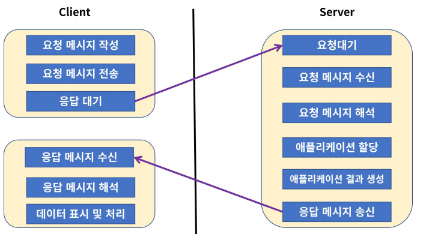
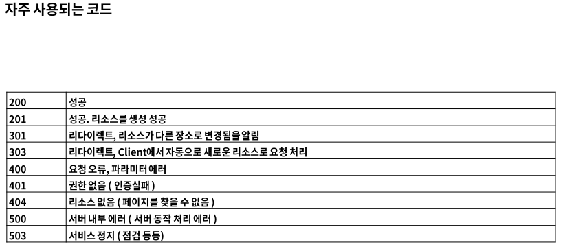

# Web

- (World Wide Web, WWW, W3)은 인터넷에 연결된 컴퓨터를 통해 사람들이 정보를 공유할 수 있는 전 세계적인 정보 공간을 말한다
- Web의 용도는 다양하게 나눌 수 있습니다. Web Site

- google, naver, daum，facebook 등 HTML로 구성된 여러 사이트들
-  API (Application Programming Interface) * Web Service
   - Kakao Open API, Google Open API, Naver Open API 등 
 - User Interface
   - Chrome, Safari, Explorer, Smartwatch, IP TV 등

# REST（Representational State Transfer: 자원의 상태 전달） 네트워크 아키텍처

- 웹에서 제공하는 모든 자원들에 각자 고유한 URI를 정의해 그 URI만 보더라도 해당 자원들의 명세를 표현하고 이해할 수 있게하는 디자인 방식(?) 방법론(?) 

1. **Clint, Server**: 클라이언트와 서버가 서로 독립적으로 분리 되어있어야 한다.
2. **Stateless**: 요청에 대해서 클라이언트의 상태를 서버에 저장하지 않는다.
3. **Cache**: 클라이언트는 서버의 응답을 Cache(임시저장》할 수 있어야 한다.
      - 클라이언트가 Cache를 통해서 응답을 재사용할 수 있어야 하며，이를 통해서 서버의 부하를 낮춘다.
4.  **계층화 ( Layered System )** : 서버와 클라이언트 사이에，방화벽，게이트웨이，Proxy 등 다양한 계층 형태로 구성이 가능해야 하며，이를 확장 할 수 있어야 한다.
5.  **인터페이스 일관성** : 인터페이스의 일관성을 지키고，아키텍처를 단순화시켜 작은 단위로 분리하여，클라 이언트，서버 가 독립적으로 개선 될 수 있어야 한다.
6.  **Code on Demand (Optional)** : 자바 애플릿，자바스크립트，플래시 등 특정한 기능을 서버로 부터 클라이언트가 전달받아 코드를 실행 할 수 있어야 한다.

### 다음의 인터페이스 일관성이 잘 지켜졌는지에 따라, REST를 잘 사용했는지 판단을 할 수 있다.
- 이러한 조건들을 잘 갖춘 경우 REST Ful 하다고 표현하고，이를 REST API 라고 부릅니다.
  
1. 자원의 식별
   
    - 웹 기반의 REST 에서는 리소스 접근을 할 때 url을 사용
  
2. 메시지를 통한 리소스 조작

    - 다양한 방식으로 데이터를 전달 : HTML, XML，JSON, TEXT
    - HTTP Header 부분에 content-type 을 통해서 데이터의 타입을 지정
    - 별도의 메시지의 형태로 데이터를 주고 받으며，client-server가 독립적으로 확장 가능하도록 합

3. 자기 서술적 메시지

   - 요청하는 데이터가 어떻게 처리 되어져야 하는지 충분한 데이터를 포함 할 수 있어야 한다.
   - HTTP 기반의 REST에서는 HTTP Method와 Header 정보，그리고 URI의 포함되는 정보로
표현할 수 있습니다.

4. 애플리케이션 상태에 대한 엔진으로써 하이퍼미디어
   
   - REST API를 개발할 때 단순히 Client 요청에 대한 데이터만 응답 해주는 것이 아닌 관련된 리소스에 대한 Link 정보까지 같이 포함되어져야 한다.

# URL 설계 패턴

1. URI (Uniform Resource Identifier)
   
   - 인터넷에서 특정 자원을 나타내는 주소 값. 해당 값은 유일 하다. (응답은 달라질 수 있다)
   - 요청 : https://www.foo.co.kr/resource/sample/!
   - 응답: fastcampus.pdf，fastcampus.pdf.doc

2. URL (Uniform Resource Locator)

   - 인터넷 상에서의 자원，특정 파일이 어디에 위치하는지 식별 하는 주소 
   - URI의 하위 개념
   - 요청 : https://www.foo.co.kr/fastcampus.pdf

## URI 설계 원칙 ( RFC-3986 )

- 슬래시 구분자 (/》는 계층 관계를 나타내는 데 사용한다.

   - https://fastcampus.co.kr/classes/java/curriculums/web-master
  
- URI 마지막문자로 (/》는포함하지 않는다.

  - https://fastcampus.co.kr/classes/java/curriculums/web-master/

- 하이픈(-)은 URI 가독성을 높이는데 사용한다

  - https://fastcampus.co.kr/classes/java/curriculums/web-master

- 밑줄(_)은 사용하지않는다.

  - https://fastcampus.co.kr/classes/java/curriculums/web_master

- URI 경로에는 소문자가 적합하다.

  - https://fastcampus.co.kr/classes/JAVA/curriculums/web-master (X) 
  - https://fastcampus.co.kr/classes/java/cumculums/web-master (0)

- 파일 확장자는 URI에포함하지않는다.

  - https://fastcampus.co.kr/classes/java/cumculums/web-master.jsp

- 프로그래밍 언어에 의존적인 확장자를 사용하지 않는다.

  - https://fastcampus.co.kr/classes/java/cumculums/web-master.do

- 구현에 의존적인 경로를 사용하지 않는다.

  - https://fastcampus.co.kr/servlet/classes/java/curriculums/web-master

- 세션 ID를 포함하지 않는다.

    - https://fastcampus.co.kr/classes/java/curriculums/web-master7session-id=abcdef

- 프로그래밍 언어의 Method명을 이용하지 않는다.

    - https://fastcampus.co.kr/classes/java/curriculums/web-master?action=intro

- 명사에 단수형보다는 복수형을 사용해야 한다. 컬렉션에 대한 표현은 복수로 사용

    - https://fastcampus.co.kr/classes/java/cumculums/web-master

- 컨트롤러 이름으로는 동사나 동사구를 사용한다.

    - https://fastcampus.co.kr/classes/java/curriculums/web-master/re-order

- 경로 부분 중 변하는 부분은 유일한 값으로 대체 한다.

  - 생략 ••• /cumculums/web-master/lessons/{lesson-id}/users/{user-id} 생략… /curriculums/web-master/lessons/2/users/100

- CRUD 기능을 나타내는 것은 URI에 사용하지 않는다.

  - GET: 생략… /curriculums/web-master/lessons/2/users/100/READ (X) 
  - DELETE: 생략… /curriculums/web-master/lessons/2/users/100 (O)

- URI Query Parameter 디자인
- URI 쿼리 부분으로 컬렉션 결과에 대해서 필터링 할 수 있다.

  - ^^••./curriculums/web-master?chapter=2

- URI 쿼리는 컬렉션의 결과를 페이지로 구분하여 나타내는데 사용한다.
 
  - ^^.../cumculums/web-master?chapter=2&page=0&size=10&sort=asc

- API에 있어서 서브 도메인은 일관성 있게 사용해야 한다.

  - https://fastcampus.co.krhttps://api.fastcampus.co.kr https://api-fastcampus.co.kr

- 클라이언트 개발자 포탈 서브 도메인은 일관성 있게 만든다.

  - https://dev-fastcampus.co.krhttps://developer-fastcampus.co.kr

# HTTP Protocol

- HTTP (Hyper Text Transfer Protocol) 로 RFC 2616에서 규정된 Web에서 데이터를 주 고 받는 프로토콜.
- HTTP는 TCP를 기반으로 한 REST의 특징을 모두 구현하고 있는 Web기반의 프로토콜
- 이름에는 하이퍼텍스트 전송용 프로토콜로 정의되어 있지만 실제로는 HTML, XML, JSON, Image, Voice, Video, Javascript, PDF 등 다양한 컴퓨터에서 다룰 수 있는 것은 모두 전송 할 수 있습니다.

## Client-Server HTTP 통신 방법

## HTTP 8 Methods

## HTTP Status Code

 
