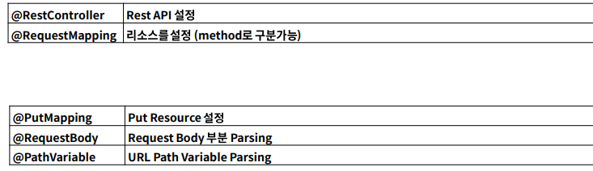
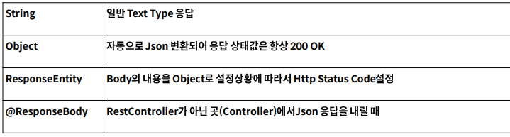

# Spring Boot

## Port 번호 변경

1. resources/application.properties/
2. server.port=9090 입력


## 공식문서

- https://docs.spring.io/spring-boot/docs/2.1.x/referecne/html/getting-started-introducing-spring-boot.html


## spring initializer

- https://start.spring.io

## 실습

```java
package com.example.hello.controller;

import org.springframework.web.bind.annotation.GetMapping;
import org.springframework.web.bind.annotation.RequestMapping;
import org.springframework.web.bind.annotation.RestController;

@RestController // 해당 class는 REST API 처리하는 controller임을 지정하는 데코레이터
@RequestMapping("/api") // URI를 지정해주는 Annotation
public class ApiController {

    @GetMapping("/hello") // http://localhost/api/hello url 매핑
    public String hell(){
        return "hello spring boot!";
    }
}


```

## GET API


```java
package com.example.hello.GetApiController;

import com.example.hello.dto.UserRequest;
import org.springframework.web.bind.annotation.*;

import java.util.Map;

@RestController
@RequestMapping("/api/get")
public class GetApiController {

    @GetMapping(path="/hello") // http://localhost:9090/api/get/hello
    public String getHello(){
        return "get Hello";
    }

    // 예전 방식
    @RequestMapping(path = "/hi", method = RequestMethod.GET) // get // http://localhost:9090/api/get/hi
    public String hi(){
        return "hi";
    }

    // http://localhost:9090/api/get/path-variable/{name}
    @GetMapping(path="/path-variable/{name}")
    public String pathVariable(@PathVariable String name){ // url에 변수 가져오는 방법
//    public String pathVariable(@PathVariable(name = "name") String pathName){ // pathVariable name과 매개변수의 이름을 달리해야 할 때
        System.out.println("PathVariable : " + name);
//        System.out.println("PathVariable : " + pathName);
        return name;
    }

    // 쿼리 파라미터
    // search?q=intellij
    // &oq=intellij
    // &aqs=chrome.0.69i59l6j69i60j69i61.5038j0j7
    // &sourceid=chrome
    // &ie=UTF-8

    // http://localhost:9090/api/get/query-param?user=steve&email=steve@gmail.com&age=30

    // query parameter 받아오는 방법 1
    @GetMapping(path="/query-param")
    public String queryParam(@RequestParam Map<String, String> queryParam) { // query parameter 연결시키는 annotation

        StringBuilder sb = new StringBuilder();

        // entrySet() : Map자료형에서 key, value값이 모둔 필요한 경우 사용
        queryParam.entrySet().forEach(entry -> {
            System.out.println(entry.getKey());
            System.out.println(entry.getValue());
            System.out.println("\n");

            sb.append(entry.getKey() + " + " + entry.getValue() + "\n" );

        });
        return sb.toString();
    }
    // query parameter 받아오는 방법 2
    @GetMapping("/query-param02")
    public String queryParam02(
            @RequestParam String user,
            @RequestParam String email,
            @RequestParam int age
    ){
        System.out.println(user);
        System.out.println(email);
        System.out.println(age);

        return user + " " + email + " " + age;
    }

    // query parameter 받아오는 방법 3 (가장 많이 쓰는 방법)
    // dto 폴더에 UserRequest 선언
    @GetMapping("query-param03")
    public String queryParam03(UserRequest userRequest){
        System.out.println(userRequest.getUser());
        System.out.println(userRequest.getEmail());
        System.out.println(userRequest.getAge());

        return userRequest.getUser() + " " + userRequest.getEmail() + " " + userRequest.getAge();

    }
}

```


## POST API


```java
package com.example.post.controller;

import com.example.post.dto.PostRequestDto;
import org.springframework.web.bind.annotation.PostMapping;
import org.springframework.web.bind.annotation.RequestBody;
import org.springframework.web.bind.annotation.RequestMapping;
import org.springframework.web.bind.annotation.RestController;

import java.util.Map;

@RestController
@RequestMapping("/api")
public class PostApiController {
    @PostMapping("/post")
    public void post(@RequestBody Map<String, Object> requestMap){ // 바디에 보내지는 데이터 매핑하는 annotation

        requestMap.forEach((key, value) -> {
            System.out.println("key : " + key);
            System.out.println("value : " + value);

        });
    }
//    key : account
//    value : user01
//    key : email
//    value : steve@gmail.com
//    key : address
//    value : 패스트캠퍼스
//    key : password
//    value : pw01

    @PostMapping("/post-dto")
    public void post(@RequestBody PostRequestDto postRequestDto){
        System.out.println(postRequestDto.toString());
    }
//    PostRequestDto{account='user01', email='steve@gmail.com', address='패스트캠퍼스', password='pw01'}
//    PostRequestDto{account='user01', email='steve@gmail.com', address='패스트캠퍼스', password='pw01', phoneNumber='01012345678'}
    // 카멜 케이스로 변경됨
//    PostRequestDto{account='user01', email='steve@gmail.com', address='패스트캠퍼스', password='pw01', phoneNumber='01012345678', OTP='132345'}

}

```
```java
package com.example.post.dto;

import com.fasterxml.jackson.annotation.JsonProperty;

public class PostRequestDto {

    private String account;
    private String email;

    private String address;
    private String password;

    @JsonProperty("phone_number") //
    private String phoneNumber; // 이때 리퀘스트 키가 스네이크 케이스인 경우 인식하지못함

    @JsonProperty("OTP") // 카멜케이스, 스네이크 케이스가 아닌 RequestBody 키값을 맵핑하기 위해 사용하는 annotation
    private String OTP;

    ...(getter setter)

    @Override
    public String toString() {
        return "PostRequestDto{" +
                "account='" + account + '\'' +
                ", email='" + email + '\'' +
                ", address='" + address + '\'' +
                ", password='" + password + '\'' +
                ", phoneNumber='" + phoneNumber + '\'' +
                ", OTP='" + OTP + '\'' +
                '}';
    }
}

```

- @JsonProperty : 다른 변수 표현 케이스를 일치시키는 annotation


## PUT API



- @JsonNaming
    - `@JsonNaming(value = PropertyNamingStrategy.SnakeCaseStrategy.class)`
    - 해당클래스에 일관적으로 Json 룰을 적용

- response 내리기
    - Spring Boot에서는 객체를 그대로 return 하면  object 형태로 응답을 보냄

```java
package com.example.post.dto;

import com.fasterxml.jackson.annotation.JsonProperty;
import com.fasterxml.jackson.databind.PropertyNamingStrategy;
import com.fasterxml.jackson.databind.annotation.JsonNaming;

import java.util.List;

@JsonNaming(value = PropertyNamingStrategy.SnakeCaseStrategy.class) // 해당클래스에 일관적으로 Json 룰을 적용
public class PutRequestDto {
    private String name;
    private int age;

//    @JsonProperty("car_list")
    private List<CarDto> carList;

...

    @Override
    public String toString() {
        return "PutRequestDto{" +
                "name='" + name + '\'' +
                ", age=" + age +
                ", carList=" + carList +
                '}';
    }
}

```
```java
package com.example.post.dto;

import com.fasterxml.jackson.annotation.JsonProperty;

public class CarDto {
    private String name;

    @JsonProperty("car_number")
    private String carNumber;

    public String getName() {
        return name;
    }
...
}
```
<br>

- url path variable 받아오기
    - `@PathVariable(name="")`

```java
...

@RestController
@RequestMapping("/api")
public class PutApiController {
    
    @PutMapping("/put/{userId}")
    public PutRequestDto put(@RequestBody PutRequestDto putRequestDto, @PathVariable(name="userId") Long id){
        System.out.println(id);
        return putRequestDto;
    }
    ...
}
```

## DELETE API


```java
package com.example.post.controller;

import org.springframework.web.bind.annotation.*;

@RestController
@RequestMapping("/api")
public class DeleteApiController {

    @DeleteMapping("/delete/{userId}")
    public void delete(@PathVariable String userId, @RequestParam String account){
        System.out.println(userId);
        System.out.println(account);
    }

}
```

## Response 내려주기



### 1. text 반환

```java


```
### 2. json 반환

```java
```

### 3. response customizing (권장)

- `ResponseEntity`

```java


```

# 스프링의 핵심


> Spring 1.0버전은 2004년 3월 출시
>   - 지난 20년 가까지의 세월 동안 단 한번도 자바 엔터프라이즈 어플리케이션 개발의 최고의 자리를 차지 
> 스프링 프레임워크의 구성은 20여가지로 구성 (https://spring.io/projects/spring-framework)
>   - 이러한 모듈들은 스프링의 핵심기능 (미, AOP, etc)을 제공해 주며, 필요한 모듈만 선택하여 사용 가능.
> 현재 단일 아키텍처(모놀리스) 마이크로서비스 아키텍처로 변환 중
>   - 여기에 맞취서 스프링도 진화하고 있는 상태.
> 여러 가지 모듈이 있지만 그 중에서 단연 **스프링 부트, 스프링 클라우드, 스프링 데이터, 스프링 배치, 스프링 시큐리티**에 중점을 둔다


## 스프링의 과제

- “테스트의 용이성”, “느슨한 결합”에 중점을 두고 개발
  
