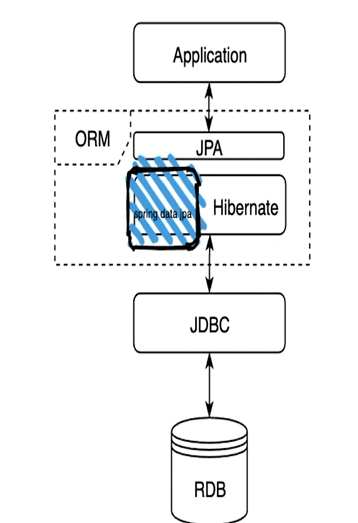

# 목표

1. jPA 기본 정의
2. Spring Data Jpa 숙련
3. Jpa 심화학습
4. Jpa Customizing 및 Troubleshooting을 위한 중/고급 기술 학습

# JPA(java Persistence API)

- 자바 진영에서 ORM(Object-Relational Mapping) 기술 표준으로 사용되는 인터페이스의 모음

- 최근 Jakarta Persistence로 renamed됨

- Java의 `ORM`
  
  >  `ORM`
  > 
  > - Object-Relational Mapping
  > - 애플리케이션 Class와 RDB(Relational DataBase)의 테이블을 매핑

## hibernate

- JPA에 대한 실제 구현체, implementation
- JPA를 구현한 다른 구현체로 대체될 수 있음

## Spring Data Jpa

- 자주 사용하는 Hibernate의 일부를 사용하기 편하도록 한번 더 추상 객체를 감싸서 만든 것
- Entity에 대한 접근을 좀 더 쉽게 수행할 수 있도록 함
