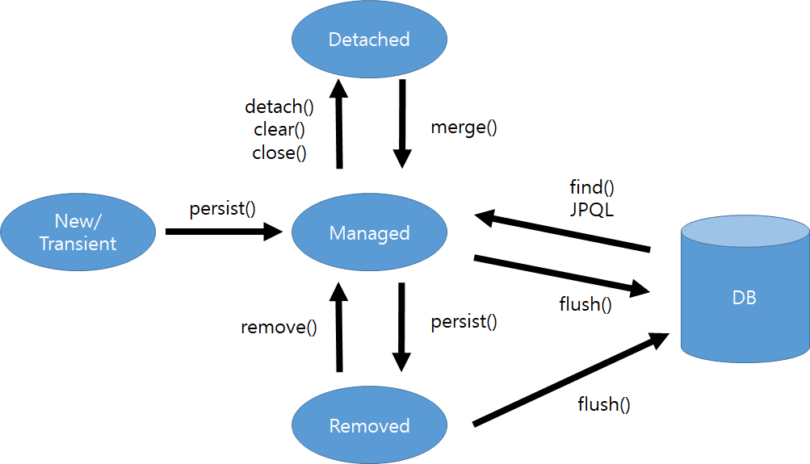

# Entity 생애주기 알아보기

## 4가지 상태

### 1. 비영속 상태(transient state, new 상태)

- 순수한 객체 상태
- 영속성 컨텍스트가 해당 entity를 관리하고 있지 않는 상태를 의미함
- 영속성 컨텍스트와 관련이 아예 없는 상태를 의미
- `@Transient`로 비영속 상태로 전환 가능
- EntityManager를 불러와서 detech()메서드를 통해 비영속 상태로 전환 가능
 

### 2. 영속 상태 (managed)

- `em.persist(book);`

- EntityManager를 통해 엔티티를 영속성 컨텍스트에 저장한 상태
- 영속성 컨텍스트가 해당 엔티티를 관리하게 된 상태임

### 3. 삭제 상태 (removed)

- 엔티티를 영속성 컨텍스트와 db에서 삭제한 상태
- `em.remove(book);`
    - 영속성 컨텍스트, db에서 삭제

### 4. 준영속 상태 (detached)

- 영속성 컨텍스트에 저장되었다가 분리된 상태

- `em.detach(book);`

    - 저장된 엔티티를 분리한 상태가 됨
    - 영속성 컨텍스트에 저장되었다 다시 분리된 상태
    - 더 이상 영속성 엔티티가 관리하지 않기에 1차 캐시 등에서 모든 정보가 삭제됨.
    - 실무에서 잘사용하지 않음

- `em.close();`

    - 영속성 컨택스트 닫기
    - 영속성 컨텍스트를 종료
    - 관리하던 모든 엔티티가 준영속 상태가 되어 버림

- `em.clear();`

    - 영속성 컨텍스트 초기화
    - 영속성 컨텍스트를 초기화 시킴 (새로 만든 영속성 컨텍스트의 상태와 동일함)
    - 모든 엔티티가 준영속상태가 됨
    - 1차 캐시에 관계없는 쿼리를 확인하고 싶을 때 사용 (직접 db에 쿼리를 날리게 됨)
 
- 준영속 상태의 경우 거의 비영속 상태와 비슷하다. 차이가 있다면 준영속 상태는 식별자를 보유하고 있음
- 준영속 상태일 때는 지연 로딩이 불가함 ( 프록시 객체 로딩 뒤 영속성 컨텍스트에서 데이터 불러올 때 문제 발생)

 

- `Book book = em.merge(book);`

    - 준영속 상태의 엔티티를 다시 영속 상태로 변환

    - 파라미터로 넘어온 엔티티의 식별자 값으로 영속성 컨텍스트 조회해서 찾아와 영속 상태로 변환

    - 없으면 db 에서 조회하고 영속상태로 변환

    - 그래도 없으면 새로운 엔티티 생성

    - 불러온 엔티티와 파라미터로 넘긴 객체가 값이 다르면 값을 채우고 병합이 이루어짐

    - 업데이트 시에는 merge 보다는 변경 감지를 이용하는게 좋음 ( 만약에 값을 안넣고 merge 해버리면 ... null 이 db에 들어가게 됨)

    - 트랜잭션이 있는 서비스 계층에 식별자와 변경할 데이터를 명확하게 전달하고

    - 서비스에서 id 로 find 해온 뒤 select 하고, 그 영속성 엔티티에 set을 수행해서 변경감지를 수행해야함.

## 영속성 컨텍스트

- `영속화` : 사라지지 않고 지속적으로 접근할 수 있다는 의미
- 데이터를 영속화하는데 사용하는 것
- 엔티티를 영구 저장하는 환경이라는 뜻
- 애플리케이션과 데이터베이스 사이에서 객체를 보관하는 가상의 데이터베이스 같은 역할
- 엔티티 매니저를 통해 엔티티를 저장하거나 조회하면 엔티티 매니저는 영속성 컨텍스트에 엔티티를 보관하고 관리한다.

### 영속성 컨텍스트가 반영되는 시점

1. transition이 완료된 순간
2. commit된 순간

### 영속성 컨텍스트의 식별자 값

- 영속성 컨텍스트는 엔티티를 식별자 값으로 구분한다.
- 따라서 영속 상태는 식별자 값이 반드시 있어야 한다.

### 영속성 컨텍스트가 엔티티를 관리할 떄 장점

1. 1차 캐시
2. 동일성 보장
3. 트랙잭션을 지원하는 쓰기 지연
4. 변경 감지
5. 지연 로딩

### 1차 캐시

- 영속성 컨텍스트 내부에 존재하는  캐시
- 영속 상태의 엔티티를 저장하는 곳
- 1차 캐시의 키 : 식별자 값(데이터베이스의 기본 키)
- 1차 캐시의 값 ; 엔티티 인스턴스

### 조회의 흐름

1. 1차 캐시에서 엔티티를 찾는다
2. 있으면 메모리에 있는 1차 캐시에서 엔티티를 조회한다.
3. 없으면 데이터베이스에서 조회한다.
4. 조회한 데이터로 엔티티를 생성해 1차 캐시에 저장한다. (엔티티를 영속상태로 만든다)
5. 조회한 엔티티를 반환한다.

### 트랜잭션을 지원하는 쓰기 지연(transactional write-behind)

- em.find(member)를 사용해 member를 저장해도 바로 INSERT SQL이 DB에 보내지는 것이 아님
- 엔티티 매니저는 트랜잭션을 커밋하기 직전까지 내부 쿼리 저장소에 INSERT SQL을 모아둠
- 이후 트랜잭션을 커밋할 때 모아둔 쿼리를 DB에 보낸다.

### entity 내용 변경감지의 흐름

1. 트랙잭션을 커밋하면 엔티티 매니저 내부에서 먼저 플러시가 호출된다.
2. 엔티티와 스냅샷을 비교하여 변경된 엔티티를 찾는다.
3. 변경된 엔티티가 있으면 수정 쿼리를 생성해서 쓰기 지연 SQL 저장소에 저장한다.
4. 쓰기 지연 저장소의 SQL을 플러시한다.
5. 데이터베이스 트랜잭션을 커밋한다.

## 플러시

- 영속성 컨텍스트의 변경 내용을 데이터베이스에 반영
- 영속성 컨텍스트의 엔티티를 지우는게 아니라 변경 내용을 데이터베이스에 동기화하는 것

### 플러시의 흐름

1. 변경 감지가 동작해서 스냅샷과 비교해서 수정된 엔티티를 찾는다.
2. 수정된 엔티티에 대해서 수정 쿼리를 만들고 SQL 저장소에 등록한다.
3. 쓰기 지연 SQL 저장소의 쿼리를 데이터베이스에 전송한다.

### 플러시하는 방법

1. `em.flush()`
2. 트랙잭션 커밋시 자동 호출
3. JPQL 쿼리 실행시 자동 호출

