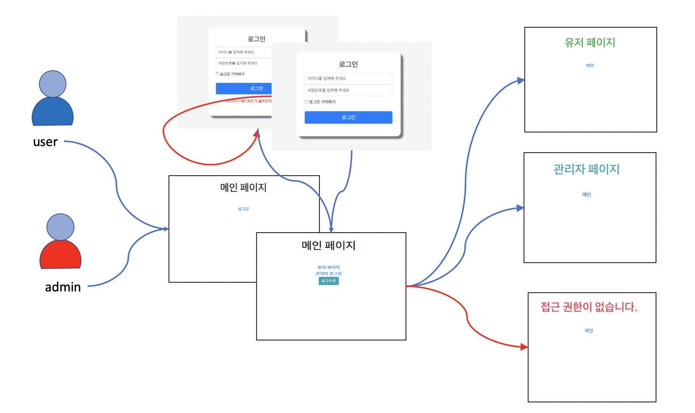

# basic login

- 아래와 같은 사이트 기획

  

- 디자이너는 이 사이트를 아래와 같이 디자인 했습니다.
  
- 로그인 페이지를 만들고 기본적인 페이지의 flow 를 실습한다.

## 페이지에 Security 설정하기

- thymeleaf 에 대한 의존성 추가
- bootstrap 을 이용해 기본 페이지 제작
- 기본 로그인 페이지 제작
- csrf 설정
- 로그인 성공시 설정
- 로그인 실패시 설정
- 로그아웃 설정
- UserDetailsSource 설정

## 코드 조각

- resource web ignore 설정

  ```java
    @Override
    public void configure(WebSecurity web) throws Exception {
        web.ignoring()
                .requestMatchers(
                        PathRequest.toStaticResources().atCommonLocations()
                )
                ;
    }
  ```

- 로그인 사용자

  ```java

    auth
      .inMemoryAuthentication()
      .withUser(
              User.withDefaultPasswordEncoder()
              .username("user1")
              .password("1111")
              .roles("USER")
      ).withUser(
      User.withDefaultPasswordEncoder()
              .username("admin")
              .password("2222")
              .roles("ADMIN")
      );

  ```

  > 주의 : withDefaultPasswordEncoder
  > - 테스트 한정 사용할 수 있는 메서드.
  > - 안전하지 않기 때문에 Deprecated됨

- thymeleaf 에서 security를 적용하는 태그

  ```html
  <div sec:authorize="isAuthenticated()">
    This content is only shown to authenticated users.
  </div>
  <div sec:authorize="hasRole('ROLE_ADMIN')">
    This content is only shown to administrators.
  </div>
  <div sec:authorize="hasRole('ROLE_USER')">
    This content is only shown to users.
  </div>
  ```

## 참고

- https://www.thymeleaf.org/doc/articles/springsecurity.html


## 웹 페이지 권한에 따른 page 흐름 제어


```java
package com.sp.fc.web.config;

@EnableWebSecurity(debug = true)
@EnableGlobalMethodSecurity(prePostEnabled = true) // controller에서 @preAuthorize로 설정한 role대로 접근 제한할 수 있음
public class SecurityConfig extends WebSecurityConfigurerAdapter {

    ...
    // test를 위해 default user 등록 방법
    @Override
    protected void configure(AuthenticationManagerBuilder auth) throws Exception {
        auth
                .inMemoryAuthentication()
                .withUser(
                        User.withDefaultPasswordEncoder() // deprecated된 메서드
                                .username("user1")
                                .password("1111")
                                .roles("USER")
                ).withUser(
                User.withDefaultPasswordEncoder()
                        .username("admin")
                        .password("2222")
                        .roles("ADMIN")
        );
    }

    // 권한 계층 설정하기
    @Bean
    RoleHierarchy roleHierarchy(){
        RoleHierarchyImpl roleHierarchy = new RoleHierarchyImpl();
        roleHierarchy.setHierarchy("ROLE_ADMIN > ROLE_USER"); // 관리자는 유저가 할 수 있는 모든 권한을 가지도록 계층화
        return roleHierarchy;
    }

    // url별 HttpSecurity 인증상태에 따라 page흐름 커스텀하기
    @Override
    protected void configure(HttpSecurity http) throws Exception {
        http
                .authorizeRequests(request->
                    request.antMatchers("/").permitAll() // 메인페이지는 모든 사용자가 들어올 수 있도록 허용
                            .anyRequest().authenticated()           // 모든 요청은 허락을 받고 들어와야 함
                 )
                // UserNamePasswordFilter 설정하기 위해 formLogin 달기
                // formLogin 구성하기
                .formLogin(login->
                        login.loginPage("/login")   // 로그인 페이지 특정해주기(로그인페이지는 권한이 있어야 하는데, 권한없이 접근할 시 무한루트 가능성)
                        .loginProcessingUrl("/loginprocess")
                        .permitAll() // 권한 없이 접근할 수 있도록 설정
                        .defaultSuccessUrl("/", false) // alwaysUse 옵션을 꺼야 redirect 가능
                        .authenticationDetailsSource(customAuthDetail) // 로그인이 발생할 때커스텀한 사용자 정보(RequestInfo)를 details에 담은 authentication을 전달해줌 
                        .failureUrl("/login-error")
                )
                // 로그인이 있으면 로그아웃은 필수
                .logout(logout->
                        logout.logoutSuccessUrl("/"))
                // EnableGlobalMethodSecurity에 의해 접근이 제한된 사용자에게 에러 메세지 대신 redirect할 url 설정
                .exceptionHandling(error->
                        error.accessDeniedPage("/access-denied")
                )
                ;
    }

    // 웹보안을 모든 request에 적용했기 때문에 server의 resource에도 보안 필터를 거치게 함
    @Override
    public void configure(WebSecurity web) throws Exception {
        // 아래와 같이 리소스들은 웹 보안에서 재외시켜줘야 함 
        web.ignoring()
                .requestMatchers(
                        // 리소스 위치를 나타내는 코드
                        PathRequest.toStaticResources().atCommonLocations()
                )
        ;
    }

}


```

## 로그인 후 authentication의 details 커스텀하기

1. Details에 담을 정보 정하기

```java

package com.sp.fc.web.config;

@Data
@AllArgsConstructor
@NoArgsConstructor
@Builder
public class RequestInfo {

    private LocalDateTime loginTime;
    private String remoteIp;
    private String sessionId;
}

```

2.  로그인할 때 HttpServletRequest에서 필요한 정보 가져와서 customAuthDetail에 build하기
    - AuthenticationDetailsSource 구현해야 함

```java
package com.sp.fc.web.config;

@Component
public class CustomAuthDetail implements AuthenticationDetailsSource<HttpServletRequest, RequestInfo> {
    // 로그인이 발생 후 authentication의 details에 담을 정보 커스텀하기
    @Override
    public RequestInfo buildDetails(HttpServletRequest request) {
        return RequestInfo.builder()
                .loginTime(LocalDateTime.now())
                .remoteIp(request.getRemoteAddr())
                .sessionId(request.getSession().getId())
                .build();
    }
}


```

3. SecurityConfig에서 로그인할 때 CustomAuthDetail을 Authentication에 넣기

  - customAuthDetail 가져오기(객체와 생성자 생성)
  - formLoign에서 authenticationDetailsSource(customAuthDetail)

```java
package com.sp.fc.web.config;

@EnableWebSecurity(debug = true)
@EnableGlobalMethodSecurity(prePostEnabled = true) // controller에서 @preAuthorize로 설정한 role대로 접근 제한할 수 있음
public class SecurityConfig extends WebSecurityConfigurerAdapter {

    private final CustomAuthDetail customAuthDetail;

    public SecurityConfig(CustomAuthDetail customAuthDetail) {
        this.customAuthDetail = customAuthDetail;
    }


    @Override
    protected void configure(HttpSecurity http) throws Exception {
        http
                .authorizeRequests(request->
                    request.antMatchers("/").permitAll() // 메인페이지는 모든 사용자가 들어올 수 있도록 허용
                            .anyRequest().authenticated()           // 모든 요청은 허락을 받고 들어와야 함
                 )
                // UserNamePasswordFilter 설정하기 위해 formLogin 달기
                // formLogin 구성하기
                .formLogin(login->
                        login.loginPage("/login")   // 로그인 페이지 특정해주기(로그인페이지는 권한이 있어야 하는데, 권한없이 접근할 시 무한루트 가능성)
                        .loginProcessingUrl("/loginprocess")
                        .permitAll() // 권한 없이 접근할 수 있도록 설정
                        .defaultSuccessUrl("/", false) // alwaysUse 옵션을 꺼야 redirect 가능
                        .authenticationDetailsSource(customAuthDetail) // 로그인이 발생할 때커스텀한 사용자 정보(RequestInfo)를 details에 담은 authentication을 전달해줌
                        .failureUrl("/login-error")
                )
                .logout(logout->
                        logout.logoutSuccessUrl("/"))
                // EnableGlobalMethodSecurity에 의해 접근이 제한된 사용자에게 에러 메세지 대신 보낼 url 설정
                .exceptionHandling(error->
                        error.accessDeniedPage("/access-denied")
                )
                ;
    }


}

```