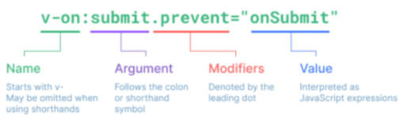

# Directive

## 1. 기본 구성

- v-접두사가 있는 특수 속성에는 값을 할당할 수 있음
    - 값에는 Js 표현식을 작성할 수 있음
- directive 역할은 표현식의 값이 변경될 때 반응적으로 DOM에 적용하는 것



- 사진의 코드는 addEventListener에서 event취소할 때 코드와 동일한 역할
- `:` : 을 통해 전달인자를 받을 수 있음
- `.` : 으로 표시되는 특수 접미사 -directive를 특별한 방법으로 바인딩해야 함

## 2. 새 Vue instance 생성

- 각각의 instance들은 연결된 DOM element에만 영향을 미침
- 연결되지않은 DOM이 Vue의 영향을 받지 않았던 것과 동일한 상황

```jsx
<!-- 1. Text interpolation -->
  <div id="app">
...
  </div>

  <!-- 2. v-text & v-html -->
  <div id="app2">
...
  </div>

  <script src="https://cdn.jsdelivr.net/npm/vue@2/dist/vue.js"></script>
  <script>

    const app2 = new Vue({
      el: '#app2',
      data: {
        message: 'Hello!',
        html: '<a href="https://www.google.com">GOOGLE</a>'
      }
    })
  </script>
```

## 3. v-text

- Template interpolation과 함께 가장 기본적인 바인딩 방법
- {{  }}와 동일한 역할
    - ~~정확히 동일한 역할인 것은 아님~~

```jsx
<body>
  <!-- 2. v-text & v-html -->
  <div id="app2">
    <!-- 2-1. v-text & {{}} -->
    <p v-text="message"></p>

  </div>

  <script src="https://cdn.jsdelivr.net/npm/vue@2/dist/vue.js"></script>
  <script>

    // 2. v-text && v-html
    const app2 = new Vue({
      el: '#app2',
      data: {
        message: 'Hello!',
      }
    })
  </script>

// Hello!
```

## 4. v-html

- RAW HTML을 표현할 수 있는 방법
- 단, 사용자가 입력하거나 제공하는 컨텐츠에는 `절대 사용 금지`
    - XSS 공격 참고

```jsx
<!-- 1. Text interpolation -->
  <!-- 2. v-text & v-html -->
  <div id="app2">
    <!-- 2-2. v-html -->
    <p v-html="html"></p>
  </div>

  <script src="https://cdn.jsdelivr.net/npm/vue@2/dist/vue.js"></script>
  <script>
    // 2. v-text && v-html
    const app2 = new Vue({
      el: '#app2',
      data: {
        ...
        html: '<a href="https://www.google.com">GOOGLE</a>'
      }
    })
  </script>

// 구글로 가는 하이퍼링크 생성
```

## 5. v-show

- 표현식에 작성된 값에 따라 element를 보여 줄 것인지 결정
    - boolean값이 변경될 때 마다 반응
- 대상 element의 display 속성을 기본 속성과 none으로 toggle
- 요소 자체는 항상 DOM에 렌더링 됨

```jsx
  <!-- 3. v-show && v-if -->
  <div id="app3">
    <p v-show="isActive">보이니? 안보이니?</p>
    <p v-if="isActive">안보이니? 보이니?</p>
  </div>

  <script src="https://cdn.jsdelivr.net/npm/vue@2/dist/vue.js"></script>
  <script>
    // 3. v-show && v-if
    const app3 = new Vue({
      el: '#app3',
      data: {
        isActive: false
      }
    })
  </script>
```

- **바인딩된 isActive의 값이 false이므로 첫 방문 시 p tag는 보이지 않음**
    - vue dev tools에서 isActive 변경 시 화면에 출력
    - 값을 false로 변경 시 다시 사라짐
- 화면에서만 사라졌을 뿐, DOM에는 존재한다.
    - display 속성이 변경되었을 뿐
    

## 6. v-show VS v-if (중요)

### 6.1 v-show (expensive initial load, cheap toggle)

- 표현식 결과와 관계없이 렌더링되므로 **초기 렌더링에 필요한 비용은 v-if보다 높을 수 있음**
- display 속성 변경으로 표현 여부를 판단하므로 렌더링 후 **toggle 비용은 적음**

### 6.2 v-if (cheap initial load, expensive toggle)

- 표현식 결과가 false인 경우 렌더링조차 되지 않으므로, **초기 렌더링 비용은 v-show보다 낮을 수 있음**
- 단, 표현식 값이 자주 변경되는경우 잦은 **재랜더링으로 비용이 증가할 수 있음**

### 6.3 v-for

- 작성 형식 : `for ... in ...`
- 반복한 데이터 타입에 모두 사용 가능
- index를 함께 출력하고자 한다면, (char, index)형태로 사용 가능

```jsx

  <!-- 3. v-for -->
  <div id="app">
    <h2>String</h2>
    <div v-for="char in myStr">
      <p>{{ index }}번째 문자열 {{ char }}</p>
    </div>
  </div>
  <script src="https://cdn.jsdelivr.net/npm/vue@2/dist/vue.js"></script>
  <script>
    const app = new Vue({
      el: '#app',
      data: {
        // 1. String
        myStr: 'Hello, World!',

      }
    })
  </script>

```

- 배열 역시 문자열과 동일하게 사용 가능
- 각 요소가 객체라면 `dot notation`으로 접근할 수 있음

```jsx

    <h2>Array</h2>
    <div v-for="(item, index) in myArr2" :key="`arry-${index}`">
      <p>{{ index }}번째 아이템</p>
      <p>{{ item.name }}</p>
    </div>

  <script src="https://cdn.jsdelivr.net/npm/vue@2/dist/vue.js"></script>
  <script>
    const app = new Vue({
      data: {
        // 2-2. Array with Object
        myArr2: [
          { id: 1, name: 'python', completed: true},
          { id: 2, name: 'django', completed: true},
          { id: 3, name: 'vue.js', completed: false},
			  ],
      }
    })
  </script>

```

- 객체 순회 시 value가 할당되어 출력
- 2번째 변수 할당 시 key 출력 가능
    - 인자 위치 잘보기 (value, key)

```jsx
    <h2>Object</h2>
    <div v-for="(value, key) in myObj"> // 인자 위치 잘보기 (value, key)
      <p>{{ key }} : {{ value }}</p>
    </div>

  <script src="https://cdn.jsdelivr.net/npm/vue@2/dist/vue.js"></script>
  <script>
    const app = new Vue({
      data: {
       // 3. Object
        myObj: {
          name: 'harry',
          age: 27
        },
      }
    })
  </script>
</body>
</html>
```

### 주의

- [참고] 특수 속성 key
- - `v-for` 사용 시 key 속성을 각 요소에 작성
- - 주로 v-for directive 작성 시 사용
- - vue 화면 구성 시 이전과 달라진 점을 확인하는 용도로 활용
- - **따라서 key가 중복되어서는 안됨**
- - 각 요소가 고유한 값을 가지고 있지 않다면 생략할 수 있음

```jsx
    <div v-for="(item, index) in myArr2" :key="`arry-${index}`">
      <p>{{ index.id }}번째 아이템</p>
		  <p>{{ item.name }}</p>
    </div>
```

- 인덱스를 출력안하더라도 위 구조를 맞춰주는 것이 좋다.
    
    
- object의 경우 key가 중복되지 않기때문에 그대로 사용해도 됨

### 6.4 v-on

- `:` : 을 통해 전달받은 인자를 확인
- 값으로 JS 표현식 작성
- addEventListener의 첫 번째 인자와 동일한 값들로 구성
- 대기하고 있던 이벤트가 발생하면 할당된 표현식  실행

```jsx
  <div id="app">
    <button v-on:click="number++">increase Number</button>
    <!-- <button @click="number++">increase Number</button> -->

    <p>{{ number }}</p> -->
  </div>

  <script src="https://cdn.jsdelivr.net/npm/vue@2/dist/vue.js"></script>
  <script>
    const app = new Vue({
      el: '#app',
      data: {
        number: 0,
        isActive: false,
      },
    })
  </script>
```

- method를 통한 data 조작도 가능
- method에 인자를 넘기는 방법은 일반 함수를 호출할 때와 동일한 방식
- `:` 을 통해 전달된 인자에 따라 특별한 modifiers가 있을 수 있음
    - ex > v-on:keyup.click
- `@` shortcut 제공
    - **@ shortcut을 많이 사용함**
    - ex > @keyup.click

### 6.5 v-bind

- HTML 기본 속성에 Vue data를 연결
- class의 경우 다양한 형태로 연결 가능
    - `조건부 바인딩`
        - {’class Name’:’조건 표현식’}
        - 삼항 연산자도 가능
    - `다중 바인딩`
        - [’JS 표현식’, ‘JS 표현식’, …]

```jsx
  <div id="app2">
    <a v-bind:href="url">Go To GOOGLE</a> // "url" 변수값임 주의

    <p v-bind:class="redTextClass">빨간 글씨</p>
    <p v-bind:class="{ 'red-text': true }">빨간 글씨</p> // true, false에 따라 추가 삭제 가능
    <p v-bind:class="[redTextClass, borderBlack]">빨간 글씨, 검은 테두리</p>
  </div>

<p :class="theme">상황에 따른 활성화</p> // shortcut 적용 사례
    <button @click="darkModeToggle">dark Mode {{ isActive }}</button>

  <script src="https://cdn.jsdelivr.net/npm/vue@2/dist/vue.js"></script>
  <script>
    const app2 = new Vue({
      el: '#app2',

      data: {
        url: 'https://www.google.com/',
        redTextClass: 'red-text',
        borderBlack: 'border-black',
        isActive: true,
        theme: 'dark-mode'
      },

      methods: {
        darkModeToggle() {
          this.isActive = !this.isActive
          if (this.isActive) {
            this.theme = 'dark-mode'
          } else {
            this.theme = 'white-mode'
          }
        }
      }
    })
  </script>
```

- Vue data의 변화에 반응하여 DOM에 반영하므로 상황에 따라 유동적 할당 가능
- `:` shortcut 제공
    - ex) **:class** 등
    - v-for에서 사용하였던 :key는 v-bind의 shortcut을 활용한 것
    

### 6.6 v-model

- Vue instance와 DOM의 `양방향 바인딩`
- Vue data 변경 시 v-model로 연결된 사용자 입력 element에도 적용
    - v-on으로 짠 코드와도 동일하게 행동함

```jsx
  <div id="app">
    <h2>1. Input -> Data</h2>
    <h3>{{ myMessage }}</h3>
    <input v-model="myMessage" type="text">
    <hr>
  </div>

  <script src="https://cdn.jsdelivr.net/npm/vue@2/dist/vue.js"></script>
  <script>
    const app = new Vue({
      el: '#app',
      data: {
        myMessage: '',
      }
    })
  </script>
```