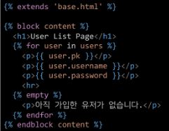
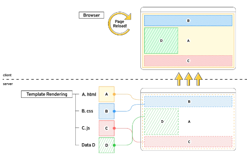
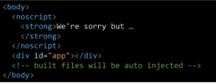

# Vue

# 사전준비

- vscode Vetur extension 설치
    - 문법 하이라이팅, 자동완성, 디버깅 기능 제공
- Chrome Vue devtools extension 설치
    - 크롬 브라우저 개발자 도구에서 vue 디버깅 기능 제공

# Front-end Development

# 1. what is Front-end Development?

- 앞으로 할 일 JavaScript를 활용한 Front-End 개발
- Back-end 개발은 Back-End 개발에 특화된 Django로 진행
- Front-end 개발은?
    - Vue.js === JavaScript Front-end Framework

## 1.1 front end Framework

- front-end 개발이란
    - 사용자에게 보여주는 화면 만들기
- Web app(SPA)을 만들 때 사용하는 도구
    - SPA -single Page Application

## 1.2 Web App 이란?

- 웹 브라우저에서 실행되는 어플리케이션 소프트웨어
- VIBE 웹 사이트를 이동
- https://vibe.naver.com/today
- 개발자도구 > 디바이스 모드
- 웹 페이지가 그대로 보이는 것이 아닌 `디바이스에 설치된 app`처럼 보이는 것
- 웹 페이지가 디바이스에 맞는 적절한 UX/UI로 표현되는 형태

## 1.3 SPA(Single Page Application)

- Web App과 함께 자주 등장할 용어 SPA
- 이전까지는 사용자의 요청에 적절한 페이지별 template을 반환
- SPA는 서버에서 최초 1장의 HTML만 전달받아 모든 요청에 대응하는 방식을 의미
- 어떻게 한 페이지로 모든 요청을 대응할 수 있을까?
- `CSR(Cient Side Rendering)`방식으로 요청하기 때문

- [참고] SSR(Server Side Rendering)이란?
- - 기존의 요청 처리 방식은 SSR
- - server가 사용자의 요청에 적합한 HTML을 렌더링하여 제공하는 방식
- - 전달받은 새문서를 보여주기 때문에 브라우저는 새로고침을 진행

## 1.4 CSR(Client Side Rendering)이란?

- 최초 한 장의 HTML을 받아오는 것은 동일
- 단, server로부터 최초로 받아오는 문서는 빈 HTML문서

- 각 요청에 대한 대응을 JavaScript를 사용하여 필요한 부분만 다시 렌더링
1. 새로운 페이지를 서버에 `AJAX`로 요청
2. 서버는 화면을 그리기 위한 필요한 데이터를 JSON방식으로 전달
3. `JSON` 데이터를 JavaScript로 처리, DOM 트리에 반영(rendering)