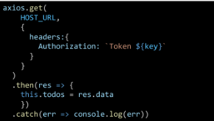
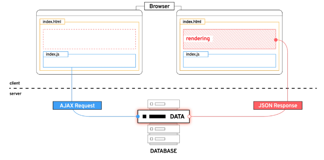

# Vue

# 사전준비

- vscode Vetur extension 설치
    - 문법 하이라이팅, 자동완성, 디버깅 기능 제공
- Chrome Vue devtools extension 설치
    - 크롬 브라우저 개발자 도구에서 vue 디버깅 기능 제공

# Front-end Development

# 1. what is Front-end Development?

- 앞으로 할 일 JavaScript를 활용한 Front-End 개발
- Back-end 개발은 Back-End 개발에 특화된 Django로 진행
- Front-end 개발은?
    - Vue.js === JavaScript Front-end Framework

## 1.1 front end Framework

- front-end 개발이란
    - 사용자에게 보여주는 화면 만들기
- Web app(SPA)을 만들 때 사용하는 도구
    - SPA -single Page Application

## 1.2 Web App 이란?

- 웹 브라우저에서 실행되는 어플리케이션 소프트웨어
- VIBE 웹 사이트를 이동
- https://vibe.naver.com/today
- 개발자도구 > 디바이스 모드
- 웹 페이지가 그대로 보이는 것이 아닌 `디바이스에 설치된 app`처럼 보이는 것
- 웹 페이지가 디바이스에 맞는 적절한 UX/UI로 표현되는 형태

## 1.3 SPA(Single Page Application)

- Web App과 함께 자주 등장할 용어 SPA
- 이전까지는 사용자의 요청에 적절한 페이지별 template을 반환
- SPA는 서버에서 최초 1장의 HTML만 전달받아 모든 요청에 대응하는 방식을 의미
- 어떻게 한 페이지로 모든 요청을 대응할 수 있을까?
- `CSR(Cient Side Rendering)`방식으로 요청하기 때문

- [참고] SSR(Server Side Rendering)이란?
- - 기존의 요청 처리 방식은 SSR
- - server가 사용자의 요청에 적합한 HTML을 렌더링하여 제공하는 방식
- - 전달받은 새문서를 보여주기 때문에 브라우저는 새로고침을 진행


## 1.4 CSR(Client Side Rendering)이란?

- 최초 한 장의 HTML을 받아오는 것은 동일
- 단, server로부터 최초로 받아오는 문서는 빈 HTML문서


- 각 요청에 대한 대응을 JavaScript를 사용하여 필요한 부분만 다시 렌더링
1. 새로운 페이지를 서버에 `AJAX`로 요청
2. 서버는 화면을 그리기 위한 필요한 데이터를 JSON방식으로 전달
3. `JSON` 데이터를 JavaScript로 처리, DOM 트리에 반영(rendering)




## 1.5 왜 CSR방식을 사용하는 걸까?

1. 모든 HTML페이지를 서버로부터 받는 것이 아니기 때문
    1. 클라이언트 - 서버간 통신 즉, 트레픽이 감소
    2. 트래피기 감소한다 = 응답 속도가 빨라진다.
2. 매번 서 문서를 받아 새로고침하는 것이 아니라 필요한 부분만 고쳐 나가므로 각 요청이 끊김없이 진행
    1. SNS에서 추천을 누를 때 마다 첫 페이지로 돌아간다 = 끔찍한 App!
    2. 요청이 자연스럽게 진행된다 = UX 향상
3. BE, FE의 작업 영역을 확실히 분리할 수 있음
    - 각자 맡은 역할을 명확히 분리 = 협업이 용이해짐

## 1.6 CSR은 만능일까?

- 첫 구동 시 필요한 데이터가 많을수록 최초 작동시작까지 오랜시간이 소요
- Naver, Netfix, Dsney+ 등 모바일에 설치된 Web-App을 실행하게 되면 잠깐의 로딩 시간이 필요함
- `검색 엔진 최적화`(SEO, Search Engine Optimization)가 어려움
    - 서버가 제공하는 것은 텅 빈 HTML
    - **내용을 채우는 것은** AJAX 요청으로 얻은 JSON 데이터로 **클라이언트(브라우저)가 진행**
- 대체적으로 HTML에 작성된 내용을 기반으로 하는 검색엔진에 빈 HTML을 공유하는 SPA서비스가 노출되기는 어려움

- [참고] SEO(Search Engine Optimization)
    
    
- - google, bing과 같은 검색 엔진 등에 내 서비스나 제품 등이 효율적으로 검색 엔진에 노출되도록 개선하는 과정을 일컫는 작업
- - `검색`  = 각 사이트가 운용하는 검색 엔진에의해 이루어지는 작업
- - `검색 엔진` = 웹 상에 존재하는 가능한 모든 정보들을 긁어 모으는 방식으로 동작
- - 정보의 대상은 주로 HTML에 작성된 내용
- - JavaScript가 실행된 이후의 결과를 확인하는 과정이 없음
- - 최근 SPA, 즉 CSR로 구성된 서비스의 비중이 증가
- - SPA 서비스도 검색 대상으로 넓히기 위해 JS를 지원하는 방식으로 발전
- - 단, 단순 HTML만을 분석하는 것보다 몇 배의 리소스가 필요한 작업이기에 여전히 CSR의 검색엔진 최적화 문제가 모두 해결된 것은 아님

## 1.7 CSR vs SSR

- 내 서비스에 적합한 렌더링 방식을 적절히 사용해야 함 - CSR과 SSR
- SPA 서비스에서도 SSR를 지원하는 Framework도 발전중
    - Vue의 NUXT.js
    - React의 NEXT.js
    - Angular Universal 등

## 1.8 여러가지 Front-End Framework

- Front-End Framework == HMTL + CSS + JS를 더 편하게 작업하기 위한 툴
    - React, Angular, Svelte, Vue
- 대부분의 기업에서는 생산성과 협업을 위해 Framework를 사용해서 개발

# 2. why Vue

- 쉽다
- 입문자가 시작하기에 좋은 framework
- 사용 사례
    - programmers, Goolge Careers, VIBE, LOUIS VUITTON, GitLab
- 직관적인 구조

## 2.1 Vue CDN

- Vue로 작업을 시작하기 위한 CDN 가져오기
- Django == Python Web Framework
    - pip install
- Vue === JS Front-end Framework
    - Bootstrap에서 사용하였던 CDN 방식 제공
    - ~~npm활용은 추후에 진행 예정~~
- `Vue 2 공식 문서`
    - https://v2.vuejs.org/
1. Getting Started
2. installation
3. Development version CDN 복사

## 2.2 Vue 코드

- 입력받은 값을 name 뒤에 출력하기

```jsx
<body>
  <div id="app">
    <p id="name">name : </p>
    <input id="inputName" type="text">
  </div>
  <script src="https://cdn.jsdelivr.net/npm/vue@2.7.13/dist/vue.js"></script>

  <script>
    // CODE HERE
    const app = new Vue({
      el: '#app',
      data: {
        message: '',
      },
    })
  </script>
</body>
</html>

```

1. Vue CDN 가져오기
2. Vue instance 생성
    - Vue instance - 1개의 object
    - 정해진 속성명을 가진 object
3. `el, data` 설정
    - data애 관리할 속성 정의
4. 선언적 렌더링 `{{ }}`
    - Vue data를 화면에 렌더링

- [참고] Dev Tools 확인
    
    
- - Vue devtools에서 data 변경 → DOM에 반영
- - 눈에 보이는 화면을 조작하는 것이 아닌 Vue가 가진 data를 조작

1. input tag에 `v-model` 작성
    - input에 값 입력 → Vue data 반영
    - Vue data → DOM 반영
    

# 3. Vue2 vs Vue3

## 3.1 Vue3

- 2022년 2월부터 vue 프레임워크의 기본 버전이 3버전으로 전환
- 대체적인 설정이 Vue3를 기본으로 적용되어 있음
    - ex) 공식 문서, CDN, npm 등

## 3.1 Vue2

- 여전히 많이사용됨(legacy code)
- 사용된 기간이 긴 만큼 상대적으로 많은 문서의 양, 참고자료, 질문/답변
- 안정적인 측면에서는 아직 Vue2가 우세한 편
