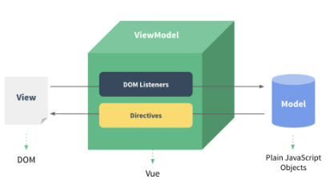

# Vue instance

# 1. MVVM Pattern

- 소프트웨어 아키텍처 패턴의 일종
- 마크업 언어로 구현하는 그래픽 사용자 인터페이스(view)의 개발을 Back-end(model)로부터 분리시켜 view가 어느 특정 모델 플랫폼에 종속되지 않도록 함



- `View` : 우리 눈에 보이는 부분 = DOM !
- `Model` : 실제 데이터 = JSON !
- `View Model` : (Vue)
    - View를 위한 Model
    - View와 연결(binding)되어 Action을 주고 받음
    - Model이 변경되면 View Model도 변경되고 바인딩된 View도 변경됨
    - View에서 사용자가 데이터를 변경하면 View Model의 데이터가 변경되고 바인딩된 다른 View도 변경됨
- View, Model, DOM, Data 서로간읜 독립성 증가, 적은 의존성
- MVC패턴에서 Controller를 빼고 view Model을 넣은 패턴

## 1.1 Vue instance

1. `new`연산자를 사용한 생성자 함수 호출
    - vue instance 생성
2. 인스턴스 출력 및 확인

```jsx
<body>
  <script src="https://cdn.jsdelivr.net/npm/vue@2.7.13/dist/vue.js"></script>
  <!-- Vue CDN -->
  <script>
    // CODE HERE
    // 1. Vue instance constructor
    const vm = new Vue()
    console.log(vm)

  </script>
</body>
```


- Vue instance === 1개의 객체
- 아주 많은 속성과 메서드를 이미 가지고있고, 이러한 기능들을 사용하는 것

- [참고] 생성자 함수
    
    
- - JS에서 객체를하나 생성한다고 한다면?
- - 하나의 객체를 선언하여 생성
- - 동일한 형태의 객체를 또 만든다면?
- - 또 다른 객체를  선언하여 생성
- - Vue에서  동일한 구조의 객체를 여러개 만들고 싶다면?
- - `new` 연산자로 사용하는 함수

```jsx
function Member(name, age, sId) {
  this.name = name
  this.age = age
  this.sId = sId
}

const member3 = new Member('isaac', 21, 2022654321)
```

- - 함수 이름은 반드시 **대문자로 시작**
- - 생성자 함수를 사용할 때는 반드시 `new` 연산자를 사용

## 1.2 el(element)

- Vue instance와 DOM을 mount(연결)하는 옵션
    - view와 model을 연결하는 역할
    - HTML **id 혹은 class와 마운트 가능**
- Vue instance와 **연결되지 않은 DOM 외부는 Vue의 영향을 받지 않음**
    - Vue 속성 및 메서드 사용 불가
- 새로운 Vue instance 생성
- 생성자 함수 첫번째 인자로 object 작성
- el옵션에 `#app`작성 = DOM 연결
    - id가 app인 엘리먼트를 선택하겠다.
- 인스턴스 출력

```jsx
<div id="app">
    {{ messsage }} <!-- app.message 값 출력 -->
</div>
<div>
    {{ messsage }} <!-- 그대로 {{ message }} 출력 -->
</div>
...
<script>

    // CODE HERE
    // 1. Vue instance constructor
    // const vm = new Vue()
    // console.log(vm)
    // 2. el
    const app = new Vue({
      el: '#app', // id가 app인 엘리먼트를 선택하겠다.
    })
    console.log(app)
</script>
```

## 1.3 data

- Vue instance의 데이터 객체 혹은 인스턴스 속성
- 데이터 객체는 반드시 기본 객체 `{}(object)`여야 함
- 객체 내부의 아이템들은 value로 모든 타입의 객체를 가질 수 있음
- 정의된 속성은 `interpolation {{ }}` 을 통해 view에 렌더링 가능함
- Vue instance에 data 객체 추가
- data 객체에 message 값 추가
- 추가된 객체의 각 값들은 this.message형태로 접근 가능

```jsx
<div id="app">
    {{ messsage }} <!-- 그대로 출력 -->
</div>
...
<script>
    // 2. el
    const app = new Vue({
      el: '#app',
      // 3. data
      data: {
        message: 'Hello, Vue!'
      },
    })
</script>
```

## 1.4 methods

- Vue instance의 method들을 정의하는 곳
- method 객체 정의
    - 객체 내 print method 정의
    - print method 실행 시 Vue instance의 data 내 message 출력
- 콘솔창에서 app.print() 실행

```jsx
<div id="app">
    {{ messsage }} <!-- 그대로 출력 -->
</div>
...
<script>
    // 2. el
    const app = new Vue({
      el: '#app',
      // 3. data
      data: {
        message: 'Hello, Vue!'
      },
    // 4. methods
      methods: {
        print: function () {
          console.log(this.message) // this는 app을 의미함
           // 정확히는 this.$data.message라고 접근해야 함
           // 간편하게 this.message로 접근할 수 있음
        },
      }
    })

</script>
```

- method를 호출하여 data 변경 가능
    - 객체 내 bye method 정의
    - print method 실행 시 Vue instance의 data 내 message 변경
- 콘솔창에서 app.bye() 실행
    - DOM에 결과 반영
    - Vue 의 강력한 반응성(reactivity)

```jsx
<div id="app">
    {{ messsage }} <!-- 그대로 출력 -->
</div>
...
<script>
    // 2. el
    const app = new Vue({
      el: '#app',
      // 3. data
      data: {
        message: 'Hello, Vue!'
      },
    // 4. methods
      methods: {
        print: function () {
          console.log(this.message)
        },
        bye: function () {
          this.message = 'Bye, Vue!'
        },
      }
    })

</script>
```

- [주의] **methods with Arrow Function**
- - 메서드를 정의할 때, Arrow Function을 사용하면 안됨
- - Arrow Function의 this는 함수가 선언될 때 상위 스코프를 가리킴
- - 즉 this가 상위 객체 window를 가리킴
- - 호출은 문제없이 가능하나 this로 Vue의 Data를 변경하지 못함