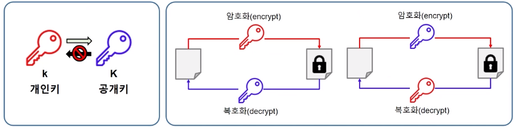
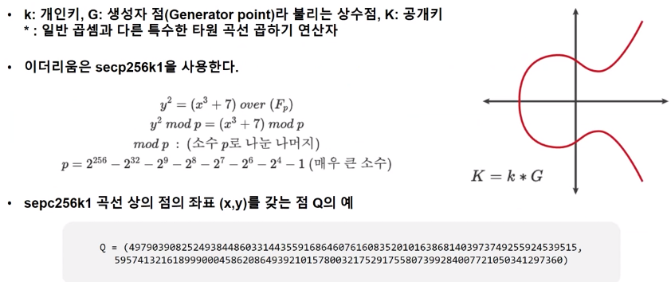

# 블록체인 기본 개념(원일)

# Block chain

## content

1. [블록체인 개요](#1-블록체인-개요)
2. [블록체인의 암호학](#2-블록체인의-암호학)
3. [트랜잭션](#3-트랜잭션transaction)
4. [합의](#4-합의consensus)

# [1. 블록체인 개요](#content)
 

## 1.1 비트코인 탄생

- `CypherPunk` 운동의 결과물로 **화폐 권력의 중앙화를 없애기 위해** 사토시 나카모토가 발명함
    - `CypherPuck` : 거대 집단으로부터 개인의 권리와 자산을 지키기 위한 운동
- 발행기관, 운영기관, 중개기관 없이 인터넷 상에서 다수의 사람들에게 신뢰받는 세계 최초의 탈중앙형 화폐 탄생

## 블록체인의 진화, 이더리움(block chain 2.0)

- 창시자 : 비탈릭 부테린
- 업계 최초 ICO(initial Coin Offering)를 통해 개발비를 모금하여, 2015년 이더리움 네트워크가 시작됨

### 이더(Ether)

- 이더리움에서 사용하는 화폐

### 비트코인과의 차이점

- 이더리움은 **스마트 컨트랙트를 실행하는 탈중앙화된 컴퓨팅 인프라**로, 월드 컴퓨터(World Computer)라고 불림
- 블록체인에 스마트 컨트랙트를 도입하여 DAO(Decentralized Autonomous Organization), 자기주권신원증명, 탈중앙형 금융 등의 가능성을 보여주고 **web 3.0의 기틀을 마련했다는 평가를 받음**

 

## 1.2 블록체인의 정의

> **블록체인이란?**
> 
- **P2P(Peer to Peer) 네트워크**를 통해 관리되는 분산 데이터베이스의 한 형태
- 블록체인 노드(네트워크에 연결된 여러 컴퓨터)에 **디지털 서명된 거래 정보**를 보관하는 **분산 원장 기술(Destributed Ledger Technology)**

> 💡 다시말해, 수 많은 컴퓨터가 동등한 계층을 가지고 네트워크를 형성하고, 각 노드들이 분산된 데이터베이스를 가지고 모든 데이터가 동기화된 상태로 운영되는 상태

 

## 1.3 블록체인의 동작 원리

1. 누군가 **트랜잭션(transaction**)을 만들어 **요청**한다.
    1. `transaction in ethereum` : 누가 누구에게 몇비트를 보냈다라는 의미의 데이터
    2. `transaction in smart contract`: 소스코드 또는 소스코드를 실행하는 명령어 
2. 트랜잭션을 요청받은 노드는 트랜잭션의 **유효성을 검증(validation)**한다.
    1. 유효성 검증은 네트워크를 구성하는 수많은 노드가 수행
3. 유효한 트랜잭션이 블록체인의 **P2P 네트워크에 전파된다(boardcast).**
4. 블록 생성자는 블록 생성 규칙을 준수하며, 검증된 트랜잭션을 포함하는 **새 블록을 생성**한다.
5. 생성된 새로운 블록이 **P2P 네트워크에 전파**된다.
6. 기존블록에 **새로운 블록이 연결**되며 트랜잭션이 처리된다.

---

# [2. 블록체인의 암호학](#content)

[2.1 공개키 암호화](#21-공개키-암호화public-key-cryptography-pkc)

[2.2 개인키와 공개키](#22-개인키와-공개키)

[2.3 해시 함수](#23-해시함수hash-function---주소-생성)

## 2.1 공개키 암호화(Public Key Cryptography, PKC)

- 공개키 암호화 == 비대칭 암호화
- 계산하기는 쉽지만, 그 역(inverse)을 계산하기 어려운 특수한 함수를 바탕으로 생성된 고유한 키를 사용하여 정보를 보호하는 방법
- 비트코인 및 이더리움에서는 이산 로그 문제(Discrete Logarithm Problem)를 이용하는 타원 곡선 암호화(Elliptic Curve Crypytography)를 활용

 

### key convention?

k : 통상 개인키를 의미

K : 통상 공개키를 의미

 

### 공개키 알고리즘은 공개키로 암호화를 하냐, 개인키로 암호화를 하냐에 따라 사용 분야가 달라짐

1. 공개키로 암호화하면 데이터 보안에 중점을 두고,
2. 개인키로 암호화하면 인증 과정에 중점을 두는 것임
    1. 암호화 데이터와 공개키를 함께 전달.
    2. 암호화된 데이터가 공개키로 복호화된다는 것은 공개키와 쌍을 이루는 개인키에의하여 암호화되었다는 것을 의미
    3. **데이터 제공자의 신원 확인이 보장된다는 뜻**

[공개키, 비공개 키 원리](https://brunch.co.kr/@artiveloper/24)

## 2.2 개인키와 공개키

## 개인키(k)

- **1 ~ 2^256 사이의 무작위로 선택한 숫자**
- 개인키 생성 프로세스는 오프라인 프로세스
- 대부분의 프로그래밍 언어에 있는 rand 함수 같은 암호학적으로 안전하지 않은 난수 생성기 사용 금지
- 우주의 원자 총 수보다 큰 수이기 때문에 동일한 수가 뽑힐 가능성이 매우 낮다.

## 공개키(K)

- 개인키를 바탕으로 공개키를 만들어냄
- 타원 곡선에 있는 점(타워 곡선 방정식을 만족하는 x 와 y 좌표의 집합)
- 이더리움은 **secp256k1 알고리즘**을 사용함

### 원리

1. secp256k1에서 G라는 한 점을 결정
2. G를 k번 연산하여 도착하는 점(x, y) 반환
3. 도착하는 점을 가지고 공개키 만듦
4. 이더리움에서 16진수 문자 130개로 직렬화된 공개키를 확인할 수 있다.
5. 이더리움은 타원 곡선 공개키 접두어 04(”압축되지 않은 지점”)를 사용한다.

> 💡 공개키로 개인키를 추론하는 것은 불가능하다 !

 

## 2.3 해시함수(Hash Function) - 주소 생성

- 공개키를 주소로 변환하기 위해 해시 함수 사용

### 해시함수

- 임시크기의 데이터를 고정된 크기 데이터로 매핑하는 함수
- 해시 함수의 입력을 메시지 또는 입력 데이터, 결과를 해시(hash)라고 함
- 결과값을 알고 있을 때 입력 데이터를 다시 작성하는 것이 불가능한 단방향(one-way)함수

### keccak-256

- 이더리움에서 해시함수
- 일반적으로 사용하는 해시함수와 달라 **주의가 필요!**
- output 접두어 : **c5d24**
- 마지막 20byte만 유지하여 주소로 사용
- 16진수를 나타내는 0x접두어가 함께 나타나기도 함
- 16진수의 대소문자를 수정하여 이더리움의 이전 버전과 호환되는 체크섬 주소를 사용함

> 💡 **블록체인 암호학 정리**
> 1. 개인키 
>     - 암호학적으로 무작위한 1~2^256 사이의 난수\
> **2. 타원 곡선 함수(Secp256k1)**을 통해 공개키 생성
> 3. 공개키 : 타원 곡선 위의 점을 직렬화 한 값
> 4. 해시 함수(keccak-256)을 이용하여 공개키 주소 매핑
> 5. 주소 : 해시의 마지막 20byte. 외부 소유 주소(externally Owned Address, EOA)

---

# [3. 트랜잭션(Transaction)](#content)

- 외부 소유 계정(EOA)에 의해 서명된 메세지
- 이더리움 네트워크에 전송되고 블록체인에 기록된다.
- 블록체인 상태 변경을 유발하거나 컨트랙트를 실행하는 유일한 방법
    - 이더리움은 독자적으로 상태가 변경되지 않는다.
    - 컨트랙트는 독자적으로 실행되지 않는다.

 

## 3.1 트랜잭션의 구조

1. **논스, nonce** : 발신 주소(EOA)에 의해 발행된 일련번호
2. **가스 가격, gas price** : 발신자가 지급하는 가스의 가격
3. **가스 한도, gas limit** : 트랜잭션을 위해 지불 허용할 가스의 최대량
4. **수신자, recipient** : 목적지 이더리움 주소
5. **값, value** : 목적지에 보낼 이더의 양
6. **데이터, data** : 가변 길이의 바이너리 데이터 페이로드(payload)
7. **디지털 서명, v, r, s** : 트랜잭션 무결성 및 부인 방지를 위한 디지털 서명

 

### 1. nonce

- 해당 주소에서 생성한 트랜잭션의 건 수
- 논스 값은 0부터 순차적 증가
- 목적
    - 트랜잭션의 순서가  꼬이지 않도록 하기 위함
        - 늦게 도착하는 트랜잭션을 기다리거나 등등
    - 트랜잭션을 복제할 수 없게 함
        - 100이더가 있는 주소에 논스 값없이 2이더를 보내는 트랜잭션을 반복 실행시켜 이더를 소진시킬 수 있음
    

### 2. gas

- 이더리움 네트워크를 사용하기 위한 수수료
- 이더(ETH)에 대한 사용자 지정 환율(gas price)을 가진 별도의 개념
    - 1 ETH = 10^18wei
- 트랜잭션이 사용할 수 있는 자원의 양을 제어하는 데 사용됨
    - 트랜잭션 수수료의 최대값 = gasPrice * gasLimit
    - `gasPrice` : 1가스 마다 지급할 가격(wei)를 설정할 수 있음
    - `gasLimit` : 최대 가스 단위 수를 지정한다.(이더 전송에 필요한 가스양은 21,000개로 고정한다.)

### 5. 값과 데이터(value & data)

- 트랜잭션의 주요 페이로드
- **4 가지의 조합**
    1. 값만 있는 경우 : 이더 지급(payment)
    2. 데이터만 있는 경우 : 호출(invocation)
    3. 값과 데이터가 있는 경우 : 지급 + 호출
    4. 값과 데이터 모두 없는 경우 : 트랜잭션은 보내지지만 가스 낭비

- **새로운 컨트랙트**
    - 수신자 주소 : 0x0(영 주소)
    - 데이터 : 컴파일된 컨트랙트의 바이트코드

### 7. 디지털 서명(digital signature)

- 트랜잭션 정보를 개인키를 사용하여 서명
- 타원 곡선 디지털 서명 알고리즘(ECDSA, Elliptic Curve Digital Signature Algorithm)을 사용하여 인코딩된 트랜잭션 정보를 EOA의 개인키를 이용하여 서명을  만든다.
- **동작**
    1. 트랜잭션 생성(6가지 필수 정보)
    2. 트랜잭션 직렬화
    3. 트랜잭션 해시
    4. 디지털 서명 생성
    5. 트랜잭션과 서명 함께 직렬화
- 서명이 담긴 트랜잭션을 함께 받은 누구나 메세지와 공개키만 사용하여 서명을 검증할 수 있다.
- **서명값을 보냄으로써의 이점**
    - 개인키 소지자에 의해 트랜잭션이 승인되었음을 증명함
    - 개인키 소지자가 해당 트랜잭션을 승인했음을 부인할 수 없음(부인 방지 non-repudiation)
    - 서명 후 데이터가 수정되지 않았음

  

## 3.2 트랜잭션 전파와 기록

1. 트랜잭션 생성
2. 트랜잭션 데이터 바탕으로 서명 생성
3. 트랜잭션과 서명 함께 직렬화
4. 이더리움 네트워크에 전송
    1. 보안상 개인키의 서명과 전송을 분리함
5. 서명된 트랜잭션은 이더리움 네트워크로 전송할 준비가 완료된 것임
6. 서명된 트랜잭션을 받은 P2P  네트워크에 연결된 노드는 다음과 같이 동작
    1. 수신한 트랜잭션의 서명을 검증
        1. 개인키로 암호화된 서명 값을 공개키로 복호화하여 서명값과 원본값이 일치하는 지 확인
    2. 유효한 경우, 사본을 저장하고 자신의 이웃 노드에게 전파한다.
7. 결과적으로 트랜잭션은 모든 노드에게 전파되며 몇 초 내에 전 세계 모든 노드로 전파된다.
    1. 각 노드의 관점에서는 트랜잭션의 출처 식별이 불가능함
    2. 특정 노드는 트랜잭션을 블록에 추가하여 새로운 블록을 만드는 작업을 수행

---

# [4. 합의(Consensus)](#content)

4.1 작업 증명(PoW)

4.2 지분 증명(PoS)

## 합의(Consensus)

- 분산 시스템에서 상태를 동기화하기 위해 사용
- 탈중앙화되었지만, 결정론적으로 운영하기 위해 각자 지켜야 하는 규칙
- **누가 생성한 블록이 유효한지 합의하기 위한 프로토콜**
- **작업 증명**({PoW, Proof of Work)과 **지분 증명**(PoS, Proof of Stake)이 가장 일반적
- 이더리움은 22년 9월 15일 PoW → PoS로 전환

 

## 4.1 작업 증명(PoW)

- 임의의 값을 대입하여 얻은 결과값이 목표 값 이하의 값을 도출할 때까지 해시를 반복하는 작업
- 해시 함수의 특성에 따라 역산이 불가능하여 무작위로 대입하는 작업을 무수히 반복해야 한다.
- **`마이닝`을 통해 새로 발행된 화폐의 보상(가상화폐)**은 **블록체인 시스템 보안에 기여하는 노드에 대한 인센티브**임
    - `마이닝(채굴)` : 새로운 블록을 만들기 위한 작업.
        - 많은 참가자가 참여할 수록 블록체인의 보안이 강화된다.
        - 쉽게 말해, **해시 함수에서 나온 출력값과 동일한 결과를 도출하는 input을 찾기 위해 반복작업(노가다) 실행하는 것**
        - 가장 빨리 채굴된 블록만 인정받아 해당 값을 찾은 노드에게 인센티브(가상화폐를 지불)

### Ethash

- 이더리움의 1.0 합의 알고리즘
- 주문형 반도체(ASIC) 저항성을 갖게 만듦 → 마이닝 인프라를 독점하고 보안을 훼손할 수 있는 PoW의 중앙화를 피할 수 있도록 함

 

## 4.2 지분 증명(PoS)

- 쉽게 말해, 보증금을 내고 검증인 집합에 가입하고, 검증인들이 올바른 block을 선정하는 방식
- 금전적 보증금 예치(financial staking) 기반의 알고리즘
- 지분 증명 블록 체인은 검증인(validator) 집합을 유지한다.
- 이더를 보유한 사람은 이더를 컨트렉트에 예치시키는 특별한 컨트렉트를 보냄으로써 검증인이 된다.
- 검증인은 다음 블록에 대해 제안(proposal)하고 투표(vote)하는 순서를 따른다.
    - 검증인이 보유한 블록이 대다수의 검증인에 의해 거부되면 보증금을 잃을 위험이 있다.
    - 대다수가 블록을 수락하면 누적된 지분에 비례해 보상을 얻는다.