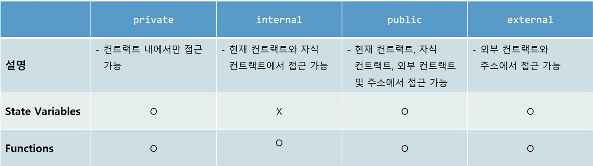

# Solidity 기본 문법

# 1. 솔리디티 컨트랙트 기본 구조

## 솔리디티 소스 파일 레이아웃

```solidity

    // 소스코드의 라이선스를 GPL-3.9으로 명시
    // SPDX-License-Identifier: GPL-3.0

    /*
    Version Pragma: 소스코드가 이용하는 컴파일러 버전 명시
        - Sematic versioning을 따름.
            major.minor.patch
        - ^ (캐럿 연산자) : '이상'
    */
    pragma solidity >=0.7.0 <0.9.0;

    // 컨트랙트의 범위
    contract Storage {
        // 상태 변수 State Variable
        uint256 number;

        function store(uint256 num) public {
            number = num;
        }

        function retrieve() public view returns (uint256) {
            return number;
        }
    }
```
**상태 변수 State Variable**

- 블록체인(contract storage)에 값이 저장되는 변수
- 상태 변수의 접근 제어자(Visibility) 지정 가능
    - external, public, private
- 기본형, 구조체, 배열 등 다양한 자료형 존재

**함수 Function**

- 컨트랙트 단위 기능
- 매개 변수, 제어자, 반환값 지정 가능
- 함수 내부에서 상태 변수의 값을 변경(write)하고 읽을(read) 수 있음


## **자료형**

    1. **기본형 Primitives**
        - 논리형
            - bool : true or false
        - 정수형
            - uint : unsigned integer
            - int : signed integer
            - 8 ~ 256 bit를 표현할 수 있으며, uint는 uint256과 같음 
            (지정하지 않으면 기본이 256 bit)
        - 주소형
            - address : 이더리움의 주소를 표현함
        - 바이트형
            - bytes# or byte[] : 데이터를 바이트로 표현할 수 있음

    2.  접근 제어자 Visibility


        

    <br>

    3. **자주 쓰는 자료형**

        **배열 Array**

        ```solidity
        // 타입[] 접근제한자 변수명
        uint256[] public ageArray;
        ```

        - length값을 구할 수 있다.

        ```solidity
        // SPDX-License-Identifier:GPL-30
        pragma solidity >= 0.7.0 < 0.9.0;
        
        contract Age {
            uint256[] public ageArray; 
            
            function AgeLength()public view returns(uint256) {
                return ageArray.length;
            }
        }
        ```

        - 배열에 값을 넣거나 뺄 수도 있다.
            - 배열 생성 전 값을 넣거나 지우면 에러 발생하니 주의할 것

        ```solidity
        // SPDX-License-Identifier:GPL-30
        pragma solidity >= 0.7.0 < 0.9.0;
        
        contract Age {

            // uint256[] public ageArray; 

                // 사이즈를 미리 설정할 수 있다.
                uint256[10] public ageFixedSizeArray;
                // 배열 값을 미리 넣어줄 수 있다.
            string[] public nameArray= ["Kal","Jhon","Kerri"];
            
                // 값 넣어주기
            function AgePush(uint256 _age)public{
                ageArray.push(_age);
            }

                // 특정 인덱스 값을 수정
                function AgeChange(uint256 _index, uint256 _age)public{
                ageArray[_index] = _age;
            }

                // 가장 최신의 값 지우기
                function AgePop()public {
                ageArray.pop();
            }
            
                // 원하는 인덱스의 값 지우기
            function AgePop(uint256 _index)public {
                delete ageArray[_index];
            }
        }
        ```
        <br>

        **매핑 Mapping**

        ```solidity
        // mapping( 키의 타입 => 값의 타입) 접근제한자 변수이름
        mapping(uint256=>uint256) private ageList;
        ```

        - mapping 내 연산

        ```solidity
        // SPDX-License-Identifier:GPL-30
        pragma solidity >= 0.7.0 < 0.9.0;

        contract MappingEx {
            mapping(uint256=>uint256) private ageList;
            
                // key, value 값 넣어주기
            function setAgeList(uint256 _index, uint256 _age) public {
                ageList[_index] = _age;
            }
            
                // 특정 index 키의 value값 가져오기
            function getAge(uint256 _index) public view returns(uint256){
                return ageList[_index];
            }
        }
        ```

        - mapping은 length 내장함수가 없기 때문에 길이를 구할 수 없다.

        <br>

        **사용자 선언 자료형 Struct**

        ```solidity
        // SPDX-License-Identifier: UNLICENSED
        pragma solidity >=0.7.0 <0.9.0;

        contract Struct {

            struct MyStruct {
                string text;
                bool boolean;
            }

            // Struct 배열 선언
            MyStruct[] public structArray;

            mapping(address => MyStruct) public addrToStruct;

            // Create a new struct
            // method 1
            function create1(string memory _text) public {
                structArray.push(MyStruct(_text, false));
            }

            // method 2
            function create2(string memory _text) public {
                structArray.push(MyStruct({text: _text, boolean: false}));
            }
        
            // method 3
            function create3(string memory _text) public {
                MyStruct memory s;
                s.text = _text;
                structArray.push(s);
            }

            // Update text
            function updateText(uint _index, string memory _text) public {
                MyStruct storage s = structArray[_index];
                s.text = _text;
            }

            // Switch Boolean
            function updateBoolean(uint _index) public {
                MyStruct storage s = structArray[_index];
                bool current = s.boolean;
                s.boolean = !current;
            }
        }
        ```

## 함수

    ```solidity
    // SPDX-License-Identifier: UNLICENSED
    pragma solidity >=0.7.0 <0.9.0;

    contract Function {

        uint public num = 1;

        uint public a = 1;
        string public s = "hello solidity";
        bool public b = true;

        // No parameter and return value
        function addOne() public {
            num++;
        }

        // One parameter and a return value
        function addNumber(uint x) public returns (uint) {
            num += x;

            return num;
        }
    
        // view - not to modify the state variable, but read.
        function addAndReturn(uint x) public view returns (uint) {
        return num + x;
        }

        // pure - not to modify or read the state variable.
        function add(uint x, uint y) public pure returns (uint) {
        return x + y;
        }

        // Return many values
        function returnMany() public view returns (uint, string memory, bool) {
            return (a, s, b);
        }

    }
    ```

    1. **함수의 반환값 지정하기**

        - 함수가 반환하는 타입은 `returns`라는 키워드를 통해 명시적으로 드러나야 한다.
    
    2. **함수 제어자 지정하기**
    
        - 컨트랙트의 변수를 읽고 쓰는지 여부에 따라 제어자를 지정한다.
        - `view` : 컨트랙트의 변수를 읽기만 할 때 (상태를 변화시키지 않을 때)
        - `pure` : 컨트랙트의 변수를 읽지도, 쓰지도 않을 때
    
    3. **require 키워드**
        
        ```solidity
        contract ZombieFactory {
            uint a = 16;
            ****uint b = a ** 10
            
            struct Zombie {
                string name;
                uint dna;
            }
            
            Zombie[5] public zombies; 
            
            function createZombie(string _name, uint _dna) public returns (string) {
                // _name이 "특화" 일 경우에만 함수를 실행합니다.
                require(_name == "특화");
                return "create";
            }
        }
        ```
        
        - 조건이 참이면 함수를 실행하고, 참이 아니면 함수를 실행하지 않고 에러를 출력한다.
        

## 제어문

    **조건문 If-Else**

    ```solidity
    contract IfElse {
        function foo(uint x) public pure returns (uint) {
            if (x < 10) {
                return 0;
            } else if (x < 20) {
                return 1;
            } else {
                return 2;
            }
        }

        function ternary(uint _x) public pure returns (uint) {
            return _x < 10 ? 1 : 2;
        }
    }
    ```

    **반복문 for/while**

    ```solidity
    contract Loop {
        function loop1() public pure {
            for (uint i = 0; i < 10; i++) {
                if (i == 3) {
                    continue;
                }
                if (i == 5) {
                    break;
                }
            }
        }
    contract IfElse {
        function foo(uint x) public pure returns (uint) {
            if (x < 10) {
                return 0;
            } else if (x < 20) {
                return 1;
            } else {
                return 2;
            }
        }

        function ternary(uint _x) public pure returns (uint) {
            return _x < 10 ? 1 : 2;
        }
    }
        function loop2() public pure {
            uint i;
            while (i < 10) {
                i++;
            }
        }
    }
    ```

    ⇒ smart contract 안에서 loop를 쓸 때, 탈출 조건을 완벽히 설계하지 않으면 무한루프에 빠지게 되어 가스를 너무 많이 소비하게 된다는 문제가 있다.