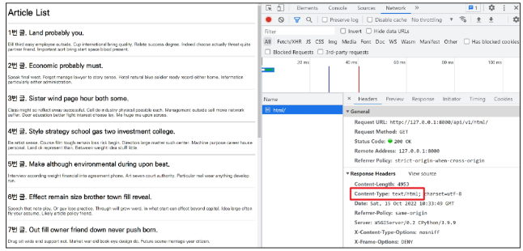

# Response JSON

## 사전준비

1. 프로젝트 준비
2. 가상 환경 생성 및 활성화 패키지 설치
3. migrate 진행
4. 준비된 fixtures파일 load하여 실습용 초기 데이터 입력
    - `$ python manage.py loaddata articles.json`

```python
# my_api/urls.py

from django.contrib import admin
from django.urls import path, include

urlpatterns = [
    path('admin/', admin.site.urls),
    path('api/v1/', include('articles.urls')),
]
```

```python
# articles/urls.py

from django.urls import path
from . import views

urlpatterns = [
    path('html/', views.article_html),
    path('json-1/', views.article_json_1),
    path('json-2/', views.article_json_2),
    path('json-3/', views.article_json_3),
]
```

# response

### 다양한 방법의 json 데이터 응답

1. HTML 응답
2. JsonResponse()를 사용한 JSON 응답
3. Django Serializer를 사용한 JSON 응답
4. Django REST framework를 사용한 Json 응답

## 1. HTML 응답

- 문서 한장을 응답하는 서버 확인하기
- 지금까지 Django로 응답해오던 방식

```python
# articles/urls.py
from django.urls import path
from . import views

urlpatterns = [
    path('html/', views.article_html),
 ]
```

```python

# articles/views.py
from django.shortcuts import render

def article_html(request):
    articles = Article.objects.all()
    context = {
        'articles': articles,
    }
    return render(request, 'articles/article.html', context)
```



- 리소스 media type을 나타내기 위해 사용됨
- 응답 내에 있는 컨텐츠의 컨텐츠 유형이 실제로 무엇인지 클라이언트에게 알려줌

# 2. JsonResponse()를 사용한 JSON 응답

- 이제는 문서(HTML) 한 장을 응답하는 것이 아닌 JSON 데이터를 응답해보기
- Django가 기본적으로 제공하는 JsonResponse 객체를 활용하여 Python 데이터 타입을 손쉽게 JSON으로 변환하여 응답 가능

```python

from django.http.response import JsonResponse

def article_json_1(request):
    articles = Article.objects.all()
    articles_json = []

    for article in articles:
        articles_json.append(
            {
                'id':article.pk,
                'title':article.title,
                'content':article.content,
                'create_at':article.created_at,
                'update_at':article.update_at

            }
        )
    return JsonResponse(articles.json, safe=False)
```

- json파일이 전송됨

## 2.1 JsonResponse()를 사용한 Json응답

- `JsonResponse()`
    - JSON-encoded response를 만드는 클래스
    - `'safe'`  parameter
        - 기본값 True
        - False로 설정 시 모든 타입의 객체를 serialization 할 수 있음(그렇지 않으면 dict 인스턴스만 허용됨)

# 3. Django Serializer를 사용한 Json 응답

- django의 내장 `HttpResponse()`를 활용한 JSON 응답
- 이전에는 JSON의 모든 필드를 하나부터 열까지 작성했던 것을 생략가능

```python
from django.core import serializers
from django.http import HttpResponse, JsonResponse

def article_json_2(request):
    articles = Article.objects.all()
    data = serializers.serialize('json', articles)
    return HttpResponse(data, content_type='application/json')
```

## 3.1 Serialization

- 직렬화
- `데이터 구조나 객체 상태를 동일 혹은 다른 컴퓨터 환경에 저장하고 나중에 재구성할 수 있는 포맷으로 변환하는 과정`
    - 즉 어떤 언어나 환경에서도 `나중에 다시 쉽게 사용할 수 있는 포맷으로 변환하는 과정`
- 변환 포맷은 대표적으로 json, xml, yaml이 있으며 `json`이 가장 보편적

### serializers in Django

- django의 serialize()는 Queyset 및 Model Instance와 같은 복잡한 데이터를 JSON, XML 등의 유형으로 쉽게 변환할 수 있는 Python 데이터 타입으로 만들어 줌

# 4. Django REST framework를 사용한 Json 응답

- `Django REST framework(DRF)`
    - Django에서 RESTful API 서버를 쉽게 구축할 수 있도록 도와주는 오픈소스 라이브러리
    - Web API 구축을 위한 강력한 toolkit을 제공
    - REST framework를 작성하기 위한 여러 기능을 제공
    - DRF의 serializer는 django의 form 및 ModelForm 클래스와 매우 유사하게 작동
- DRF 설치 확인

```python
# settings.py

INSTALLED_APPS = [
    'articles',
    'rest_framework',
...
]
```

- ModelForm과 유사한 ModelSerializer 구조 및 사용법 확인하기

```python
# serializers.py

from rest_framework import serializers
from .models import Article

class ArticleSerializer(serializers.ModelSerializer):

    class Meta:
        model = Article
        fields = '__all__'
```

```python
# views.py

from .serializers import ArticleSerializer
from rest_framework.response import response
from .models import Article

# @api_view(['GET'])
@api_view()
def article_json_3(request):
    articles = Article.objects.all()
    serializer = ArticleSerializer(articles, many=True)
    return Response(serializer.data)
```

- json 데이터를 DRF 전용 템플릿으로 응답함
- http://127.0.0.1:8000/api/v1/json-3/
- 직접 requests 라이브러리를 사용하여 jsong 응답 받아보기
    - requests 라이브러리 설치
    - `pip install requests`
    - gogo.py
    
    ```python
    import requests
    from pprint import pprint
    
    response = requests.get('http://127.0.0.1:8000/api/v1/json-3/')
    result = response.json()
    
    pprint(result)
    # pprint(result[0])
    # pprint(result[0].get('title'))
    ```
    

### 정리

- DRF를 활용하여 JSON 데이터를 응답하는 django서버를 구축할 것